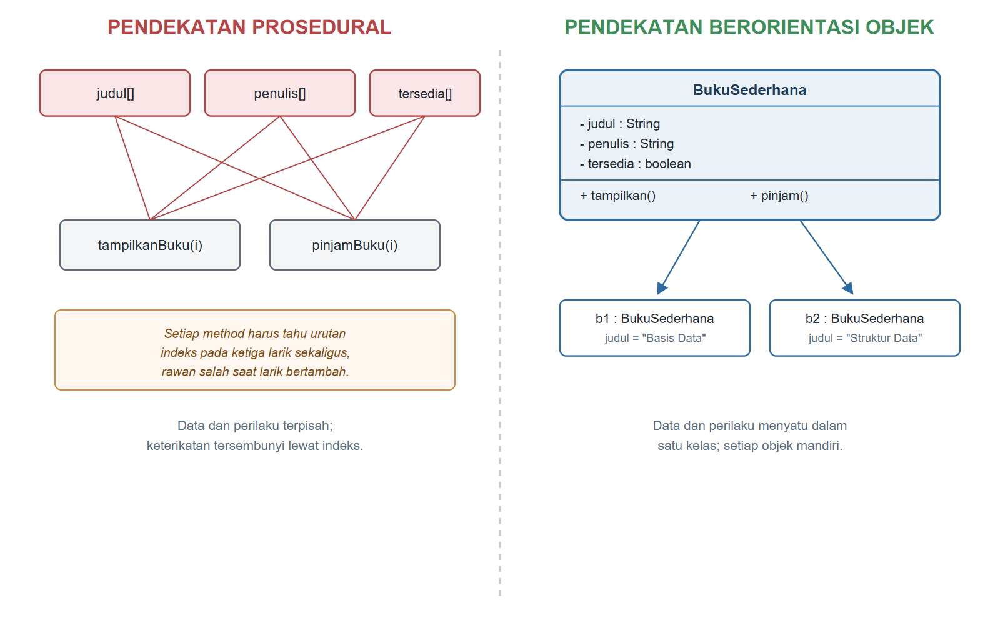
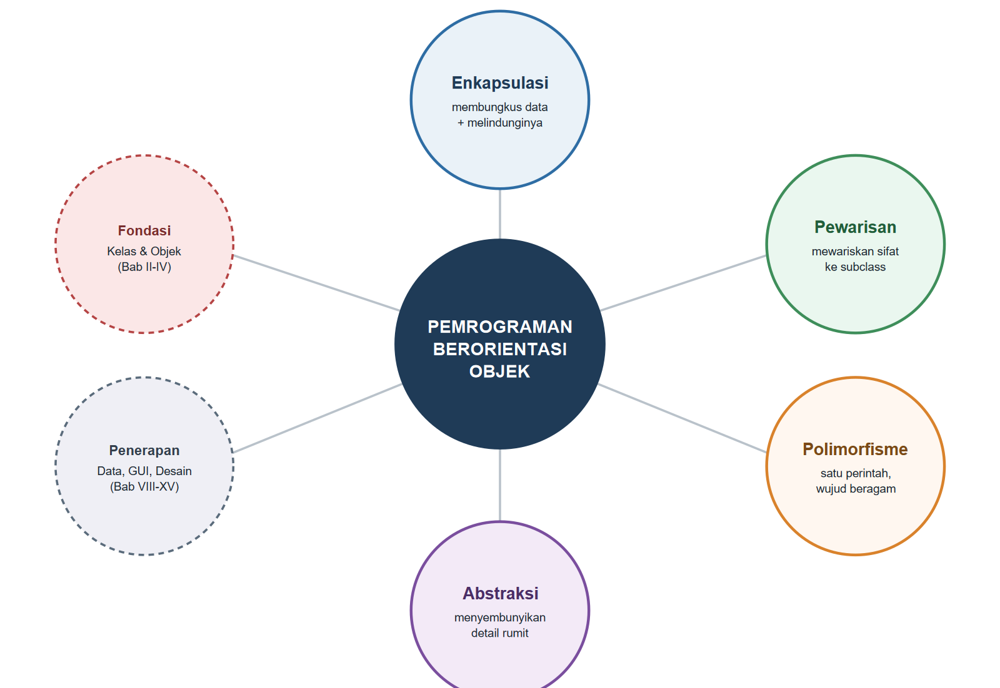
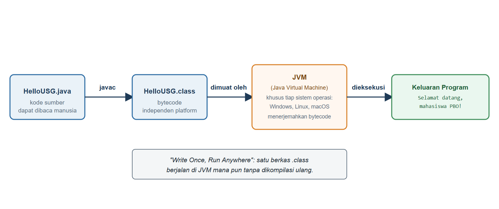

# BAB I.
# (PARADIGMA PEMROGRAMAN BERORIENTASI OBJEK)

### CPMK/ Sub-CPMK :

- **CPMK2** : Mahasiswa mampu mengimplementasikan konsep pemrograman berorientasi objek (enkapsulasi, pewarisan, polimorfisme, abstraksi, *interface*, penanganan eksepsi, *collection*, dan *generics*) dalam bahasa Java untuk menyelesaikan masalah.
- **Sub-CPMK1** : Mahasiswa mampu menjelaskan paradigma pemrograman berorientasi objek serta menerapkan konsep kelas dan objek (atribut, *method*, *constructor*) dalam bahasa Java.

### Indikator Penilaian:

Ketepatan menjelaskan paradigma pemrograman berorientasi objek dibanding paradigma prosedural dan konsep dasar objek, meliputi keterbatasan pendekatan prosedural, gagasan objek sebagai gabungan data dan perilaku, empat pilar pemrograman berorientasi objek, serta siklus kompilasi dan eksekusi program Java.

### Kriteria Keberhasilan (Rubrik):

- Sangat Baik (≥ 85): Mahasiswa mampu membandingkan paradigma prosedural dan berorientasi objek secara kritis dengan contoh kasus sistem informasi yang relevan, menjelaskan keempat pilar secara tepat, serta berkontribusi aktif dan beralasan dalam diskusi dan praktikum lingkungan Java.
- Baik (70-84): Mahasiswa mampu menjelaskan perbedaan kedua paradigma dan keempat pilar dengan benar, tetapi contoh yang diajukan belum dikaitkan secara mendalam dengan kasus sistem informasi.
- Cukup (55-69): Mahasiswa mampu menyebutkan definisi objek dan keempat pilar, tetapi belum mampu menunjukkan keunggulan paradigma berorientasi objek terhadap paradigma prosedural pada kasus nyata.

### Deskripsi Kemampuan yang Diharapkan:

Setelah mempelajari bab ini, mahasiswa diharapkan mampu menjelaskan alasan pergeseran dari pemrograman prosedural ke pemrograman berorientasi objek, mengenali objek beserta data dan perilakunya pada suatu masalah, serta menyiapkan lingkungan pengembangan Java untuk menjalankan program pertama. Dalam konteks Sistem Informasi, kemampuan ini menjadi dasar untuk memandang entitas organisasi, seperti buku, anggota, dan transaksi peminjaman pada perpustakaan, sebagai objek yang dapat dimodelkan dan dikembangkan secara bertahap menjadi aplikasi yang terpelihara.

## A. Pendahuluan

Bayangkan seorang staf teknologi informasi di perpustakaan kampus diminta membuat program sederhana untuk mencatat data buku. Ia mulai dengan tiga larik: satu untuk judul, satu untuk penulis, dan satu untuk status ketersediaan. Program berjalan baik pada awalnya. Namun, pimpinan perpustakaan kemudian meminta agar sistem juga mencatat tahun terbit, jumlah eksemplar, dan siapa peminjam terakhir. Staf tersebut harus menambah larik baru untuk setiap kebutuhan, lalu menelusuri kembali setiap fungsi yang pernah dibuat untuk memastikan indeks pada seluruh larik tetap sinkron. Satu kesalahan kecil, misalnya lupa memperbarui satu larik saat larik lain sudah bertambah datanya, dapat membuat data judul buku tertukar dengan data buku lain.

Kondisi tersebut bukan kesalahan staf tersebut secara pribadi, melainkan konsekuensi dari cara program disusun. Ketika data (judul, penulis, status) dan perilaku (menampilkan, meminjamkan) dipisahkan ke dalam larik dan fungsi yang berdiri sendiri-sendiri, keterkaitan di antara keduanya hanya ada di dalam kepala programmer, bukan di dalam struktur program itu sendiri. Semakin besar aplikasi yang dibangun, semakin besar pula risiko kesalahan semacam ini. Paradigma pemrograman berorientasi objek lahir untuk mengatasi persoalan struktural ini dengan menyatukan data dan perilaku yang berkaitan ke dalam satu kesatuan yang disebut kelas, sehingga setiap perubahan cukup dilakukan pada satu tempat.

Setelah mempelajari bab ini, mahasiswa akan mampu menilai sendiri kapan sebuah program mulai "kewalahan" karena ditulis secara prosedural, dan bagaimana pemrograman berorientasi objek menawarkan struktur yang lebih tahan terhadap perubahan kebutuhan; kemampuan inilah yang akan langsung dipakai untuk membangun studi kasus utama buku ini, yaitu **Sistem Informasi Perpustakaan Universitas Sunan Gresik (SIP-USG)**. SIP-USG akan dibangun secara bertahap dari Bab I hingga Bab XV, dimulai dari entitas paling sederhana seperti *Buku* (`Book`) dan *Anggota* (`Member`), berkembang menjadi hierarki jenis koleksi seperti *Jurnal* (`Journal`) dan *Koleksi Digital* (`DigitalItem`), dilengkapi proses *Peminjaman* (`Loan`), lalu dihubungkan ke basis data MySQL/MariaDB dan ditampilkan melalui antarmuka grafis Java Swing. Setiap bab akan melanjutkan kode dari bab sebelumnya, sehingga di akhir buku mahasiswa telah menyaksikan sendiri sebuah aplikasi tumbuh dari beberapa baris kode menjadi produk perangkat lunak yang utuh.

## B. Keterbatasan Paradigma Prosedural

Pemrograman prosedural menyusun program sebagai urutan instruksi yang dikelompokkan ke dalam fungsi atau *method* statis, sedangkan data disimpan terpisah dalam variabel atau larik yang diakses secara bebas oleh fungsi mana pun. Struktur ini terasa alami untuk program kecil, tetapi mulai menimbulkan masalah begitu jumlah data dan fungsi bertambah. Kode Program {{kp:prosedur-buku}} memperlihatkan versi sederhana dari skenario pada bagian A, yaitu program prosedural yang mengelola data dua buku menggunakan tiga larik sejajar.

Kode Program #prosedur-buku. Pengelolaan data buku secara prosedural

```java
public class ProsedurPerpustakaan {
    static String[] judul =
        {"Basis Data", "Struktur Data"};
    static String[] penulis =
        {"Kadir, A.", "Sedgewick, R."};
    static boolean[] tersedia = {true, true};

    static void tampilkanBuku(int i) {
        String s =
            tersedia[i] ? "tersedia" : "dipinjam";
        System.out.println(judul[i] + " - "
            + penulis[i] + " [" + s + "]");
    }

    static void pinjamBuku(int i) {
        if (tersedia[i]) {
            tersedia[i] = false;
            System.out.println(
                "Dipinjam: " + judul[i]);
        } else {
            System.out.println(
                "Ditolak, sudah dipinjam: "
                + judul[i]);
        }
    }

    public static void main(String[] args) {
        for (int i = 0; i < judul.length; i++) {
            tampilkanBuku(i);
        }
        pinjamBuku(0);
        pinjamBuku(0);
    }
}
```

Keluaran Program:

```
Basis Data - Kadir, A. [tersedia]
Struktur Data - Sedgewick, R. [tersedia]
Dipinjam: Basis Data
Ditolak, sudah dipinjam: Basis Data
```

Perhatikan bahwa ketiga larik `judul`, `penulis`, dan `tersedia` dideklarasikan terpisah, tetapi ketiganya sebenarnya menggambarkan satu hal yang sama, yaitu "buku". Kebersamaan makna ini tidak tertulis di mana pun dalam kode; yang menjaga keterkaitannya hanyalah kesepakatan tidak tertulis bahwa indeks ke-0 pada ketiga larik selalu merujuk pada buku yang sama. *Method* `tampilkanBuku` dan `pinjamBuku` harus menerima parameter indeks dan mengakses ketiga larik sekaligus setiap kali dipanggil, sehingga kedua *method* tersebut bergantung penuh pada struktur larik yang ada di luar dirinya.

Masalah baru akan muncul begitu kebutuhan bertambah. Jika pimpinan perpustakaan meminta penambahan atribut `tahunTerbit`, staf pengembang harus menambah larik keempat, lalu memeriksa ulang setiap *method* yang memproses data buku untuk memastikan tidak ada yang terlewat. Jika suatu saat urutan buku pada satu larik diubah tanpa mengubah larik lain dengan urutan yang sama, misalnya karena diurutkan berdasarkan abjad, seluruh data akan tertukar tanpa menimbulkan kesalahan kompilasi maupun galat saat program dijalankan. Program tetap berjalan, tetapi menghasilkan informasi yang keliru, jenis kesalahan yang justru paling sulit dilacak karena tidak disertai pesan galat.

## C. Gagasan Dasar Paradigma Berorientasi Objek

Bandingkan pendekatan pada bagian B dengan cara petugas perpustakaan konvensional bekerja menggunakan kartu buku. Setiap kartu memuat seluruh informasi satu buku, mulai dari judul, penulis, hingga catatan peminjaman, dalam satu lembar fisik yang menyatu dan tidak mungkin tertukar dengan kartu buku lain. Petugas cukup mengambil satu kartu untuk mengetahui atau memperbarui seluruh informasi buku tersebut. Gagasan inilah yang menjadi dasar pemrograman berorientasi objek: data dan perilaku yang berkaitan disatukan ke dalam satu kesatuan yang disebut *kelas* (**class**), sedangkan setiap kartu buku yang benar-benar ada di laci katalog adalah *objek* (**object**), yaitu wujud nyata dari kelas tersebut yang memiliki nilai datanya sendiri.

Kode Program {{kp:objek-buku}} menuliskan ulang persoalan yang sama seperti pada Kode Program {{kp:prosedur-buku}}, tetapi kali ini judul, penulis, status ketersediaan, serta *method* `tampilkan` dan `pinjam` disatukan ke dalam satu kelas bernama `BukuSederhana`.

Kode Program #objek-buku. Pengelolaan data buku secara berorientasi objek

```java
public class ObjekPerpustakaan {
    static class BukuSederhana {
        String judul;
        String penulis;
        boolean tersedia = true;
        void tampilkan() {
            String s =
                tersedia ? "tersedia" : "dipinjam";
            System.out.println(judul + " - "
                + penulis + " [" + s + "]");
        }
        void pinjam() {
            if (tersedia) {
                tersedia = false;
                System.out.println(
                    "Dipinjam: " + judul);
            } else {
                System.out.println(
                    "Ditolak, sudah dipinjam: "
                    + judul);
            }
        }
    }

    public static void main(String[] args) {
        BukuSederhana b1 = new BukuSederhana();
        b1.judul = "Basis Data";
        b1.penulis = "Kadir, A.";

        BukuSederhana b2 = new BukuSederhana();
        b2.judul = "Struktur Data";
        b2.penulis = "Sedgewick, R.";

        b1.tampilkan();
        b2.tampilkan();
        b1.pinjam();
        b1.pinjam();
    }
}
```

Keluaran Program:

```
Basis Data - Kadir, A. [tersedia]
Struktur Data - Sedgewick, R. [tersedia]
Dipinjam: Basis Data
Ditolak, sudah dipinjam: Basis Data
```

Keluaran kedua program identik, tetapi struktur di baliknya sangat berbeda. Kata kunci `class BukuSederhana` mendefinisikan sebuah cetak biru yang menyatakan bahwa setiap "buku sederhana" memiliki atribut `judul`, `penulis`, dan `tersedia`, serta bisa melakukan `tampilkan()` dan `pinjam()`. Baris `new BukuSederhana()` membuat objek nyata dari cetak biru tersebut; setiap pemanggilan `new` menghasilkan objek baru yang berdiri sendiri di memori, sehingga `b1` dan `b2` masing-masing menyimpan nilai `judul` dan `penulis` sendiri meskipun berasal dari kelas yang sama persis. Ketika `b1.pinjam()` dipanggil, *method* tersebut hanya memengaruhi atribut milik `b1`, tidak menyentuh `b2` sama sekali, karena keduanya adalah objek yang terpisah.

Perlu dicatat bahwa kelas `BukuSederhana` pada Kode Program {{kp:objek-buku}} dituliskan sebagai kelas bersarang (*nested class*) di dalam `ObjekPerpustakaan` semata-mata agar seluruh kode dapat ditampilkan dalam satu listing yang ringkas. Mulai Bab II, setiap kelas akan ditulis pada berkas tersendiri sebagaimana lazimnya proyek Java, dan kelas `Book` yang sesungguhnya untuk SIP-USG akan mulai dibangun di sana dengan atribut serta aturan yang lebih lengkap. Gambar {{g:bab01-prosedural-vs-objek}} merangkum perbedaan mendasar antara kedua pendekatan yang telah dibahas.



## D. Empat Pilar OOP: Enkapsulasi, Pewarisan, Polimorfisme, Abstraksi

Gagasan menyatukan data dan perilaku ke dalam kelas, seperti yang telah dibahas pada bagian C, hanyalah pintu masuk pemrograman berorientasi objek. Di atas gagasan dasar tersebut berdiri empat pilar utama yang akan menjadi kerangka pembahasan seluruh buku ini. Bagian ini memperkenalkan keempatnya secara garis besar; setiap pilar akan dibahas secara utuh dan mendalam pada bab-bab berikutnya.

*Enkapsulasi* (**encapsulation**) adalah pembungkusan atribut suatu objek beserta pengaturan siapa saja yang boleh mengaksesnya secara langsung. Bayangkan mahasiswa yang ingin meminjam buku tidak diperbolehkan langsung mengambil buku dari rak dan mengubah catatan ketersediaannya sendiri; mahasiswa harus melalui loket sirkulasi, dan hanya petugas atau sistem yang berwenang mengubah status ketersediaan setelah memverifikasi syarat peminjaman. Dengan cara yang sama, sebuah objek dapat menyembunyikan atributnya dan hanya mengizinkan perubahan melalui *method* tertentu yang telah diberi aturan. Pilar ini dibahas tuntas pada Bab III.

*Pewarisan* (**inheritance**) memungkinkan sebuah kelas baru dibentuk berdasarkan kelas yang sudah ada, mewarisi seluruh atribut dan *method*-nya, lalu menambahkan atau menyesuaikan sebagian di antaranya. Di perpustakaan, anggota dapat berupa mahasiswa, dosen, atau staf; ketiganya berbagi identitas umum sebagai "anggota perpustakaan" (memiliki nomor anggota dan nama), tetapi memiliki batas jumlah pinjaman dan lama peminjaman yang berbeda. Pewarisan memungkinkan aturan umum dituliskan satu kali saja, sementara aturan khusus tiap jenis anggota ditambahkan tanpa mengulang kode yang sama. Pilar ini menjadi topik utama Bab V.

*Polimorfisme* (**polymorphism**), yang secara harfiah berarti "banyak bentuk", memungkinkan satu perintah yang sama menghasilkan perilaku berbeda tergantung objek yang menjalankannya. Ketika petugas sirkulasi memproses pengembalian, langkah yang ia lakukan selalu sama yaitu "hitung denda jika terlambat", tetapi rumus dendanya bisa berbeda antara buku cetak, jurnal, dan koleksi digital. Dengan polimorfisme, kode pemanggil cukup memanggil `hitungDenda()` pada objek apa pun tanpa perlu tahu jenis koleksinya secara pasti; objek itu sendiri yang tahu cara menghitung dendanya. Pilar ini dibahas pada Bab VI.

*Abstraksi* (**abstraction**) adalah penyederhanaan sesuatu yang rumit menjadi antarmuka yang mudah dipakai, dengan menyembunyikan detail teknis yang tidak perlu diketahui pemakainya. Mahasiswa yang meminjam buku hanya perlu menyerahkan kartu anggota dan buku yang diinginkan; ia tidak perlu tahu bagaimana sistem di baliknya memeriksa basis data, menghitung batas pinjam, atau mencatat log transaksi. Dalam kode, abstraksi diwujudkan melalui kontrak berupa *abstract class* dan *interface* yang menyatakan "apa" yang bisa dilakukan suatu objek tanpa membeberkan "bagaimana" hal itu dilakukan. Pilar ini dibahas pada Bab VII. Gambar {{g:bab01-peta-empat-pilar}} memetakan keempat pilar tersebut beserta kaitannya dengan struktur buku ini secara keseluruhan.



## E. Ekosistem Java: JDK, JRE, JVM, dan Siklus Kompilasi

Sebelum menulis kode berorientasi objek yang sesungguhnya, mahasiswa perlu memahami perangkat yang menjalankan program Java. **JDK** (*Java Development Kit*) adalah paket perangkat pengembangan lengkap yang berisi kompiler (`javac`), alat bantu (*debugger*, dokumentasi), serta **JRE** (*Java Runtime Environment*) di dalamnya. JRE sendiri berisi pustaka kelas standar Java dan **JVM** (*Java Virtual Machine*), yaitu mesin virtual yang benar-benar menjalankan program. Buku ini menetapkan JDK 21 (rilis *Long-Term Support*/LTS) sebagai standar tunggal di seluruh bab agar seluruh kode tetap kompatibel tanpa perlu berpindah versi.

Program Java tidak dijalankan langsung dari kode sumber yang ditulis manusia. Kode sumber berekstensi `.java` terlebih dahulu diterjemahkan oleh `javac` menjadi *bytecode* berekstensi `.class`, yaitu instruksi tingkat rendah yang tidak terikat pada sistem operasi tertentu. Saat program dijalankan, JVM pada sistem operasi yang bersangkutan (Windows, Linux, atau macOS) memuat berkas `.class` tersebut lalu mengeksekusinya. Karena setiap sistem operasi memiliki JVM masing-masing yang mampu membaca format *bytecode* yang sama, satu berkas `.class` dapat dijalankan di komputer mana pun tanpa perlu dikompilasi ulang, prinsip yang dikenal sebagai *"Write Once, Run Anywhere"*. Gambar {{g:bab01-siklus-kompilasi-java}} menggambarkan alur ini secara utuh, mulai dari berkas sumber hingga keluaran tampil di layar.



Kesalahan yang terjadi saat tahap `javac` disebut *kesalahan waktu kompilasi* (*compile-time error*), misalnya salah ketik nama tipe data atau tanda kurung kurawal yang tidak seimbang; kesalahan jenis ini mencegah berkas `.class` terbentuk sama sekali. Kesalahan yang baru muncul ketika program sedang berjalan disebut *kesalahan waktu jalan* (*runtime error*), misalnya pembagian dengan nol; jenis kesalahan ini akan dibahas secara khusus pada Bab VIII tentang penanganan eksepsi.

## F. Praktikum Terbimbing: Instalasi JDK 21 dan NetBeans

Praktikum ini menuntun penyiapan lingkungan pengembangan yang akan dipakai di seluruh bab berikutnya, hingga program Java pertama berhasil dikompilasi dan dijalankan.

1. Unduh pemasang JDK 21 (disarankan distribusi Eclipse Temurin) yang sesuai dengan sistem operasi komputer Anda dari situs resmi penyedia OpenJDK.
2. Jalankan pemasang tersebut dan ikuti petunjuknya hingga selesai. Catat lokasi folder instalasi, misalnya `C:\Program Files\Eclipse Adoptium\jdk-21`.
3. Atur variabel lingkungan `JAVA_HOME` agar menunjuk ke folder instalasi tersebut, lalu tambahkan `%JAVA_HOME%\bin` (Windows) atau `$JAVA_HOME/bin` (Linux/macOS) ke variabel `PATH`.
4. Buka terminal baru, lalu ketik `java -version` dan `javac -version`. Kedua perintah harus menampilkan versi 21.
5. Unduh dan pasang Apache NetBeans versi terbaru yang mendukung JDK 21, mengikuti panduan resmi Apache NetBeans.
6. Buka NetBeans, lalu periksa menu *Tools → Java Platforms* untuk memastikan JDK 21 terdaftar sebagai *platform* aktif.
7. Buat proyek baru dengan memilih *File → New Project → Java with Ant → Java Application*, lalu beri nama proyek `Bab01-ParadigmaOOP`.
8. Buat kelas baru bernama `HelloUSG` pada proyek tersebut, lalu salin Kode Program 3 ke dalamnya.
9. Jalankan proyek dengan menekan tombol *Run* (ikon segitiga hijau) atau tombol F6, lalu amati keluaran pada jendela *Output* di bagian bawah NetBeans.

Kode Program #hello-usg. Program Java pertama, HelloUSG

```java
public class HelloUSG {
    public static void main(String[] args) {
        System.out.println("======================");
        System.out.println("Sistem Info Pustaka");
        System.out.println("Univ. Sunan Gresik");
        System.out.println("SIP-USG - Pertama");
        System.out.println("======================");
        String v = System.getProperty("java.version");
        System.out.println("Versi JDK aktif: " + v);
        System.out.println("Selamat datang, PBO!");
    }
}
```

Keluaran Program:

```
================================
 Sistem Informasi Perpustakaan  
 Universitas Sunan Gresik       
 (SIP-USG) - Program Pertama    
================================
Versi JDK aktif : 21.0.12.1
Selamat datang, mahasiswa PBO!
```

Perhatikan bahwa nilai versi JDK yang tercetak diambil langsung dari `System.getProperty("java.version")`, bukan dituliskan sebagai teks tetap. Baris ini sengaja disertakan agar mahasiswa terbiasa memverifikasi lingkungan Java yang sedang aktif melalui kode, sebuah kebiasaan yang berguna ketika suatu saat bekerja pada komputer dengan lebih dari satu versi JDK terpasang.

#### Kesalahan Umum dan Cara Mengatasinya

| Gejala/Pesan Error | Penyebab | Perbaikan |
|---|---|---|
| `'javac' is not recognized as an internal or external command` | Variabel `PATH` belum menunjuk ke folder `bin` JDK 21 | Tambahkan folder `bin` JDK ke variabel `PATH`, lalu buka ulang jendela terminal |
| `error: class HelloUSG is public, should be declared in a file named HelloUSG.java` | Nama berkas tidak identik dengan nama kelas `public`, termasuk huruf besar/kecil | Ganti nama berkas agar sama persis dengan nama kelas |
| `Error: Main method not found in class HelloUSG` | Deklarasi `main` salah, misalnya kurang `static` atau parameter `String[] args` | Tulis ulang persis: `public static void main(String[] args)` |
| Tombol *Run* di NetBeans tidak aktif atau salah menjalankan kelas lain | *Main Class* proyek belum ditetapkan | Klik kanan proyek → *Properties* → *Run* → isi kolom *Main Class* |

### Rangkuman

Paradigma pemrograman prosedural mengorganisasikan program sebagai kumpulan variabel dan fungsi yang saling terpisah, sehingga struktur data dan operasi yang memanipulasinya harus disinkronkan secara manual oleh programmer; pendekatan ini menjadi rawan kesalahan begitu jumlah atribut dan fungsi bertambah. Pemrograman berorientasi objek menjawab persoalan tersebut dengan menyatukan data (atribut) dan perilaku (*method*) ke dalam satu kesatuan yang disebut kelas, sedangkan objek adalah wujud nyata dari kelas tersebut saat program berjalan. Empat pilar utama paradigma ini, yaitu enkapsulasi, pewarisan, polimorfisme, dan abstraksi, akan dipelajari secara bertahap sepanjang buku ini melalui studi kasus Sistem Informasi Perpustakaan Universitas Sunan Gresik (SIP-USG). Sebelum menulis kode berorientasi objek, mahasiswa perlu memahami ekosistem Java, yaitu JDK sebagai perangkat pengembangan, `javac` yang mengompilasi kode sumber menjadi *bytecode*, dan JVM yang mengeksekusi *bytecode* tersebut di berbagai sistem operasi. Praktikum bab ini menuntun instalasi JDK 21 dan NetBeans hingga program Java pertama berhasil dijalankan.

### Soal/Pertanyaan

1. (C2) Jelaskan dua perbedaan mendasar antara paradigma prosedural dan paradigma berorientasi objek berdasarkan cara keduanya mengorganisasikan data dan perilaku!
2. (C2) Sebutkan dan jelaskan secara singkat keempat pilar pemrograman berorientasi objek beserta satu analogi dunia nyata untuk masing-masing!
3. (C3) Perhatikan Kode Program {{kp:prosedur-buku}}. Jika ditambahkan atribut baru `tahunTerbit`, *method* apa saja yang harus diubah? Jelaskan alasannya!
4. (C3) Telusuri Kode Program {{kp:objek-buku}} baris demi baris, lalu jelaskan bagaimana objek `b1` dan `b2` dapat menyimpan data berbeda meskipun berasal dari kelas yang sama!
5. (C4) Bandingkan struktur Kode Program {{kp:prosedur-buku}} dan Kode Program {{kp:objek-buku}} meskipun keduanya menghasilkan keluaran yang identik. Jelaskan mengapa struktur yang berbeda dapat menghasilkan hasil akhir yang sama, dan pendekatan mana yang lebih tahan terhadap perubahan kebutuhan!
6. (C4) Jelaskan proses yang dialami berkas `HelloUSG.java` sejak ditulis hingga menghasilkan keluaran di layar, menggunakan istilah `javac`, *bytecode*, dan JVM secara tepat!
7. (C5) Rancanglah, dalam bentuk daftar atribut dan *method* tanpa perlu menulis kode, sebuah kelas `Anggota` untuk SIP-USG yang menyimpan data anggota perpustakaan. Sebutkan minimal empat atribut dan dua *method* yang diperlukan!
8. (C6) SIP-USG akan mengelola data buku, anggota, dan transaksi peminjaman hingga terhubung ke basis data dan antarmuka grafis pada bab-bab akhir buku ini. Nilailah apakah pendekatan prosedural seperti pada Kode Program {{kp:prosedur-buku}} masih layak dipakai untuk membangun seluruh SIP-USG. Berikan argumen berdasarkan konsep pada bab ini!

### Rujukan Bab

- Apache Software Foundation. (2024). *Apache NetBeans documentation*. https://netbeans.apache.org/
- Deitel, P. J., & Deitel, H. M. (2018). *Java how to program, early objects* (11th ed.). Pearson Education.
- Horstmann, C. S. (2022). *Core Java, Volume I: Fundamentals* (12th ed.). Oracle Press/Pearson.
- Oracle Corporation. (2023). *Java Platform, Standard Edition & JDK documentation (JDK 21)*. https://docs.oracle.com/en/java/javase/21/
