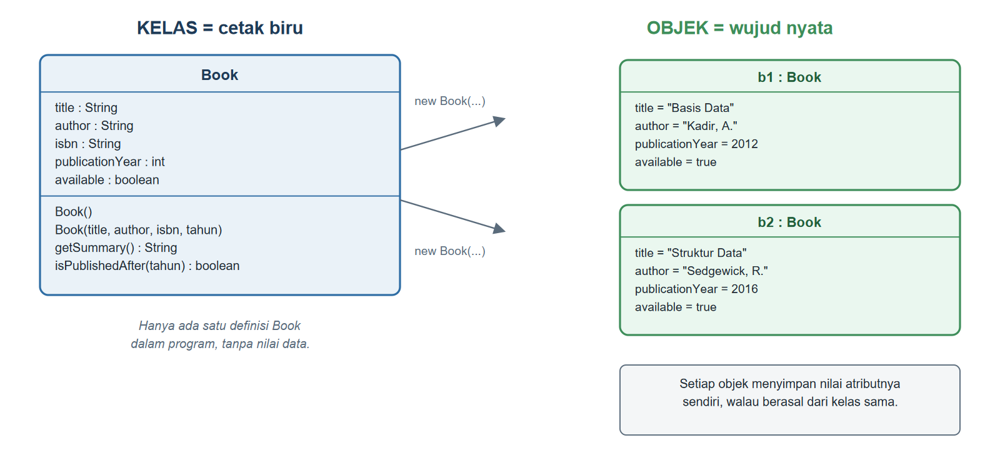
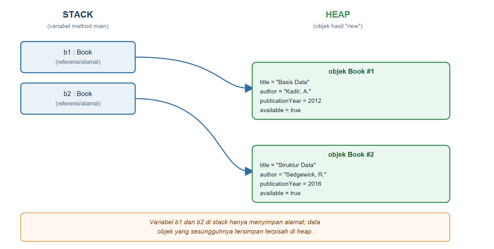

# BAB II.
# (KELAS, OBJEK, ATRIBUT, METHOD, DAN CONSTRUCTOR)

### CPMK/ Sub-CPMK :

- **CPMK2** : Mahasiswa mampu mengimplementasikan konsep pemrograman berorientasi objek (enkapsulasi, pewarisan, polimorfisme, abstraksi, *interface*, penanganan eksepsi, *collection*, dan *generics*) dalam bahasa Java untuk menyelesaikan masalah.
- **Sub-CPMK1** : Mahasiswa mampu menjelaskan paradigma pemrograman berorientasi objek serta menerapkan konsep kelas dan objek (atribut, *method*, *constructor*) dalam bahasa Java.

### Indikator Penilaian:

Ketepatan menerapkan kelas, objek, atribut, *method*, dan *constructor* dalam Java, meliputi pendeklarasian kelas sebagai cetak biru, pembuatan objek dengan kata kunci `new`, pemilihan tipe data atribut, perancangan *method* berparameter dan bernilai kembali, serta pemanfaatan *constructor overloading* dan kata kunci `this`.

### Kriteria Keberhasilan (Rubrik):

- Sangat Baik (≥ 85): Mahasiswa mampu mengidentifikasi atribut dan perilaku entitas dari sebuah kasus secara tepat, memilih tipe data yang sesuai beserta alasannya, serta mengimplementasikan kelas lengkap dengan *constructor* bertingkat yang dapat dikompilasi dan dijalankan tanpa kesalahan.
- Baik (70-84): Mahasiswa mampu membuat kelas, objek, dan *method* yang berjalan dengan benar, tetapi pemilihan atribut atau pemanfaatan *constructor overloading* dan `this` belum sepenuhnya tepat.
- Cukup (55-69): Mahasiswa mampu menulis kelas sederhana dan membuat objeknya, tetapi masih memerlukan panduan dalam merancang *method* bernilai kembali dan *constructor* yang sesuai kebutuhan kasus.

### Deskripsi Kemampuan yang Diharapkan:

Setelah mempelajari bab ini, mahasiswa diharapkan mampu menerjemahkan entitas dari sebuah kasus menjadi kelas Java yang memiliki atribut, *method*, dan *constructor*, lalu membuat serta memanipulasi objek dari kelas tersebut. Dalam konteks Sistem Informasi, kemampuan ini merupakan langkah pertama dalam mewujudkan entitas data organisasi, misalnya data buku dan anggota perpustakaan, menjadi komponen program yang dapat dipakai ulang oleh modul lain.

## A. Pendahuluan

Bab I telah menunjukkan bahwa menyatukan data dan perilaku ke dalam satu kelas membuat program lebih mudah dirawat dibanding menyebarkannya ke berbagai larik dan fungsi yang terpisah. Namun, contoh pada Bab I masih sangat sederhana: kelas `BukuSederhana` hanya dituliskan sebagai kelas bersarang di dalam satu berkas, dan objeknya dibentuk dengan langsung mengisi atribut satu per satu dari luar. Cara ini belum mencerminkan bagaimana kelas sesungguhnya dirancang pada proyek nyata, tempat setiap kelas hidup pada berkasnya sendiri dan menyediakan cara pembuatan objek yang lebih terkendali melalui *constructor*.

Bab ini membangun kelas `Book` dan `Member` yang sesungguhnya untuk SIP-USG, lengkap dengan atribut yang mewakili data nyata sebuah buku dan anggota perpustakaan, *method* yang mengembalikan informasi dalam bentuk yang siap ditampilkan, serta *constructor* yang memastikan setiap objek baru langsung berada pada keadaan yang wajar sejak awal dibentuk. Dengan menuntaskan bab ini, mahasiswa akan mampu merancang kelas dari sebuah kebutuhan data, sebuah keterampilan yang akan dipakai berulang kali pada seluruh bab berikutnya setiap kali SIP-USG membutuhkan entitas baru, seperti *Journal*, *Loan*, dan seterusnya.

## B. Kelas sebagai Cetak Biru dan Objek sebagai Instans

Bayangkan proses pendaftaran anggota baru di perpustakaan kampus. Petugas tidak mengarang ulang format data setiap kali ada pendaftar; ia selalu mengisikan data ke dalam formulir yang sama, yang sudah menentukan kolom apa saja yang harus diisi, misalnya nomor induk, nama, dan surel. Formulir itu adalah cetak biru, sedangkan setiap lembar formulir yang telah diisi oleh mahasiswa tertentu adalah wujud nyata dari cetak biru tersebut. Kelas dalam Java berperan persis seperti formulir kosong itu: ia menentukan atribut apa saja yang dimiliki setiap objek, tanpa menyimpan nilai data sungguhan. Objek adalah "formulir yang sudah terisi", dibuat dari kelas menggunakan kata kunci `new`.

Kode Program {{kp:kelas-book}} menuliskan kelas `Book` untuk SIP-USG. Kelas ini akan dipakai dan disempurnakan pada hampir seluruh bab berikutnya, sehingga penting untuk dipahami secara menyeluruh sejak awal.

Kode Program #kelas-book. Kelas Book untuk SIP-USG

```java
package id.ac.usg.sip.model;

public class Book {
    String title;
    String author;
    String isbn;
    int publicationYear;
    boolean available;

    public Book() {
        this.available = true;
    }

    public Book(String title, String author,
            String isbn, int publicationYear) {
        this.title = title;
        this.author = author;
        this.isbn = isbn;
        this.publicationYear = publicationYear;
        this.available = true;
    }

    public String getSummary() {
        String status =
            available ? "Tersedia" : "Dipinjam";
        return title + " (" + publicationYear
            + ") oleh " + author
            + " [" + status + "]";
    }

    public boolean isPublishedAfter(int year) {
        return publicationYear > year;
    }

    public void displayInfo() {
        System.out.println(getSummary());
    }
}
```

Baris `public class Book` mendeklarasikan kelas baru bernama `Book`. Lima baris berikutnya, yaitu `title`, `author`, `isbn`, `publicationYear`, dan `available`, adalah atribut (juga disebut *field*) yang menyatakan data apa saja yang dimiliki setiap objek `Book`. Perhatikan bahwa atribut-atribut ini sengaja belum diberi kata kunci `private`; bab ini berfokus pada mekanisme dasar kelas dan objek, sedangkan cara melindungi atribut secara benar akan dibahas tuntas pada Bab III melalui *access modifier*.

Untuk membuat objek dari kelas `Book`, gunakan kata kunci `new` diikuti nama kelas dan tanda kurung, seperti `new Book()` atau `new Book("Struktur Data", "Sedgewick, R.", "978-1", 2016)`. Setiap pemanggilan `new` mengalokasikan ruang memori baru yang cukup untuk menampung seluruh atribut objek tersebut. Gambar {{g:bab02-kelas-vs-objek}} menggambarkan hubungan antara satu kelas `Book` dengan dua objek yang dibuat darinya, `b1` dan `b2`, yang masing-masing menyimpan nilai atributnya sendiri meskipun berasal dari cetak biru yang sama persis.



Secara teknis, variabel seperti `b1` dan `b2` yang dideklarasikan di dalam *method* tidak menyimpan objek itu sendiri, melainkan hanya menyimpan referensi (alamat rujukan) menuju tempat objek tersebut sesungguhnya berada di memori. Java mengelola dua wilayah memori yang berbeda: *stack*, tempat variabel lokal dan referensi disimpan selama sebuah *method* berjalan, dan *heap*, tempat seluruh objek yang dibuat dengan `new` benar-benar hidup selama masih ada yang merujuknya. Gambar {{g:bab02-stack-heap}} menggambarkan pemisahan ini.



Pemahaman ini penting karena menjelaskan mengapa mengubah atribut lewat satu referensi objek dapat memengaruhi referensi lain yang menunjuk ke objek yang sama, sebuah perilaku yang akan sering ditemui ketika SIP-USG mengelola banyak objek `Book` yang saling terhubung pada bab-bab berikutnya.

## C. Atribut dan Tipe Data

Pemilihan tipe data untuk setiap atribut bukan keputusan sembarangan. Atribut `title`, `author`, dan `isbn` pada kelas `Book` bertipe `String` karena ketiganya adalah rangkaian karakter yang tidak dipakai untuk perhitungan matematis. Atribut `publicationYear` bertipe `int` karena nilainya berupa bilangan bulat yang bisa dibandingkan secara numerik, sebagaimana terlihat pada *method* `isPublishedAfter`. Atribut `available` bertipe `boolean` karena hanya memiliki dua kemungkinan keadaan, yaitu `true` atau `false`. Tabel {{t:tipe-primitif}} merangkum delapan tipe data primitif bawaan Java beserta kegunaannya.

Tabel #tipe-primitif. Tipe data primitif dalam Java

| Tipe | Ukuran | Contoh Kegunaan pada SIP-USG |
|---|---|---|
| `byte` | 8 bit | Nilai kecil, jarang dipakai langsung |
| `short` | 16 bit | Nilai kecil, jarang dipakai langsung |
| `int` | 32 bit | `publicationYear`, jumlah eksemplar |
| `long` | 64 bit | Nomor induk dalam skala sangat besar |
| `float` | 32 bit, desimal | Jarang dipakai; presisi terbatas |
| `double` | 64 bit, desimal | Nominal denda keterlambatan |
| `char` | 16 bit | Satu huruf, misalnya kode rak |
| `boolean` | 1 bit (logis) | `available`, status aktif anggota |

Perlu dibedakan antara tipe data primitif pada Tabel {{t:tipe-primitif}} dengan tipe data objek seperti `String`. Nilai primitif disimpan langsung pada tempat variabelnya berada, sedangkan variabel bertipe `String` sesungguhnya adalah referensi menuju objek `String` di *heap*, sama seperti referensi `b1` dan `b2` pada Gambar {{g:bab02-stack-heap}}. Ketepatan memilih tipe data akan berpengaruh langsung pada bab-bab mendatang, misalnya `double` untuk perhitungan denda pada Bab VI atau `LocalDate` untuk tanggal peminjaman pada praktikum lanjutan.

## D. Method: Deklarasi, Parameter, dan Nilai Kembali

Sebuah *method* dideklarasikan dengan pola `tipeKembali namaMethod(daftar parameter) { badan method }`. Perhatikan *method* `getSummary()` pada Kode Program {{kp:kelas-book}}: kata `String` sebelum nama *method* menyatakan bahwa *method* ini wajib mengembalikan sebuah nilai bertipe `String` melalui pernyataan `return`, dan tanda kurung yang kosong menunjukkan bahwa *method* ini tidak menerima parameter apa pun. Setiap kali `getSummary()` dipanggil pada suatu objek `Book`, *method* ini membaca atribut objek tersebut, menyusun sebuah kalimat ringkas, lalu mengembalikannya kepada pemanggil.

Bandingkan dengan *method* `isPublishedAfter(int year)`. Kata `int year` di dalam tanda kurung adalah parameter, yaitu nilai yang harus disediakan pemanggil setiap kali *method* ini dipanggil, misalnya `b2.isPublishedAfter(2015)`. Nilai `2015` tersebut akan disalin ke dalam variabel `year` selama *method* berjalan, lalu dibandingkan dengan atribut `publicationYear` milik objek yang memanggilnya. *Method* ini mengembalikan `boolean`, sehingga hasilnya dapat langsung dipakai di dalam kondisi `if` atau dicetak seperti pada Kode Program {{kp:bab02-demo}}.

*Method* `displayInfo()` berbeda lagi: kata `void` di depan namanya menyatakan bahwa *method* ini tidak mengembalikan nilai apa pun. *Method* semacam ini dipanggil semata-mata untuk efeknya, dalam hal ini mencetak informasi ke layar, bukan untuk hasil yang akan dipakai kembali oleh kode lain. Ketiga pola ini, yaitu *method* tanpa parameter dengan nilai kembali, *method* berparameter dengan nilai kembali, dan *method* tanpa nilai kembali, mencakup hampir seluruh bentuk *method* yang akan ditemui sepanjang buku ini.

## E. Constructor, Overloading Constructor, dan Kata Kunci this

*Constructor* adalah blok kode khusus yang dijalankan satu kali setiap saat objek baru dibuat dengan `new`, bertugas memastikan objek tersebut langsung berada pada keadaan awal yang wajar. *Constructor* selalu memiliki nama yang identik dengan nama kelasnya dan tidak memiliki tipe kembali sama sekali, bahkan bukan `void`. Kode Program {{kp:kelas-book}} memiliki dua *constructor*: `Book()` tanpa parameter, dan `Book(String title, String author, String isbn, int publicationYear)` dengan empat parameter. Menyediakan lebih dari satu *constructor* dengan daftar parameter yang berbeda pada kelas yang sama disebut *constructor overloading*; Java memilih *constructor* yang sesuai berdasarkan jumlah dan tipe argumen yang dituliskan saat `new` dipanggil.

Perhatikan penulisan `this.title = title;` di dalam *constructor* berparameter. Nama parameter `title` sengaja dibuat sama dengan nama atribut `title` agar kode lebih mudah dibaca, tetapi hal ini menimbulkan ambiguitas: di dalam badan *constructor*, `title` begitu saja akan merujuk pada parameter, bukan atributnya. Kata kunci `this` menunjuk pada objek yang sedang dibuat itu sendiri, sehingga `this.title` secara eksplisit merujuk pada atribut milik objek, membedakannya dari parameter `title` yang nilainya baru saja diterima. Tanpa `this`, pernyataan `title = title;` hanya akan menyalin nilai parameter ke dirinya sendiri dan atribut objek akan tetap kosong, sebuah kesalahan yang sering luput dari perhatian pemula karena tidak menimbulkan galat kompilasi.

Kode Program {{kp:kelas-member}} menerapkan pola yang sama pada kelas `Member`, sekaligus memperlihatkan bagaimana *constructor* tanpa parameter dapat menetapkan nilai baku (dalam hal ini batas maksimum lima buku yang boleh dipinjam) tanpa harus diisi ulang setiap kali.

Kode Program #kelas-member. Kelas Member untuk SIP-USG

```java
package id.ac.usg.sip.model;

public class Member {
    String memberId;
    String name;
    String email;
    int maxLoan;

    public Member() {
        this.maxLoan = 3;
    }

    public Member(String memberId, String name,
            String email) {
        this.memberId = memberId;
        this.name = name;
        this.email = email;
        this.maxLoan = 3;
    }

    public String getSummary() {
        return memberId + " - " + name
            + " (maks " + maxLoan + " buku)";
    }

    public boolean canBorrow(int loanCountNow) {
        return loanCountNow < maxLoan;
    }

    public void displayInfo() {
        System.out.println(getSummary());
    }
}
```

## F. Praktikum Terbimbing: Membangun Kelas Book dan Member pada SIP-USG

Praktikum ini menuntun pembuatan kelas `Book` dan `Member` sebagai fondasi model data SIP-USG, lalu mengujinya melalui satu kelas demonstrasi.

1. Pada proyek NetBeans, buat paket baru bernama `id.ac.usg.sip.model` melalui klik kanan folder *Source Packages → New → Java Package*.
2. Buat kelas baru `Book` di dalam paket tersebut, lalu salin isi Kode Program {{kp:kelas-book}}.
3. Buat kelas baru `Member` pada paket yang sama, lalu salin isi Kode Program {{kp:kelas-member}}.
4. Buat kelas baru `Bab02Demo` pada paket yang sama, lalu salin isi Kode Program {{kp:bab02-demo}}.
5. Tinjau kembali setiap *constructor* dan pastikan seluruh parameter sudah sesuai urutannya dengan atribut yang dituju.
6. Jalankan `Bab02Demo` dengan tombol *Run File* (Shift+F6), lalu amati keluaran pada jendela *Output*.
7. Ubah salah satu nilai argumen pada `Bab02Demo`, misalnya tahun terbit, kompilasi ulang, dan amati bagaimana keluaran `isPublishedAfter` ikut berubah.

Kode Program #bab02-demo. Demonstrasi objek Book dan Member

```java
package id.ac.usg.sip.model;

public class Bab02Demo {
    public static void main(String[] args) {
        Book b1 = new Book();
        b1.title = "Basis Data";
        b1.author = "Kadir, A.";
        b1.publicationYear = 2012;

        Book b2 = new Book("Struktur Data",
            "Sedgewick, R.", "978-1", 2016);

        b1.displayInfo();
        b2.displayInfo();
        System.out.println("Terbit setelah 2015? "
            + b2.isPublishedAfter(2015));

        Member m1 = new Member("A0001",
            "Nadia Ramadhani", "nadia@usg.ac.id");
        m1.displayInfo();
        System.out.println("Boleh pinjam lagi? "
            + m1.canBorrow(2));
    }
}
```

Keluaran Program:

```
Basis Data (2012) oleh Kadir, A. [Tersedia]
Struktur Data (2016) oleh Sedgewick, R. [Tersedia]
Terbit setelah 2015? true
A0001 - Nadia Ramadhani (maks 3 buku)
Boleh pinjam lagi? true
```

Perhatikan bahwa objek `b1` dibuat dengan *constructor* tanpa parameter lalu atributnya diisi satu per satu, sedangkan objek `b2` langsung dibuat lengkap melalui *constructor* berparameter. Kedua cara ini sah karena atribut `Book` masih memakai akses baku (belum `private`), sehingga `Bab02Demo` yang berada pada paket yang sama dapat mengaksesnya secara langsung. Bab III akan mengubah keadaan ini dan menunjukkan mengapa akses langsung semacam ini sebaiknya dibatasi.

#### Kesalahan Umum dan Cara Mengatasinya

| Gejala/Pesan Error | Penyebab | Perbaikan |
|---|---|---|
| `error: missing return statement` | *Method* dideklarasikan bertipe kembali (bukan `void`) tetapi tidak semua jalur kode memiliki `return` | Pastikan setiap kemungkinan alur di dalam *method* diakhiri `return` dengan nilai bertipe sesuai |
| `NullPointerException` saat memanggil `.length()` pada `title` | Atribut `String` belum diisi (masih `null`) karena objek dibuat dengan `new Book()` tanpa mengisi atributnya | Isi atribut segera setelah objek dibuat, atau gunakan *constructor* berparameter |
| `error: constructor Book in class Book cannot be applied to given types` | Jumlah atau urutan argumen saat `new Book(...)` tidak cocok dengan *constructor* mana pun | Sesuaikan argumen dengan salah satu daftar parameter *constructor* yang tersedia |
| Nilai atribut tetap `null`/`0` walau `this.title = title;` sudah ditulis | Nama parameter *constructor* tidak sama dengan nama atribut, sehingga `this` yang seharusnya dipakai malah dilewatkan pada baris lain | Periksa setiap baris penugasan, pastikan `this.namaAtribut` dipakai secara konsisten |

### Rangkuman

Kelas adalah cetak biru yang mendeklarasikan atribut dan *method* suatu entitas, sedangkan objek adalah wujud nyata dari kelas tersebut yang dibuat menggunakan kata kunci `new` dan disimpan pada wilayah memori *heap*; variabel yang menunjuk padanya, seperti pada *stack*, hanya menyimpan referensi. Pemilihan tipe data atribut harus disesuaikan dengan sifat datanya, misalnya `String` untuk teks, `int` untuk bilangan bulat, dan `boolean` untuk keadaan dua kemungkinan. *Method* dideklarasikan dengan tipe kembali, nama, dan daftar parameter; *method* dapat mengembalikan nilai atau tidak (`void`), serta dapat menerima nol atau lebih parameter yang nilainya disediakan pemanggil. *Constructor* menjamin objek baru langsung berada pada keadaan yang wajar sejak awal dibentuk, dapat dibuat lebih dari satu melalui *constructor overloading*, dan kata kunci `this` dipakai untuk membedakan atribut objek dari parameter yang kebetulan memiliki nama sama. Kelas `Book` dan `Member` yang dibangun pada bab ini akan terus dipakai dan disempurnakan pada seluruh bab berikutnya.

### Soal/Pertanyaan

1. (C2) Jelaskan perbedaan antara kelas dan objek, serta kaitannya dengan kata kunci `new`!
2. (C2) Sebutkan tiga tipe data primitif Java beserta satu contoh atribut pada kelas `Book` atau `Member` yang cocok memakai masing-masing tipe tersebut!
3. (C3) Perhatikan Kode Program {{kp:kelas-book}}. Jelaskan mengapa `this` diperlukan pada *constructor* berparameter, dan apa yang akan terjadi pada nilai atribut `title` jika seluruh `this.` dihapus dari *constructor* tersebut!
4. (C3) Telusuri Kode Program {{kp:bab02-demo}} baris demi baris, lalu jelaskan mengapa `b1.isPublishedAfter(2015)` tidak dipanggil pada program tersebut walau *method*-nya tersedia pada kelas `Book`!
5. (C4) Bandingkan cara objek `b1` dan `b2` dibuat pada Kode Program {{kp:bab02-demo}}. Analisis kelebihan dan kekurangan masing-masing cara, dikaitkan dengan risiko atribut yang lupa diisi!
6. (C4) Gambarkan (dalam bentuk uraian, tanpa perlu menggambar) posisi variabel `m1` dan objek `Member` yang dirujuknya pada *stack* dan *heap*, mengikuti pola Gambar {{g:bab02-stack-heap}}!
7. (C5) Rancang sebuah *method* baru bernama `isOverdue(int daysBorrowed, int maxDays)` pada kelas `Book` yang mengembalikan `boolean`. Tuliskan deklarasi *method* tersebut beserta penjelasan tipe kembali dan parameternya, tanpa perlu menulis badan *method* secara lengkap!
8. (C6) SIP-USG ke depannya akan memiliki jenis koleksi lain selain buku, misalnya jurnal dan koleksi digital, yang berbagi sebagian atribut dengan `Book` (judul, status ketersediaan) tetapi memiliki atribut khas masing-masing. Nilailah apakah menyalin kelas `Book` menjadi `Journal` dan mengubah sebagian isinya merupakan strategi yang baik untuk SIP-USG hingga bab-bab akhir buku ini!

### Rujukan Bab

- Deitel, P. J., & Deitel, H. M. (2018). *Java how to program, early objects* (11th ed.). Pearson Education.
- Kadir, A. (2012). *Algoritma & pemrograman menggunakan Java*. Penerbit Andi.
- Oracle Corporation. (2024). *The Java tutorials: Object-oriented programming concepts*. https://docs.oracle.com/javase/tutorial/java/concepts/
