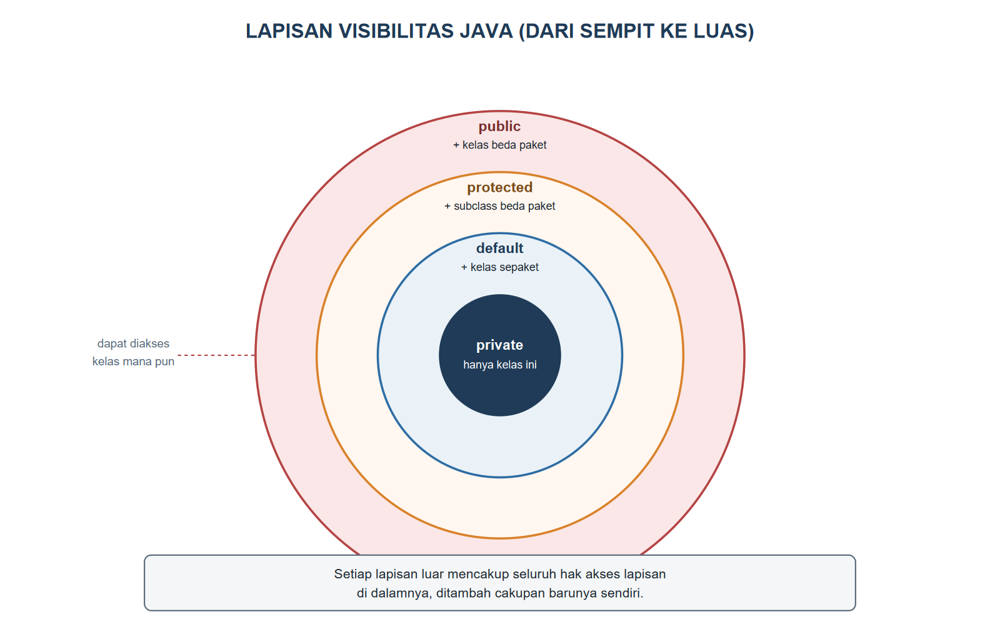
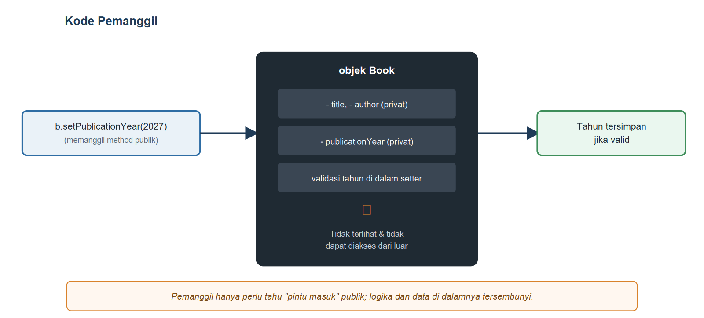

# BAB III.
# (ENKAPSULASI, ACCESS MODIFIER, DAN INFORMATION HIDING)

### CPMK/ Sub-CPMK :

- **CPMK2** : Mahasiswa mampu mengimplementasikan konsep pemrograman berorientasi objek (enkapsulasi, pewarisan, polimorfisme, abstraksi, *interface*, penanganan eksepsi, *collection*, dan *generics*) dalam bahasa Java untuk menyelesaikan masalah.
- **Sub-CPMK2** : Mahasiswa mampu menerapkan enkapsulasi dan *information hiding* melalui *access modifier* dan *getter/setter*.

### Indikator Penilaian:

Ketepatan menerapkan enkapsulasi melalui *access modifier* dan *getter/setter*, meliputi pemilihan tingkat akses `private`, *default*, `protected`, dan `public` secara tepat, penyembunyian data internal objek, penempatan validasi data di dalam *setter*, serta perancangan kelas yang tidak dapat diubah (*immutable*) apabila diperlukan.

### Kriteria Keberhasilan (Rubrik):

- Sangat Baik (≥ 85): Mahasiswa mampu mengidentifikasi data yang harus dilindungi pada sebuah kasus, memilih *access modifier* beserta alasan yang logis, dan menerapkan validasi di dalam *setter* sehingga objek tidak pernah berada pada keadaan yang tidak sah.
- Baik (70-84): Mahasiswa mampu menerapkan atribut `private` beserta *getter/setter* dengan benar, tetapi aturan validasi yang dibuat belum mencakup seluruh kemungkinan data yang tidak sah.
- Cukup (55-69): Mahasiswa mampu membuat *getter/setter* secara mekanis, tetapi belum mampu menjelaskan tujuan *information hiding* maupun memilih tingkat akses yang sesuai untuk tiap anggota kelas.

### Deskripsi Kemampuan yang Diharapkan:

Setelah mempelajari bab ini, mahasiswa diharapkan mampu melindungi keadaan internal objek dengan membatasi akses langsung terhadap atribut serta menyediakan jalur akses yang terkendali dan tervalidasi. Dalam konteks Sistem Informasi, kemampuan ini penting untuk menjaga integritas data, misalnya memastikan nomor induk mahasiswa dan status keanggotaan perpustakaan hanya dapat diubah melalui aturan bisnis yang sah sehingga kesalahan input tidak merusak basis data.

## A. Pendahuluan

Kelas `Book` dan `Member` yang dibangun pada Bab II berfungsi dengan baik, tetapi menyimpan sebuah kelemahan serius: seluruh atributnya memakai akses baku (*default*), sehingga kelas mana pun dalam paket yang sama dapat mengubah nilainya secara langsung tanpa melalui pemeriksaan apa pun. Kode `b1.publicationYear = -500;` atau `m1.memberId = "";` akan berhasil dikompilasi dan dijalankan tanpa keluhan, padahal keduanya jelas tidak masuk akal untuk sebuah aplikasi perpustakaan sungguhan. Semakin banyak bagian kode yang boleh menyentuh atribut secara langsung, semakin sulit pula memastikan objek selalu berada pada keadaan yang valid, terutama ketika aplikasi berkembang dan dikerjakan oleh lebih dari satu orang.

Bab ini menutup celah tersebut dengan menerapkan pilar enkapsulasi secara sungguh-sungguh: seluruh atribut `Book` dan `Member` diubah menjadi `private`, lalu satu-satunya jalan untuk membaca atau mengubahnya adalah melalui *method* `getter` dan `setter` yang dapat memuat aturan pemeriksaan. Manfaatnya langsung terasa: begitu aturan validasi ditulis satu kali di dalam *setter*, seluruh bagian aplikasi yang memanggil *setter* tersebut otomatis ikut terlindungi, tanpa perlu mengulang pemeriksaan yang sama di banyak tempat.

## B. Konsep Enkapsulasi dan Information Hiding

Bayangkan proses peminjaman buku di perpustakaan. Mahasiswa tidak diperkenankan masuk ke gudang arsip dan mengubah sendiri catatan ketersediaan sebuah buku; ia harus melalui loket sirkulasi, menyerahkan kartu anggota dan buku yang ingin dipinjam, lalu petugas atau sistem yang memeriksa kelayakan sebelum mengubah status buku tersebut menjadi "dipinjam". Loket ini adalah satu-satunya jalur resmi menuju data, dan setiap permintaan yang lewat jalur ini pasti diperiksa terlebih dahulu. *Enkapsulasi* menerapkan gagasan yang sama pada objek: atribut disembunyikan dari akses langsung, dan satu-satunya jalan mengubahnya adalah melalui *method* yang telah ditentukan kelas itu sendiri.

Konsep ini berkaitan erat dengan *information hiding*, yaitu prinsip perancangan yang menyembunyikan detail implementasi suatu kelas dari kelas lain yang memakainya. Kelas pemakai `Book` tidak perlu tahu bahwa validasi tahun terbit dilakukan dengan membandingkan terhadap rentang `1450` sampai `2100`; ia cukup tahu bahwa jika tahun yang dikirim tidak valid, *setter* akan menolaknya. Bila suatu saat aturan validasi berubah, misalnya batas bawah disesuaikan menjadi tahun ditemukannya mesin cetak modern, perubahan itu cukup dilakukan pada satu tempat di dalam kelas `Book`, tanpa menyentuh kode mana pun yang memanggilnya.

## C. Access Modifier: private, default, protected, public

Java menyediakan empat tingkat visibilitas untuk atribut, *method*, maupun kelas: `private`, *default* (tanpa kata kunci sama sekali), `protected`, dan `public`. Keempatnya membentuk lapisan yang semakin melebar, sebagaimana digambarkan pada Gambar {{g:bab03-lapisan-akses}}: `private` hanya dapat diakses dari dalam kelas yang sama, *default* menambahkan akses dari kelas lain pada paket yang sama, `protected` menambahkan lagi akses dari *subclass* meskipun berada pada paket berbeda, dan `public` dapat diakses dari kelas mana pun tanpa batasan.



Tabel {{t:matriks-akses}} merangkum keempat tingkat tersebut dalam bentuk matriks yang dapat dijadikan rujukan cepat.

Tabel #matriks-akses. Matriks visibilitas access modifier Java

| Pemanggil | private | default | protected | public |
|---|---|---|---|---|
| Kelas yang sama | Boleh | Boleh | Boleh | Boleh |
| Kelas lain, paket sama | Tidak | Boleh | Boleh | Boleh |
| *Subclass*, paket beda | Tidak | Tidak | Boleh | Boleh |
| Kelas lain, paket beda | Tidak | Tidak | Tidak | Boleh |

Kode Program {{kp:akses-model}} memperagakan keempat tingkat tersebut pada satu kelas nyata, sedangkan Kode Program {{kp:akses-demo}} memanggilnya dari kelas lain yang berada pada paket berbeda.

Kode Program #akses-model. Empat tingkat akses pada satu kelas

```java
package id.ac.usg.sip.model;

public class AksesModel {
    private String rahasia = "hanya kelas ini";
    String sepaket = "sekelas & sepaket";
    protected String turunan = "sepaket & subclass";
    public String publik = "semua kelas";

    public void tampilkanSemua() {
        System.out.println("private   : " + rahasia);
        System.out.println("default   : " + sepaket);
        System.out.println("protected : " + turunan);
        System.out.println("public    : " + publik);
    }
}
```

Kode Program #akses-demo. Memanggil AksesModel dari paket lain

```java
package id.ac.usg.sip.app;

import id.ac.usg.sip.model.AksesModel;

public class AksesDemo {
    public static void main(String[] args) {
        AksesModel a = new AksesModel();
        a.tampilkanSemua();

        // Dari paket lain, hanya atribut public
        // yang boleh diakses langsung seperti ini:
        System.out.println("Diakses langsung: "
            + a.publik);

        // Baris berikut SENGAJA tidak dituliskan
        // karena tidak akan berhasil dikompilasi:
        // a.rahasia    -> private, beda kelas
        // a.sepaket    -> default, beda paket
        // a.turunan    -> protected, bukan subclass
    }
}
```

Keluaran Program:

```
private   : hanya kelas ini
default   : sekelas & sepaket
protected : sepaket & subclass
public    : semua kelas
Diakses langsung: semua kelas
```

Perhatikan bahwa `AksesDemo` berada pada paket `id.ac.usg.sip.app`, berbeda dari `AksesModel` yang berada pada `id.ac.usg.sip.model`. Dari posisi ini, `AksesDemo` hanya sanggup menyentuh atribut `publik` secara langsung; ketiga baris komentar di bagian akhir menunjukkan pemanggilan yang akan ditolak kompiler seandainya dituliskan sungguhan, tepat sesuai Tabel {{t:matriks-akses}} pada baris "Kelas lain, paket beda". *Method* `tampilkanSemua()` sendiri tetap dapat membaca keempat atribut tanpa kecuali karena *method* tersebut berada di dalam kelas `AksesModel` itu sendiri, sehingga selalu memiliki akses penuh terhadap anggota kelasnya sendiri, berapa pun tingkat visibilitasnya.

## D. Getter, Setter, dan Validasi Data di Dalam Setter

Bekal dari bagian C sekarang diterapkan pada `Book`. Seluruh atributnya diubah menjadi `private`, lalu setiap atribut mendapatkan *getter* untuk membacanya dan *setter* untuk mengubahnya. Perbedaan pentingnya dibandingkan sekadar mengembalikan atau menyalin nilai adalah bahwa *setter* kini boleh memuat pemeriksaan sebelum benar-benar menyimpan nilai baru, sebagaimana terlihat pada Kode Program {{kp:book-privat}}.

Kode Program #book-privat. Cuplikan Book.java: atribut privat dan validasi pada setter

```java
public class Book {
    private String title;
    // ... author, isbn, publicationYear, dan
    // available kini juga private; setPublication-
    // Year() memvalidasi tahun dengan pola serupa

    public Book(String title, String author,
            String isbn, int publicationYear) {
        setTitle(title);
        this.author = author;
        this.isbn = isbn;
        setPublicationYear(publicationYear);
        this.available = true;
    }

    public String getTitle() {
        return title;
    }

    public void setTitle(String title) {
        if (title == null || title.isBlank()) {
            throw new IllegalArgumentException(
                "Judul tidak boleh kosong");
        }
        this.title = title;
    }
    // ... getter/setter atribut lain, getSummary(),
    // isPublishedAfter(), dan displayInfo() memakai
    // pola yang sama, tidak berubah dari Bab II
}
```

Perhatikan bahwa *constructor* berparameter kini memanggil `setTitle(title)` dan `setPublicationYear(publicationYear)`, bukan menugaskan nilai secara langsung ke atribut. Dengan begitu, validasi yang sama berlaku baik ketika nilai diberikan lewat *constructor* saat objek pertama kali dibuat, maupun lewat *setter* kapan pun setelahnya; aturan bisnis hanya perlu dituliskan satu kali di dalam *setter*. Gambar {{g:bab03-kotak-hitam}} meringkas gagasan ini: pemanggil di luar kelas hanya berinteraksi dengan "pintu masuk" berupa *method* publik, sementara data dan aturan pemeriksaannya tersembunyi rapat di dalam objek.



Jika `setTitle` dipanggil dengan `null` atau untaian kosong, *method* ini melemparkan `IllegalArgumentException`, sebuah mekanisme penanganan kesalahan yang akan dibahas tuntas pada Bab VIII. Untuk saat ini, cukup dipahami bahwa melemparkan eksepsi adalah cara *setter* menolak nilai yang tidak sah sekaligus memberi tahu pemanggil alasan penolakannya, jauh lebih aman dibandingkan diam-diam menyimpan nilai yang salah atau membiarkan program berhenti tanpa pesan yang jelas.

## E. Immutability dan Praktik Baik Bloch (2018)

Sebagian data sebaiknya tidak dapat diubah sama sekali setelah objeknya dibuat. Joshua Bloch, dalam *Effective Java* (2018), menganjurkan agar kelas dirancang tidak dapat diubah (*immutable*) apabila memungkinkan, karena objek yang keadaannya tidak pernah berubah jauh lebih mudah dipahami, diuji, dan dipakai bersama pada aplikasi yang berjalan dengan banyak alur secara bersamaan. Sebuah kelas dikatakan *immutable* apabila seluruh atributnya `final`, tidak memiliki *setter* sama sekali, dan nilainya hanya ditentukan satu kali melalui *constructor*.

Kode Program {{kp:kelas-isbn}} menerapkan prinsip ini pada kelas `Isbn`, yang mewakili kode ISBN sebuah buku sebagai nilai yang tidak berubah setelah dibuat.

Kode Program #kelas-isbn. Kelas Isbn yang bersifat immutable

```java
package id.ac.usg.sip.model;

public final class Isbn {
    private final String value;

    public Isbn(String value) {
        String v = value == null ? "" : value.trim();
        if (!v.matches("[0-9-]{10,17}")) {
            throw new IllegalArgumentException(
                "Format ISBN tidak valid: " + value);
        }
        this.value = v;
    }

    public String getValue() {
        return value;
    }

    @Override
    public String toString() {
        return value;
    }
}
```

Kata kunci `final` pada kelas `Isbn` mencegah kelas ini diturunkan (dibahas lebih lanjut pada Bab V), sedangkan `final` pada atribut `value` memastikan nilainya hanya dapat ditetapkan satu kali, yaitu di dalam *constructor*, dan tidak dapat diubah lagi setelahnya karena tidak ada *setter* yang disediakan. Validasi format tetap dilakukan di dalam *constructor*, sehingga tidak mungkin ada objek `Isbn` yang berhasil dibuat dengan nilai yang tidak sah. Sebagai latihan lanjutan, atribut `isbn` pada kelas `Book` dapat diganti dari `String` polos menjadi `Isbn` seperti ini agar formatnya selalu terjamin benar; latihan ini menjadi salah satu Soal/Pertanyaan pada akhir bab.

## F. Praktikum Terbimbing: Mengamankan Member dan Validasi Nomor Induk Mahasiswa

Praktikum ini menerapkan pola yang sama seperti bagian D pada kelas `Member`, dengan tambahan validasi format nomor induk mahasiswa (NIM).

1. Buka kelas `Member` yang telah dibuat pada Bab II, lalu ubah seluruh atributnya menjadi `private`.
2. Tambahkan *getter* untuk setiap atribut, mengikuti pola `getNamaAtribut()` yang telah dipelajari pada Bab II.
3. Tambahkan *setter* `setMemberId(String memberId)` yang menolak nilai selain delapan digit angka, mengikuti Kode Program {{kp:member-privat}}.
4. Tambahkan *setter* `setEmail(String email)` yang menolak nilai tanpa tanda `@`.
5. Ubah kedua *constructor* agar memanggil *setter* yang relevan, bukan menugaskan atribut secara langsung.
6. Buat kelas `Bab03Demo` pada paket `id.ac.usg.sip.app`, lalu salin Kode Program {{kp:bab03-demo}}.
7. Jalankan `Bab03Demo` dan amati bagaimana percobaan membuat `Member` dengan NIM tidak valid ditolak dengan pesan yang jelas, alih-alih membuat program berhenti tanpa penjelasan.

Kode Program #member-privat. Cuplikan Member.java: validasi nomor induk mahasiswa

```java
public class Member {
    private String memberId;
    // ... name, email, dan maxLoan kini juga
    // private, mengikuti pola yang sama

    public void setMemberId(String memberId) {
        boolean valid = memberId != null
            && memberId.matches("\\d{8}");
        if (!valid) {
            throw new IllegalArgumentException(
                "NIM harus 8 digit: " + memberId);
        }
        this.memberId = memberId;
    }
    // ... getter/setter atribut lain tidak berubah
    // polanya dari Bab II
}
```

Kode Program #bab03-demo. Menguji validasi Book, Member, dan Isbn

```java
package id.ac.usg.sip.app;

import id.ac.usg.sip.model.Book;
import id.ac.usg.sip.model.Isbn;
import id.ac.usg.sip.model.Member;

public class Bab03Demo {
    public static void main(String[] args) {
        Book b = new Book("Basis Data",
            "Kadir, A.", "978-1", 2012);
        b.displayInfo();

        try {
            b.setPublicationYear(3000);
        } catch (IllegalArgumentException e) {
            System.out.println("Ditolak: "
                + e.getMessage());
        }

        try {
            Member m = new Member("A1",
                "Nadia", "nadia@usg.ac.id");
        } catch (IllegalArgumentException e) {
            System.out.println("Ditolak: "
                + e.getMessage());
        }

        Member m2 = new Member("20240001",
            "Nadia Ramadhani", "nadia@usg.ac.id");
        m2.displayInfo();

        Isbn kode = new Isbn("978-602-04-1234-5");
        System.out.println("ISBN: " + kode);
    }
}
```

Keluaran Program:

```
Basis Data (2012) oleh Kadir, A. [Tersedia]
Ditolak: Tahun terbit tidak valid: 3000
Ditolak: NIM harus 8 digit: A1
20240001 - Nadia Ramadhani (maks 3 buku)
ISBN: 978-602-04-1234-5
```

Perhatikan bahwa kedua percobaan yang gagal, yaitu tahun terbit tahun 3000 dan NIM `"A1"`, tidak menghentikan program secara paksa karena keduanya dibungkus blok `try-catch` yang menangkap `IllegalArgumentException` dan mencetak pesannya. Program tetap berjalan lancar hingga baris terakhir walaupun dua percobaan di tengahnya sengaja berisi data yang tidak sah, sebuah bukti nyata bahwa validasi pada *setter* berhasil melindungi objek `Book` dan `Member` dari data yang tidak masuk akal.

#### Kesalahan Umum dan Cara Mengatasinya

| Gejala/Pesan Error | Penyebab | Perbaikan |
|---|---|---|
| `error: title has private access in Book` | Kode di luar kelas `Book` mencoba mengakses atribut privat secara langsung, misalnya `b.title` | Gunakan `getTitle()` untuk membaca dan `setTitle(...)` untuk mengubah nilainya |
| Program berhenti dengan `IllegalArgumentException` tanpa pesan yang jelas ditangani | Pemanggil tidak membungkus pemanggilan *setter* dengan `try-catch` padahal nilainya berpotensi tidak valid | Tangkap eksepsi dengan `try-catch` di sekitar pemanggilan *setter*, atau pastikan nilai sudah diperiksa sebelum dikirim |
| Validasi pada *setter* tidak pernah terpicu walau nilai jelas tidak valid | *Constructor* masih menugaskan nilai langsung ke atribut, misalnya `this.title = title;`, alih-alih memanggil `setTitle(title)` | Ubah seluruh penugasan pada *constructor* agar memanggil *setter* yang relevan |
| `error: cannot find symbol` pada pemanggilan `getX()`/`setX()` | Nama *getter*/*setter* tidak mengikuti konvensi `getNamaAtribut`/`setNamaAtribut` dengan huruf besar pada awal nama atribut | Sesuaikan nama *method* dengan konvensi, misalnya atribut `title` menjadi `getTitle()`/`setTitle()` |

### Rangkuman

Enkapsulasi membungkus atribut suatu objek dan membatasi aksesnya melalui *access modifier*, sedangkan *information hiding* menyembunyikan detail implementasi kelas dari kelas lain yang memakainya. Java menyediakan empat tingkat visibilitas yang membentuk lapisan semakin melebar, yaitu `private`, *default*, `protected`, dan `public`, masing-masing menentukan kelas mana saja yang boleh mengaksesnya secara langsung. Atribut sebaiknya dijadikan `private` dan hanya diakses melalui *getter* untuk membaca serta *setter* untuk mengubah, karena *setter* dapat memuat validasi yang menjamin objek tidak pernah berada pada keadaan yang tidak sah; *constructor* pun sebaiknya memanggil *setter* yang sama agar aturan berlaku sejak objek pertama kali dibuat. Sebagian data, seperti kode ISBN pada kelas `Isbn`, sebaiknya dirancang tidak dapat diubah sama sekali (*immutable*) dengan menjadikan seluruh atributnya `final` dan tidak menyediakan *setter*, sesuai anjuran Bloch (2018). Kelas `Book` dan `Member` yang telah diamankan pada bab ini akan menjadi fondasi yang lebih kukuh untuk pemodelan relasi antarkelas pada Bab IV.

### Soal/Pertanyaan

1. (C2) Jelaskan perbedaan antara enkapsulasi dan *information hiding*, serta bagaimana keduanya saling berkaitan!
2. (C2) Urutkan keempat *access modifier* Java dari yang paling ketat hingga paling longgar, lalu jelaskan satu contoh penggunaan yang tepat untuk `protected` pada SIP-USG!
3. (C3) Perhatikan Kode Program {{kp:book-privat}}. Jelaskan mengapa *constructor* memanggil `setTitle(title)`, bukan langsung menugaskan `this.title = title;`!
4. (C3) Telusuri Kode Program {{kp:bab03-demo}}, lalu jelaskan mengapa program tetap berjalan hingga baris terakhir walau dua percobaan di tengahnya berisi data yang tidak valid!
5. (C4) Bandingkan Kode Program {{kp:akses-model}} dan Kode Program {{kp:akses-demo}}. Analisis mengapa `a.publik` berhasil diakses langsung dari `AksesDemo`, sementara ketiga atribut lainnya tidak, dengan merujuk pada Tabel {{t:matriks-akses}}!
6. (C4) Jelaskan mengapa kelas `Isbn` pada Kode Program {{kp:kelas-isbn}} disebut *immutable*, dan sebutkan dua ciri kode yang menunjukkan sifat tersebut!
7. (C5) Rancanglah *setter* `setMaxLoan(int maxLoan)` untuk kelas `Member` yang menolak nilai kurang dari 1 atau lebih dari 10. Tuliskan kode lengkap *method* tersebut beserta pesan kesalahannya!
8. (C6) SIP-USG menyimpan atribut `isbn` pada kelas `Book` sebagai `String` polos sejak Bab II. Nilailah apakah mengganti tipe atribut tersebut menjadi `Isbn` seperti pada Kode Program {{kp:kelas-isbn}} merupakan langkah yang tepat, dan jelaskan dampaknya terhadap kode yang sudah memanggil `getIsbn()` di bagian lain aplikasi!

### Rujukan Bab

- Bloch, J. (2018). *Effective Java* (3rd ed.). Addison-Wesley Professional.
- Deitel, P. J., & Deitel, H. M. (2018). *Java how to program, early objects* (11th ed.). Pearson Education.
