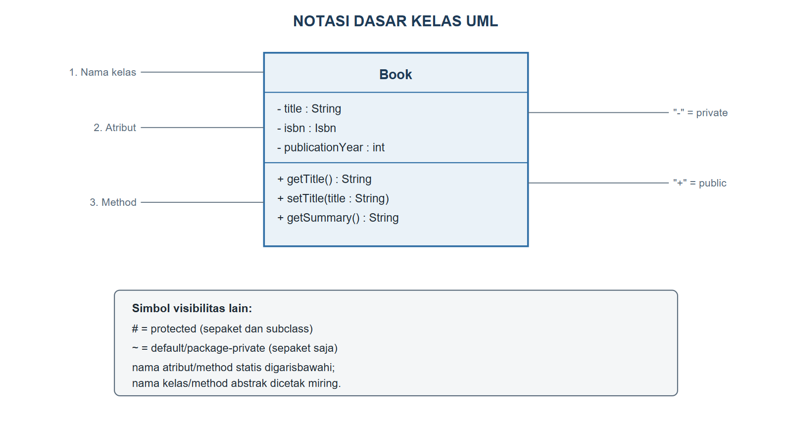
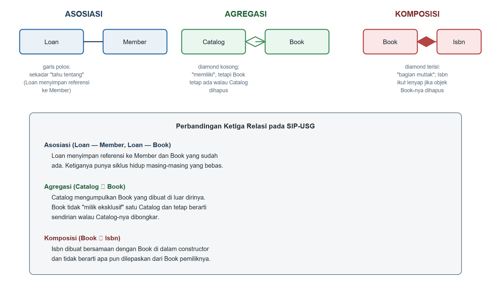
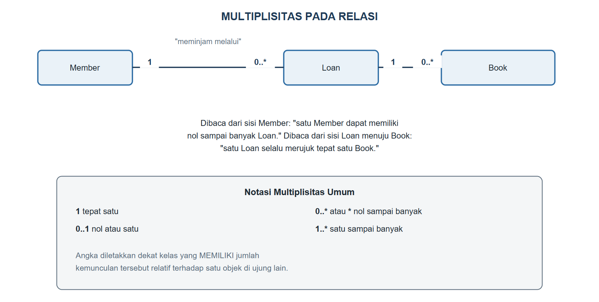
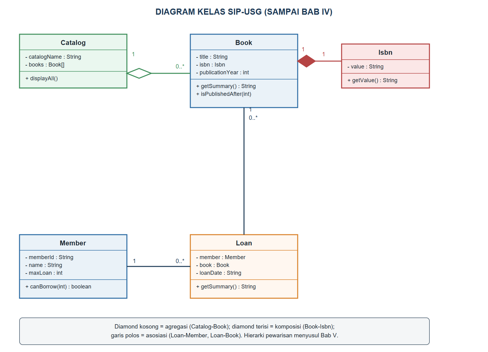

# BAB IV.
# (PEMODELAN BERORIENTASI OBJEK DENGAN DIAGRAM KELAS UML)

### CPMK/ Sub-CPMK :

- **CPMK1** : Mahasiswa mampu merancang model berorientasi objek (kelas, objek, dan relasi antarkelas) menggunakan diagram kelas UML secara tepat.
- **Sub-CPMK3** : Mahasiswa mampu merancang model berorientasi objek menggunakan diagram kelas UML beserta relasi antarkelas.

### Indikator Penilaian:

Ketepatan merancang diagram kelas UML dan relasi antarkelas dari kasus, meliputi penulisan notasi kelas tiga kompartemen beserta visibilitas, penentuan jenis relasi asosiasi, agregasi, komposisi, dependensi, dan generalisasi, penetapan multiplisitas, serta penerjemahan diagram kelas ke dalam kode Java dan sebaliknya.

### Kriteria Keberhasilan (Rubrik):

- Sangat Baik (≥ 85): Mahasiswa mampu mengidentifikasi seluruh kelas dan relasi penting dari narasi kasus, memilih jenis relasi dan multiplisitas berdasarkan aturan bisnis yang dapat dipertanggungjawabkan, serta menyajikan diagram yang runtut dan konsisten dengan kode Java.
- Baik (70-84): Mahasiswa mampu menyusun diagram kelas dengan notasi yang benar, tetapi masih terdapat kekeliruan kecil dalam membedakan agregasi dan komposisi atau dalam menetapkan multiplisitas.
- Cukup (55-69): Mahasiswa mampu menggambar kelas beserta atribut dan *method*, tetapi relasi antarkelas yang dimodelkan belum lengkap dan belum didukung alasan dari kasus.

### Deskripsi Kemampuan yang Diharapkan:

Setelah mempelajari bab ini, mahasiswa diharapkan mampu menganalisis narasi kebutuhan sebuah sistem, mengidentifikasi kelas beserta relasinya, lalu menuangkannya ke dalam diagram kelas UML yang dapat diterjemahkan langsung menjadi kode Java. Dalam konteks Sistem Informasi, diagram kelas merupakan artefak komunikasi utama antara analis, pengembang, dan pemangku kepentingan sehingga kemampuan ini menjadi bekal langsung untuk mata kuliah Rekayasa Perangkat Lunak dan perancangan basis data.

## A. Pendahuluan

Sejak Bab II, SIP-USG dikembangkan dengan menulis kode Java secara langsung: kelas `Book` dan `Member` dirancang lalu segera diimplementasikan. Cara ini masih dapat ditangani ketika kelasnya baru dua atau tiga, tetapi mulai terasa berat begitu jumlah kelas dan relasi antarkelasnya bertambah. Bayangkan seorang analis sistem yang harus menjelaskan rancangan SIP-USG kepada pimpinan perpustakaan yang tidak membaca kode Java; ia memerlukan bahasa visual yang dapat dipahami bersama, sebelum satu baris kode pun dituliskan.

*Unified Modeling Language* (UML) menyediakan bahasa visual tersebut, dan diagram kelas adalah salah satu diagram UML yang paling banyak dipakai dalam pengembangan perangkat lunak berorientasi objek. Bab ini mengajarkan cara membaca dan menggambar diagram kelas, termasuk cara menyatakan hubungan antarkelas seperti asosiasi, agregasi, dan komposisi, lalu menunjukkan bahwa diagram tersebut bukan sekadar gambar dekoratif, melainkan cetak biru yang dapat diterjemahkan baris demi baris menjadi kode Java. Kemampuan ini akan langsung dipakai untuk menyelesaikan Tugas 1 pada bagian F, sekaligus menjadi bekal merancang seluruh hierarki kelas SIP-USG yang lebih rumit pada Bab V dan seterusnya.

## B. Notasi Kelas, Atribut, Method, dan Visibilitas

Diagram kelas UML menggambarkan setiap kelas sebagai kotak persegi panjang yang terbagi menjadi tiga kompartemen: nama kelas di bagian atas, daftar atribut di tengah, dan daftar *method* di bagian bawah. Gambar {{g:bab04-notasi-kelas}} menunjukkan notasi ini memakai kelas `Book` yang telah dibangun pada bab-bab sebelumnya sebagai contoh.



Setiap atribut dan *method* pada diagram kelas dapat diberi awalan simbol yang menyatakan visibilitasnya, sejalan persis dengan *access modifier* Java yang telah dipelajari pada Bab III: tanda `+` untuk `public`, `-` untuk `private`, `#` untuk `protected`, dan `~` untuk *default*. Atribut dituliskan dengan pola `namaAtribut : TipeData`, sedangkan *method* dituliskan dengan pola `namaMethod(parameter) : TipeKembali`. Notasi ini sengaja dibuat ringkas dan tidak memuat badan kode, karena tujuannya adalah menyampaikan struktur dan kontrak kelas, bukan detail implementasinya.

## C. Relasi Antarkelas: Asosiasi, Agregasi, Komposisi

Sebuah kelas jarang berdiri sendiri; SIP-USG memerlukan beberapa kelas yang saling terhubung untuk mewakili proses peminjaman buku secara utuh. UML membedakan tiga jenis relasi struktural yang paling umum antara dua kelas, sebagaimana dirangkum pada Gambar {{g:bab04-tiga-relasi}}.



*Asosiasi* adalah relasi paling umum, sekadar menyatakan bahwa satu kelas "mengetahui" atau "memakai" kelas lain, digambarkan dengan garis polos. Kelas `Loan` yang akan dibangun pada bab ini berasosiasi dengan `Member` dan `Book`: sebuah `Loan` menyimpan referensi ke satu `Member` dan satu `Book` yang sudah ada sebelumnya, tetapi ketiga objek tersebut memiliki siklus hidup masing-masing yang bebas satu sama lain.

*Agregasi* adalah bentuk relasi "memiliki" yang lebih longgar, digambarkan dengan diamond kosong pada ujung kelas yang menjadi "keseluruhan". Kelas `Catalog` mengumpulkan sejumlah objek `Book`, tetapi setiap `Book` dibuat secara independen di luar `Catalog` dan tetap bermakna penuh seandainya `Catalog` yang menampungnya dibongkar; hubungan analoginya seperti rak koleksi tematik di perpustakaan yang dapat dibongkar pasang tanpa membuat buku-bukunya lenyap.

*Komposisi* adalah bentuk relasi "memiliki" yang paling ketat, digambarkan dengan diamond terisi penuh pada ujung kelas "keseluruhan". Bagian yang terlibat dalam komposisi tidak memiliki makna berdiri sendiri di luar keseluruhannya, dan lazimnya dibuat serta dihancurkan bersamaan dengan objek pemiliknya. Kelas `Isbn` yang telah dibangun pada Bab III kini dijadikan bagian dari `Book` melalui komposisi: setiap `Isbn` dibuat di dalam *constructor* `Book` dan tidak pernah berarti terlepas dari buku yang memilikinya, seperti halaman judul yang dicetak menyatu dengan buku fisiknya.

## D. Multiplisitas, Dependensi, dan Generalisasi

Selain jenis relasi, diagram kelas juga menyatakan *multiplisitas*, yaitu berapa banyak objek pada satu ujung relasi yang dapat berpasangan dengan satu objek pada ujung relasi lainnya. Gambar {{g:bab04-multiplisitas}} menunjukkan multiplisitas pada relasi `Member`, `Loan`, dan `Book`.



Notasi `1` pada sisi `Member` dan angka `0..*` pada sisi `Loan` dibaca "satu `Member` dapat berpasangan dengan nol sampai banyak `Loan`", sedangkan arah sebaliknya, dari `Loan` menuju `Member`, memakai multiplisitas `1` karena setiap `Loan` pasti tercatat atas tepat satu anggota. Multiplisitas semacam ini bukan hanya catatan dekoratif; ia langsung memberi tahu pengembang apakah sebuah atribut relasi harus berupa objek tunggal (multiplisitas `1` atau `0..1`) atau berupa kumpulan objek (multiplisitas `0..*` atau `1..*`), yang nantinya menentukan apakah atribut tersebut cukup berupa referensi tunggal atau memerlukan struktur `Collection` seperti yang akan dipelajari pada Bab IX.

*Dependensi* adalah relasi paling lemah, digambarkan dengan garis putus-putus berpanah, menyatakan bahwa satu kelas memakai kelas lain hanya sesaat, misalnya sebagai tipe parameter sebuah *method*, tanpa menyimpan referensinya sebagai atribut. *Generalisasi* adalah relasi "adalah sebuah" yang mendasari pewarisan, digambarkan dengan panah bersegitiga kosong menunjuk ke *superclass*; relasi ini akan menjadi topik utama Bab V ketika SIP-USG membutuhkan hierarki `LibraryItem`, `Book`, `Journal`, dan `DigitalItem`.

## E. Dari Diagram Kelas ke Kode Java (dan Sebaliknya)

Diagram kelas pada Gambar {{g:bab04-diagram-sip-usg}} merangkum seluruh kelas SIP-USG hingga bab ini beserta relasinya, dan setiap bagian diagram tersebut dapat diterjemahkan langsung menjadi kode Java yang sudah pernah ditulis maupun yang baru diperkenalkan pada bab ini.



Relasi asosiasi antara `Loan`, `Member`, dan `Book` diterjemahkan menjadi atribut bertipe kelas lain di dalam `Loan`, sebagaimana terlihat pada Kode Program {{kp:kelas-loan}}.

Kode Program #kelas-loan. Kelas Loan: asosiasi menuju Member dan Book

```java
package id.ac.usg.sip.model;

public class Loan {
    private Member member;
    private Book book;
    private String loanDate;

    public Loan(Member member, Book book,
            String loanDate) {
        this.member = member;
        this.book = book;
        this.loanDate = loanDate;
    }

    public String getSummary() {
        return member.getName() + " meminjam "
            + book.getTitle() + " pada "
            + loanDate;
    }
}
```

Relasi agregasi antara `Catalog` dan `Book` diterjemahkan menjadi atribut larik `Book[]` yang diisi dari luar kelas `Catalog` lewat *constructor*, bukan dibuat sendiri oleh `Catalog`, sebagaimana terlihat pada Kode Program {{kp:kelas-catalog}}.

Kode Program #kelas-catalog. Kelas Catalog: agregasi terhadap Book

```java
package id.ac.usg.sip.model;

public class Catalog {
    private String catalogName;
    private Book[] books;

    public Catalog(String catalogName, Book[] books) {
        this.catalogName = catalogName;
        this.books = books;
    }

    public void displayAll() {
        System.out.println("Katalog: " + catalogName);
        for (Book b : books) {
            System.out.println("- " + b.getSummary());
        }
    }
}
```

Adapun relasi komposisi antara `Book` dan `Isbn` diterjemahkan dengan membuat objek `Isbn` langsung di dalam *constructor* `Book`, alih-alih menerimanya sebagai parameter dari luar, sebagaimana terlihat pada Kode Program {{kp:book-komposisi}}.

Kode Program #book-komposisi. Cuplikan Book.java: komposisi terhadap Isbn

```java
public class Book {
    private Isbn isbn;
    // ... atribut title, author, publicationYear,
    // dan available tidak berubah dari Bab III

    public Book(String title, String author,
            String isbnValue, int publicationYear) {
        setTitle(title);
        this.author = author;
        this.isbn = new Isbn(isbnValue);
        setPublicationYear(publicationYear);
        this.available = true;
    }

    public Isbn getIsbn() {
        return isbn;
    }
    // ... getter/setter dan method lain tidak
    // berubah polanya dari Bab III
}
```

Perhatikan bahwa `Book` tidak lagi memiliki `setIsbn`: karena hubungannya adalah komposisi yang dibentuk sekali di dalam *constructor*, kode ISBN sebuah buku dianggap tidak berubah sepanjang umur objek tersebut, konsisten dengan sifat *immutable* kelas `Isbn` yang telah dipelajari pada Bab III.

## F. Praktikum Terbimbing: Diagram Kelas Lengkap SIP-USG

Praktikum ini menuntun penerapan Kode Program {{kp:kelas-loan}} dan Kode Program {{kp:kelas-catalog}}, sekaligus mempraktikkan pembacaan diagram kelas sebagai rancangan sebelum menulis kode.

1. Gambar ulang Gambar {{g:bab04-diagram-sip-usg}} di atas kertas atau alat bantu diagram pilihan Anda, tanpa melihat kode Java-nya terlebih dahulu.
2. Buat kelas `Loan` pada paket `id.ac.usg.sip.model`, lalu salin Kode Program {{kp:kelas-loan}}.
3. Buat kelas `Catalog` pada paket yang sama, lalu salin Kode Program {{kp:kelas-catalog}}.
4. Ubah kelas `Book` mengikuti Kode Program {{kp:book-komposisi}}: ganti tipe atribut `isbn` dari `String` menjadi `Isbn`, sesuaikan *constructor*, dan hapus `setIsbn` jika ada.
5. Buat kelas `Bab04Demo` pada paket `id.ac.usg.sip.app`, lalu salin Kode Program {{kp:bab04-demo}}.
6. Jalankan `Bab04Demo`, lalu cocokkan urutan pemanggilan *constructor* pada kode dengan arah panah multiplisitas pada Gambar {{g:bab04-diagram-sip-usg}}.

Kode Program #bab04-demo. Merangkai Catalog, Book, Member, dan Loan

```java
package id.ac.usg.sip.app;

import id.ac.usg.sip.model.Book;
import id.ac.usg.sip.model.Catalog;
import id.ac.usg.sip.model.Loan;
import id.ac.usg.sip.model.Member;

public class Bab04Demo {
    public static void main(String[] args) {
        Book b1 = new Book("Basis Data",
            "Kadir, A.", "978-602-04-0001-1", 2012);
        Book b2 = new Book("Struktur Data",
            "Sedgewick, R.", "978-602-04-0002-8",
            2016);

        Catalog katalog = new Catalog(
            "Rak Ilmu Komputer",
            new Book[] {b1, b2});
        katalog.displayAll();
        System.out.println(
            "ISBN b1: " + b1.getIsbn());

        Member m1 = new Member("20240001",
            "Nadia Ramadhani", "nadia@usg.ac.id");

        Loan pinjaman = new Loan(m1, b1,
            "2026-09-14");
        System.out.println(pinjaman.getSummary());
    }
}
```

Keluaran Program:

```
Katalog: Rak Ilmu Komputer
- Basis Data (2012) oleh Kadir, A. [Tersedia]
- Struktur Data (2016) oleh Sedgewick, R. [Tersedia]
ISBN b1: 978-602-04-0001-1
Nadia Ramadhani meminjam Basis Data pada 2026-09-14
```

Perhatikan urutan pembuatan objek pada `main`: `Book` dan `Member` dibuat lebih dahulu karena keduanya adalah objek independen, baru kemudian `Catalog` dan `Loan` dibuat dengan merujuk objek-objek yang sudah ada. Urutan ini bukan kebetulan, melainkan konsekuensi langsung dari arah relasi pada diagram kelas: kelas yang menjadi "ujung yang dirujuk" pada sebuah relasi harus sudah ada sebelum kelas yang "merujuknya" dapat dibuat.

#### Catatan Asesmen

| Butir | Keterangan |
|---|---|
| Nama tugas | Tugas 1. Rancangan Diagram Kelas UML |
| Sub-CPMK | Sub-CPMK3 |
| Penugasan | Rancang diagram kelas UML beserta relasi antarkelas untuk satu kasus (mis. sistem perpustakaan atau toko sederhana). |
| Ruang lingkup | Kelas, atribut, *method*, relasi antarkelas. |
| Cara pengerjaan | Individu; dikumpulkan via LMS. |
| Batas waktu | Minggu ke-5 |
| Luaran | Dokumen diagram kelas UML (PDF) dengan penjelasan singkat. |

#### Kesalahan Umum dan Cara Mengatasinya

| Gejala/Pesan Error | Penyebab | Perbaikan |
|---|---|---|
| Diagram menggambarkan seluruh relasi sebagai asosiasi biasa | Belum membedakan kekuatan kepemilikan antarkelas | Tanyakan "apakah bagian ini berarti tanpa keseluruhannya?"; jika tidak, pertimbangkan agregasi atau komposisi |
| `error: cannot find symbol` saat memanggil `book.getTitle()` di dalam `Loan` | Atribut `book` pada `Loan` belum diberi nilai, atau tipe parameter *constructor* tertukar urutannya | Periksa urutan parameter *constructor* `Loan(Member, Book, String)` sesuai pemanggilan `new Loan(...)` |
| Multiplisitas tertukar arah, misalnya `0..*` diletakkan pada sisi yang salah | Salah membaca sisi mana yang "dihitung banyaknya" relatif terhadap satu objek di ujung lain | Baca relasi dari satu arah penuh dahulu: "satu X berpasangan dengan berapa Y", baru arah sebaliknya |
| Kelas `Catalog` gagal dikompilasi karena `Book[] books` dianggap tidak diinisialisasi | Larik `books` tidak diberi nilai awal sebelum dipakai pada perulangan `displayAll()` | Pastikan larik selalu diisi lewat *constructor* sebelum *method* lain memakainya |

### Rangkuman

Diagram kelas UML menggambarkan setiap kelas sebagai kotak tiga kompartemen berisi nama, atribut, dan *method* beserta simbol visibilitasnya, dan berfungsi sebagai bahasa visual bersama antara analis, pengembang, dan pemangku kepentingan sebelum kode ditulis. Tiga jenis relasi struktural yang umum dipakai adalah asosiasi, yaitu hubungan "mengetahui" yang longgar; agregasi, yaitu hubungan "memiliki" yang bagiannya tetap bermakna secara independen; dan komposisi, yaitu hubungan "memiliki" yang paling ketat karena bagiannya tidak berarti terlepas dari keseluruhannya. Multiplisitas menyatakan berapa banyak objek yang dapat berpasangan pada setiap ujung relasi, sedangkan dependensi dan generalisasi melengkapi kosakata relasi UML, dengan generalisasi menjadi dasar pewarisan yang dibahas mulai Bab V. Pada SIP-USG, relasi ini diterapkan melalui kelas `Loan` (asosiasi terhadap `Member` dan `Book`), `Catalog` (agregasi terhadap `Book`), dan pembaruan kelas `Book` yang kini memiliki `Isbn` melalui komposisi, membuktikan bahwa diagram kelas dapat diterjemahkan langsung menjadi kode Java yang konsisten.

### Soal/Pertanyaan

1. (C2) Jelaskan perbedaan mendasar antara asosiasi, agregasi, dan komposisi, masing-masing disertai satu contoh dari SIP-USG!
2. (C2) Gambarkan (dalam bentuk uraian) notasi tiga kompartemen sebuah kelas UML, lalu sebutkan arti keempat simbol visibilitasnya!
3. (C3) Perhatikan Kode Program {{kp:kelas-catalog}}. Jelaskan mengapa relasi antara `Catalog` dan `Book` tergolong agregasi, bukan komposisi!
4. (C3) Telusuri Kode Program {{kp:bab04-demo}}, lalu jelaskan mengapa objek `Book` dan `Member` harus dibuat sebelum objek `Loan` dapat dibuat!
5. (C4) Bandingkan Kode Program {{kp:book-komposisi}} dengan versi `Book` pada Bab III yang atribut `isbn`-nya masih bertipe `String`. Analisis dampak perubahan ini terhadap kode lain yang sudah memanggil `getIsbn()`!
6. (C4) Perhatikan Gambar {{g:bab04-multiplisitas}}. Jelaskan mengapa multiplisitas antara `Member` dan `Loan` adalah `1` berbanding `0..*`, bukan `1` berbanding `1`!
7. (C5) Rancanglah (dalam bentuk notasi UML tertulis, tanpa perlu menggambar) sebuah kelas `Reservation` yang mewakili pemesanan buku yang sedang dipinjam orang lain. Tentukan atributnya, serta jenis dan multiplisitas relasinya terhadap `Member` dan `Book`!
8. (C6) SIP-USG ke depannya akan memiliki jenis koleksi lain selain `Book`, yaitu `Journal` dan `DigitalItem`, yang berbagi sebagian atribut yang sama. Nilailah relasi apa yang paling tepat menghubungkan ketiganya pada diagram kelas, dan jelaskan mengapa hal ini akan dibahas sebagai generalisasi pada Bab V, bukan sebagai agregasi atau komposisi!

### Rujukan Bab

- Deitel, P. J., & Deitel, H. M. (2018). *Java how to program, early objects* (11th ed.). Pearson Education.
- Horstmann, C. S. (2022). *Core Java, Volume I: Fundamentals* (12th ed.). Oracle Press/Pearson.
