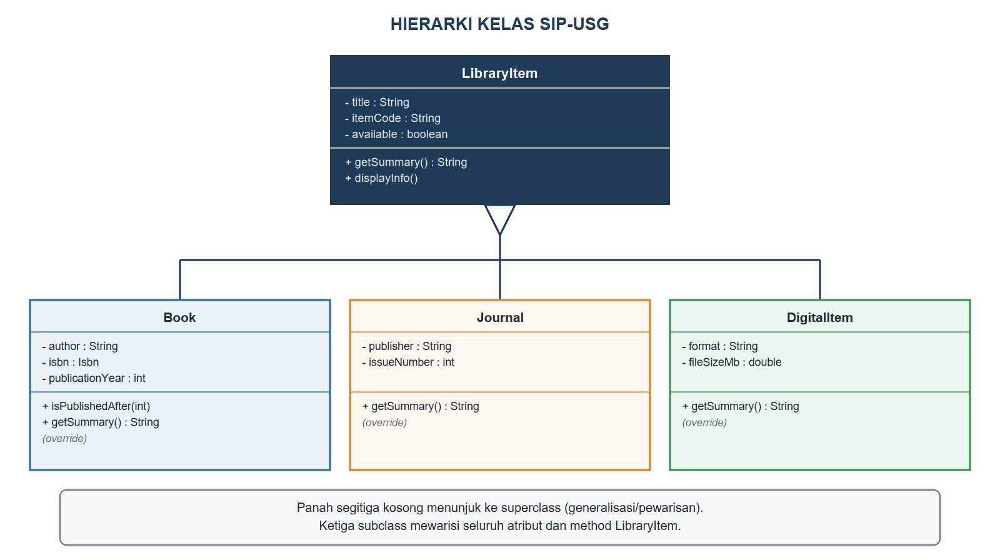
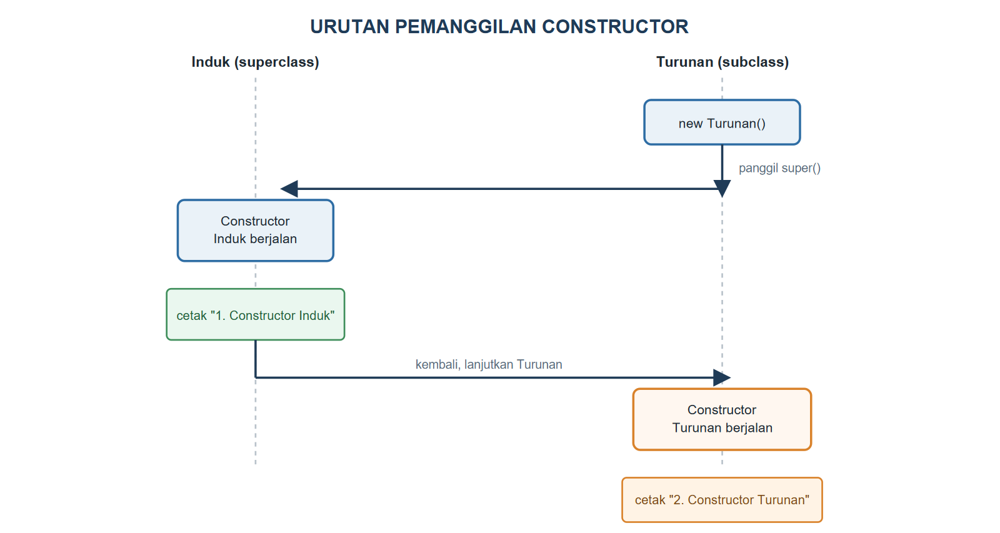

# BAB V.
# (PEWARISAN / INHERITANCE)

### CPMK/ Sub-CPMK :

- **CPMK2** : Mahasiswa mampu mengimplementasikan konsep pemrograman berorientasi objek (enkapsulasi, pewarisan, polimorfisme, abstraksi, *interface*, penanganan eksepsi, *collection*, dan *generics*) dalam bahasa Java untuk menyelesaikan masalah.
- **Sub-CPMK4** : Mahasiswa mampu mengimplementasikan pewarisan (*inheritance*) dan polimorfisme (*polymorphism*) dalam bahasa Java.

### Indikator Penilaian:

Ketepatan mengimplementasikan pewarisan (*superclass*, *subclass*, `super`, *override*), meliputi penyusunan hierarki kelas dengan kata kunci `extends`, pemanggilan *constructor* dan *method* milik *superclass* melalui `super`, penimpaan *method* dengan anotasi `@Override`, serta penilaian kewajaran kedalaman hierarki pewarisan.

### Kriteria Keberhasilan (Rubrik):

- Sangat Baik (≥ 85): Mahasiswa mampu mengidentifikasi atribut dan perilaku bersama dari beberapa entitas, menyusun hierarki pewarisan yang memenuhi hubungan "adalah sebuah" (*is-a*), serta mengimplementasikan `super` dan *override* dengan tepat disertai alasan perancangan yang logis.
- Baik (70-84): Mahasiswa mampu membuat *superclass* dan *subclass* yang berjalan dengan benar beserta *override*, tetapi masih terdapat duplikasi kode atau pemanggilan `super` yang belum tepat.
- Cukup (55-69): Mahasiswa mampu menulis kelas turunan dengan `extends`, tetapi belum mampu membedakan kapan pewarisan tepat digunakan dan belum konsisten menerapkan *override*.

### Deskripsi Kemampuan yang Diharapkan:

Setelah mempelajari bab ini, mahasiswa diharapkan mampu merancang dan mengimplementasikan hierarki kelas yang menempatkan atribut dan perilaku bersama pada *superclass*, lalu menyesuaikan perilaku khusus pada *subclass*. Dalam konteks Sistem Informasi, pewarisan memungkinkan pengembang mengelola ragam entitas yang serupa, seperti buku cetak, jurnal, dan koleksi digital di perpustakaan, tanpa menulis ulang logika yang sama sehingga aplikasi lebih mudah dikembangkan saat jenis koleksi baru ditambahkan.

## A. Pendahuluan

Diagram kelas pada Bab IV telah menyinggung bahwa SIP-USG akan segera memiliki lebih dari satu jenis koleksi: buku cetak, jurnal, dan koleksi digital. Jika ketiganya ditulis sebagai kelas yang sepenuhnya berdiri sendiri seperti `Book` selama ini, atribut `title`, `itemCode`, dan `available` beserta *method* `getSummary()` dan `displayInfo()` harus disalin ulang pada `Journal` dan `DigitalItem`, padahal ketiganya jelas-jelas berbagi konsep yang sama, yaitu "sesuatu yang dapat dipinjam dari perpustakaan". Menyalin kode semacam ini bukan hanya membuang waktu, tetapi juga menciptakan risiko baru: begitu ada perbaikan pada logika bersama, misalnya cara menyusun status ketersediaan, perbaikan itu harus diingat untuk diterapkan di tiga tempat sekaligus.

Bab ini memperkenalkan pilar kedua pemrograman berorientasi objek, yaitu pewarisan, sebagai jawaban atas persoalan tersebut. Sebuah kelas baru bernama `LibraryItem` dibangun untuk menampung seluruh atribut dan *method* yang dimiliki bersama oleh jenis koleksi apa pun, lalu `Book` yang telah dibangun sejak Bab II diubah agar mewarisi `LibraryItem`, disusul dua kelas baru, `Journal` dan `DigitalItem`. Dengan menuntaskan bab ini, mahasiswa akan mampu mengenali kapan beberapa kelas sebaiknya disatukan lewat pewarisan, sebuah keterampilan yang akan langsung diuji ketika polimorfisme mulai memanfaatkan hierarki ini pada Bab VI.

## B. Superclass, Subclass, dan Kata Kunci extends

Perpustakaan kampus mengelola berbagai jenis koleksi yang berbeda bentuk fisiknya, tetapi memiliki identitas dasar yang sama: setiap koleksi punya judul, kode koleksi (nomor rak atau kode unik), dan status apakah sedang tersedia atau sedang dipinjam. *Superclass* menampung kesamaan ini, sedangkan *subclass* menambahkan hal-hal khas milik jenis koleksi tertentu, seperti nama penulis pada buku atau ukuran berkas pada koleksi digital. Kata kunci `extends` menyatakan hubungan "adalah sebuah" (*is-a*) ini: `Book` adalah sebuah `LibraryItem`, `Journal` adalah sebuah `LibraryItem`, dan seterusnya.

Kode Program {{kp:kelas-libraryitem}} membangun kelas `LibraryItem` sebagai *superclass* bersama bagi seluruh jenis koleksi SIP-USG.

Kode Program #kelas-libraryitem. Kelas LibraryItem sebagai superclass

```java
package id.ac.usg.sip.model;

public class LibraryItem {
    private String title;
    private String itemCode;
    private boolean available;

    public LibraryItem(String title,
            String itemCode) {
        if (title == null || title.isBlank()) {
            throw new IllegalArgumentException(
                "Judul tidak boleh kosong");
        }
        this.title = title;
        this.itemCode = itemCode;
        this.available = true;
    }
    public String getTitle() {
        return title;
    }
    public String getItemCode() {
        return itemCode;
    }
    public boolean isAvailable() {
        return available;
    }
    public void setAvailable(boolean available) {
        this.available = available;
    }

    public String getSummary() {
        String status =
            available ? "Tersedia" : "Dipinjam";
        return title + " [" + itemCode + ", "
            + status + "]";
    }
    public void displayInfo() {
        System.out.println(getSummary());
    }
}
```

Kelas `Book` kini ditulis ulang agar mewarisi `LibraryItem` melalui `extends`, sebagaimana terlihat pada Kode Program {{kp:kelas-book-extends}}. Perhatikan bahwa `Book` tidak lagi mendeklarasikan `title`, `itemCode`, maupun `available`; ketiganya otomatis dimiliki `Book` karena diwariskan dari `LibraryItem`, sehingga `Book` hanya perlu menambahkan atribut yang benar-benar khas miliknya sendiri, yaitu `author`, `isbn`, dan `publicationYear`. Ini adalah manfaat langsung pewarisan: `Book` mewarisi seluruh kemampuan `LibraryItem` tanpa menuliskan ulang satu baris pun kodenya.

Kode Program #kelas-book-extends. Kelas Book mewarisi LibraryItem

```java
package id.ac.usg.sip.model;

public class Book extends LibraryItem {
    private String author;
    private Isbn isbn;
    private int publicationYear;

    public Book(String title, String itemCode,
            String author, String isbnValue,
            int publicationYear) {
        super(title, itemCode);
        this.author = author;
        this.isbn = new Isbn(isbnValue);
        setPublicationYear(publicationYear);
    }
    public String getAuthor() {
        return author;
    }
    public Isbn getIsbn() {
        return isbn;
    }
    public int getPublicationYear() {
        return publicationYear;
    }
    public final void setPublicationYear(int year) {
        if (year < 1450 || year > 2100) {
            throw new IllegalArgumentException(
                "Tahun tidak valid: " + year);
        }
        this.publicationYear = year;
    }
    public boolean isPublishedAfter(int year) {
        return publicationYear > year;
    }
    @Override
    public String getSummary() {
        return super.getSummary() + " oleh "
            + author + " (" + publicationYear + ")";
    }
}
```

Gambar {{g:bab05-hierarki-kelas}} merangkum hierarki lengkap yang dibangun pada bab ini: `LibraryItem` sebagai *superclass*, dengan `Book`, `Journal`, dan `DigitalItem` sebagai tiga *subclass* yang masing-masing menambahkan atribut dan menimpa `getSummary()` sesuai kekhasannya sendiri.



## C. Kata Kunci super pada Constructor dan Method

Perhatikan baris pertama di dalam *constructor* `Book` pada Kode Program {{kp:kelas-book-extends}}: `super(title, itemCode);`. Baris ini memanggil *constructor* milik `LibraryItem` untuk menyiapkan bagian atribut yang diwariskan (`title`, `itemCode`, `available`) sebelum `Book` melanjutkan menyiapkan atributnya sendiri. Pemanggilan `super(...)` pada *constructor* wajib menjadi pernyataan pertama apabila dituliskan secara eksplisit, karena bagian yang diwariskan harus selesai dibentuk lebih dahulu sebelum bagian tambahan pada *subclass* dapat memakainya dengan aman.

Jika sebuah *subclass* sama sekali tidak menuliskan pemanggilan `super(...)`, Java tetap akan memanggil *constructor* tanpa parameter milik *superclass* secara otomatis sebagai baris pertama, sebagaimana dibuktikan pada Kode Program {{kp:constructor-order}} dan diringkas pada Gambar {{g:bab05-urutan-constructor}}.

Kode Program #constructor-order. Membuktikan urutan pemanggilan constructor

```java
package id.ac.usg.sip.app;

public class ConstructorOrderDemo {
    static class Induk {
        Induk() {
            System.out.println(
                "1. Constructor Induk");
        }
    }

    static class Turunan extends Induk {
        Turunan() {
            System.out.println(
                "2. Constructor Turunan");
        }
    }

    public static void main(String[] args) {
        new Turunan();
    }
}
```

Keluaran Program:

```
1. Constructor Induk
2. Constructor Turunan
```



Selain pada *constructor*, `super` juga dipakai untuk memanggil *method* versi *superclass* dari dalam *subclass*, seperti pada `super.getSummary()` di dalam `getSummary()` milik `Book`. Cara ini menghindari duplikasi: `Book` tidak perlu menuliskan ulang logika penyusunan judul, kode koleksi, dan status ketersediaan, cukup memanggil versi `LibraryItem`-nya lalu menambahkan informasi khas `Book` di baliknya.

## D. Override Method dan Anotasi @Override

*Method* `getSummary()` pada `LibraryItem` menghasilkan ringkasan umum yang berlaku untuk semua jenis koleksi. Namun, setiap jenis koleksi sesungguhnya perlu menampilkan informasi tambahan yang khas: buku perlu menampilkan penulis, jurnal perlu menampilkan penerbit dan nomor edisi, dan koleksi digital perlu menampilkan format berkas. *Overriding* memungkinkan sebuah *subclass* mendefinisikan ulang *method* yang sudah ada pada *superclass*-nya, dengan tanda tangan (nama, parameter, dan tipe kembali) yang identik.

Anotasi `@Override` di atas *method* yang ditimpa, seperti terlihat pada Kode Program {{kp:kelas-book-extends}}, bukanlah keharusan agar kode dapat dikompilasi, tetapi sangat dianjurkan karena kompiler akan memeriksa apakah *method* tersebut benar-benar menimpa *method* milik *superclass*. Tanpa anotasi ini, kesalahan ketik kecil pada nama *method* atau parameter, misalnya menuliskan `getsummary()` dengan huruf kecil, tidak akan membuat *method* baru dianggap sebagai *override*, melainkan diam-diam dianggap *method* baru yang terpisah, sebuah kesalahan yang sulit dilacak tanpa bantuan anotasi ini.

Kode Program {{kp:kelas-journal}} dan Kode Program {{kp:kelas-digitalitem}} menerapkan pola *override* yang sama pada dua *subclass* baru.

Kode Program #kelas-journal. Kelas Journal, subclass LibraryItem

```java
package id.ac.usg.sip.model;

public class Journal extends LibraryItem {
    private String publisher;
    private int issueNumber;

    public Journal(String title, String itemCode,
            String publisher, int issueNumber) {
        super(title, itemCode);
        this.publisher = publisher;
        this.issueNumber = issueNumber;
    }

    public String getPublisher() {
        return publisher;
    }

    public int getIssueNumber() {
        return issueNumber;
    }

    @Override
    public String getSummary() {
        return super.getSummary() + " - "
            + publisher + ", edisi "
            + issueNumber;
    }
}
```

Kode Program #kelas-digitalitem. Kelas DigitalItem, subclass LibraryItem

```java
package id.ac.usg.sip.model;

public class DigitalItem extends LibraryItem {
    private String format;
    private double fileSizeMb;

    public DigitalItem(String title, String itemCode,
            String format, double fileSizeMb) {
        super(title, itemCode);
        this.format = format;
        this.fileSizeMb = fileSizeMb;
    }

    public String getFormat() {
        return format;
    }

    public double getFileSizeMb() {
        return fileSizeMb;
    }

    @Override
    public String getSummary() {
        return super.getSummary() + " ("
            + format + ", " + fileSizeMb + " MB)";
    }
}
```

## E. Kelas Object, final, dan Batas Kewajaran Hierarki

Setiap kelas yang dituliskan tanpa `extends` sama sekali sesungguhnya tetap memiliki *superclass*, yaitu `Object`, kelas paling dasar dalam Java yang menjadi nenek moyang seluruh kelas lainnya secara implisit. *Method* seperti `toString()`, `equals(Object)`, dan `hashCode()` yang mungkin sudah pernah ditemui mahasiswa sesungguhnya diwariskan dari `Object`, dan dapat ditimpa (*override*) mengikuti pola yang sama seperti `getSummary()` pada bab ini. Sebagai latihan lanjutan, `toString()` dapat ditimpa agar memanggil `getSummary()`, sehingga objek `LibraryItem` dapat langsung dicetak dengan `System.out.println(item)` tanpa memanggil `getSummary()` secara eksplisit.

Kata kunci `final` memiliki tiga kegunaan berkaitan dengan pewarisan. Pada atribut, `final` mencegah nilainya diubah setelah ditetapkan, seperti telah dipelajari pada kelas `Isbn` di Bab III. Pada *method*, seperti `setPublicationYear` di Kode Program {{kp:kelas-book-extends}}, `final` mencegah *subclass* menimpa *method* tersebut, berguna ketika validasi di dalamnya harus selalu berlaku sama tanpa boleh dilonggarkan oleh *subclass* mana pun. Pada kelas, seperti `Isbn`, `final` mencegah kelas tersebut diturunkan sama sekali.

Pewarisan bukan alat yang tepat untuk setiap situasi. Aturan praktis yang dapat dipegang adalah menguji apakah hubungan "adalah sebuah" benar-benar berlaku: `Book` adalah sebuah `LibraryItem` masuk akal, tetapi `Loan` bukanlah sebuah `Member` maupun sebuah `Book`, sehingga `Loan` tetap dirancang berelasi lewat asosiasi seperti pada Bab IV, bukan lewat pewarisan. Hierarki yang dipaksakan padahal hubungannya sebenarnya "memiliki", bukan "adalah sebuah", akan menyulitkan pemeliharaan kode di kemudian hari; prinsip ini akan dibahas lebih jauh sebagai *Liskov Substitution Principle* pada Bab XIII.

## F. Praktikum Terbimbing: Hierarki LibraryItem, Book, Journal, dan DigitalItem

Praktikum ini menuntun pembentukan hierarki lengkap SIP-USG serta pembaruan kelas `Catalog` dan `Loan` agar dapat menampung jenis koleksi apa pun.

1. Buat kelas `LibraryItem` pada paket `id.ac.usg.sip.model`, lalu salin Kode Program {{kp:kelas-libraryitem}}.
2. Ubah kelas `Book` mengikuti Kode Program {{kp:kelas-book-extends}}: tambahkan `extends LibraryItem`, hapus atribut yang kini diwariskan, dan sesuaikan *constructor* agar memanggil `super(title, itemCode)`.
3. Buat kelas `Journal` dan `DigitalItem` pada paket yang sama, lalu salin Kode Program {{kp:kelas-journal}} dan Kode Program {{kp:kelas-digitalitem}}.
4. Ubah kelas `Catalog` agar atributnya bertipe `LibraryItem[]`, bukan `Book[]`, sehingga dapat menampung ketiga jenis koleksi sekaligus.
5. Ubah kelas `Loan` agar atributnya bertipe `LibraryItem`, bukan `Book`, dengan alasan yang sama.
6. Buat kelas `Bab05Demo` pada paket `id.ac.usg.sip.app`, lalu salin Kode Program {{kp:bab05-demo}}.
7. Jalankan `Bab05Demo`, lalu amati bahwa `katalog.displayAll()` mencetak ringkasan yang berbeda-beda untuk setiap jenis koleksi walau dipanggil melalui *method* yang sama, `getSummary()`. Perilaku ini adalah pratinjau polimorfisme yang akan dibahas tuntas pada Bab VI.

Kode Program #bab05-demo. Menguji hierarki LibraryItem lewat Catalog dan Loan

```java
package id.ac.usg.sip.app;

import id.ac.usg.sip.model.Book;
import id.ac.usg.sip.model.Catalog;
import id.ac.usg.sip.model.DigitalItem;
import id.ac.usg.sip.model.Journal;
import id.ac.usg.sip.model.LibraryItem;
import id.ac.usg.sip.model.Loan;
import id.ac.usg.sip.model.Member;

public class Bab05Demo {
    public static void main(String[] args) {
        Book b1 = new Book("Basis Data", "B001",
            "Kadir, A.", "978-602-04-0001-1", 2012);
        Journal j1 = new Journal(
            "Jurnal SI", "J001",
            "USG Press", 12);
        DigitalItem d1 = new DigitalItem(
            "E-Modul Java Dasar", "D001",
            "PDF", 4.5);

        Catalog katalog = new Catalog(
            "Rak Ilmu Komputer",
            new LibraryItem[] {b1, j1, d1});
        katalog.displayAll();

        Member m1 = new Member("20240001",
            "Nadia Ramadhani", "nadia@usg.ac.id");
        Loan pinjaman = new Loan(m1, j1,
            "2026-09-14");
        System.out.println(pinjaman.getSummary());
    }
}
```

Keluaran Program:

```
Katalog: Rak Ilmu Komputer
- Basis Data [B001, Tersedia] oleh Kadir, A. (2012)
- Jurnal SI [J001, Tersedia] - USG Press, edisi 12
- E-Modul Java Dasar [D001, Tersedia] (PDF, 4.5 MB)
Nadia Ramadhani meminjam Jurnal SI pada 2026-09-14
```

Perhatikan bahwa `katalog` bertipe `Catalog` dengan atribut `LibraryItem[]`, tetapi larik yang diberikan berisi campuran `Book`, `Journal`, dan `DigitalItem`. Java mengizinkan ini karena ketiganya memang benar-benar sebuah `LibraryItem` melalui pewarisan; kemampuan menyimpan dan memperlakukan objek dari beberapa *subclass* berbeda melalui satu tipe referensi *superclass* inilah yang menjadi jembatan langsung menuju polimorfisme pada Bab VI.

#### Kesalahan Umum dan Cara Mengatasinya

| Gejala/Pesan Error | Penyebab | Perbaikan |
|---|---|---|
| `error: constructor LibraryItem in class LibraryItem cannot be applied to given types` | *Subclass* tidak memanggil `super(...)` dengan argumen yang sesuai, sehingga Java mencoba memanggil *constructor* tanpa parameter yang tidak tersedia | Tambahkan pemanggilan `super(...)` yang sesuai sebagai baris pertama *constructor* *subclass* |
| `error: super(...) must be first statement` | Pernyataan lain dituliskan sebelum `super(...)` di dalam *constructor* | Pindahkan `super(...)` menjadi baris pertama di dalam *constructor* |
| *Method* yang dimaksud sebagai *override* ternyata tidak pernah dipanggil sesuai harapan | Tanda tangan *method* pada *subclass* tidak identik dengan *superclass* (salah ketik nama atau parameter), sehingga dianggap *method* baru, bukan *override* | Tambahkan anotasi `@Override` agar kompiler memeriksa kecocokan tanda tangan *method* |
| `error: cannot inherit from final Isbn` | Mencoba membuat *subclass* dari kelas yang dideklarasikan `final` | Hapus kata kunci `final` jika kelas tersebut memang perlu diturunkan, atau rancang ulang tanpa pewarisan |

### Rangkuman

Pewarisan memungkinkan sebuah kelas baru, yaitu *subclass*, dibentuk berdasarkan kelas yang sudah ada, yaitu *superclass*, melalui kata kunci `extends`, sehingga seluruh atribut dan *method* pada *superclass* otomatis dimiliki *subclass* tanpa perlu dituliskan ulang. Kata kunci `super` dipakai untuk memanggil *constructor* *superclass* sebagai pernyataan pertama pada *constructor* *subclass*, serta untuk memanggil versi *method* milik *superclass* dari dalam *method* yang menimpanya. *Overriding*, yang ditandai anotasi `@Override`, memungkinkan *subclass* mendefinisikan ulang perilaku *method* tertentu sesuai kekhasannya, seperti `getSummary()` yang berbeda hasilnya pada `Book`, `Journal`, dan `DigitalItem`. Setiap kelas Java tanpa `extends` eksplisit tetap mewarisi `Object` secara implisit, dan kata kunci `final` dapat membatasi perubahan lebih lanjut pada atribut, *method*, atau kelas. Pewarisan hanya tepat dipakai ketika hubungan "adalah sebuah" benar-benar berlaku; SIP-USG kini memiliki hierarki `LibraryItem`, `Book`, `Journal`, dan `DigitalItem` yang menjadi fondasi bagi polimorfisme pada Bab VI.

### Soal/Pertanyaan

1. (C2) Jelaskan hubungan "adalah sebuah" (*is-a*) pada pewarisan, lalu berikan satu contoh dari SIP-USG dan satu contoh bukan kandidat pewarisan yang tepat!
2. (C2) Jelaskan mengapa anotasi `@Override` dianjurkan meskipun tidak wajib agar kode dapat dikompilasi!
3. (C3) Perhatikan Kode Program {{kp:kelas-book-extends}}. Jelaskan mengapa `super(title, itemCode)` harus menjadi pernyataan pertama di dalam *constructor* `Book`!
4. (C3) Telusuri Kode Program {{kp:constructor-order}}, lalu jelaskan mengapa "1. Constructor Induk" tercetak lebih dahulu daripada "2. Constructor Turunan" walau `Turunan` tidak menuliskan pemanggilan `super()` secara eksplisit!
5. (C4) Bandingkan `getSummary()` pada `LibraryItem`, `Book`, `Journal`, dan `DigitalItem`. Analisis bagaimana `super.getSummary()` mencegah duplikasi kode pada ketiga *subclass*!
6. (C4) Perhatikan Gambar {{g:bab05-hierarki-kelas}}. Jelaskan mengapa `Loan` pada Bab IV tidak digambarkan sebagai *subclass* dari `Member` atau `Book`, melainkan tetap berelasi lewat asosiasi!
7. (C5) Rancanglah (dalam bentuk kerangka kode, tanpa perlu implementasi lengkap) sebuah kelas `Thesis` yang mewarisi `LibraryItem`, mewakili skripsi mahasiswa yang disimpan di perpustakaan. Sebutkan minimal dua atribut tambahan yang khas serta *method* mana yang perlu ditimpa!
8. (C6) SIP-USG kini memiliki empat kelas yang saling berkaitan lewat pewarisan dan relasi. Nilailah apakah menambahkan `available` sebagai atribut tersendiri pada `Book`, `Journal`, dan `DigitalItem`, alih-alih mewarisinya dari `LibraryItem`, akan menjadi keputusan rancangan yang baik, dan jelaskan konsekuensinya terhadap `Catalog` yang bergantung pada `LibraryItem[]`!

### Rujukan Bab

- Deitel, P. J., & Deitel, H. M. (2018). *Java how to program, early objects* (11th ed.). Pearson Education.
- Horstmann, C. S. (2022). *Core Java, Volume I: Fundamentals* (12th ed.). Oracle Press/Pearson.
