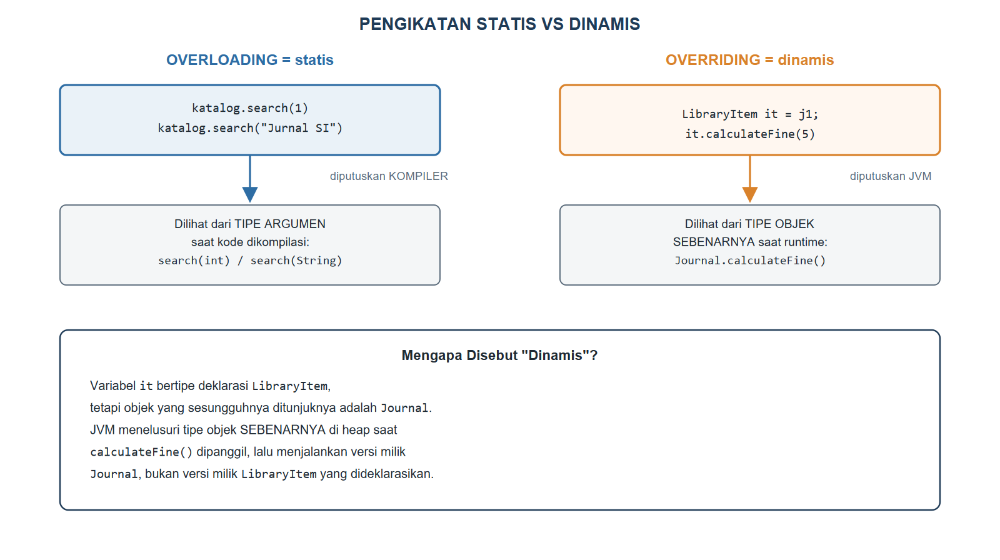
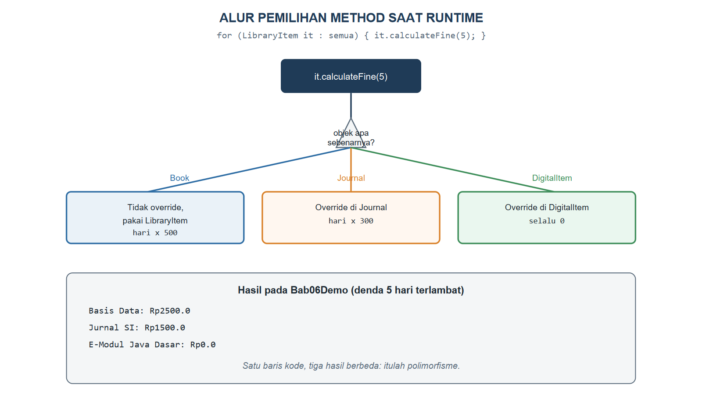

# BAB VI.
# (POLIMORFISME / POLYMORPHISM)

### CPMK/ Sub-CPMK :

- **CPMK2** : Mahasiswa mampu mengimplementasikan konsep pemrograman berorientasi objek (enkapsulasi, pewarisan, polimorfisme, abstraksi, *interface*, penanganan eksepsi, *collection*, dan *generics*) dalam bahasa Java untuk menyelesaikan masalah.
- **Sub-CPMK4** : Mahasiswa mampu mengimplementasikan pewarisan (*inheritance*) dan polimorfisme (*polymorphism*) dalam bahasa Java.

### Indikator Penilaian:

Ketepatan mengimplementasikan *overloading*, *overriding*, dan *dynamic binding*, meliputi pembedaan polimorfisme statis dan dinamis, penelusuran *method* yang dipilih saat *runtime*, penggunaan *upcasting*, *downcasting*, dan `instanceof` secara aman, serta pemanfaatan referensi *superclass* untuk mengolah sekumpulan objek yang berbeda jenis.

### Kriteria Keberhasilan (Rubrik):

- Sangat Baik (≥ 85): Mahasiswa mampu menjawab soal kuis tentang *overloading* dan *overriding* secara tepat dan lengkap, menelusuri keluaran program polimorfik dengan penalaran yang benar, serta menerapkan *dynamic binding* untuk menghilangkan percabangan berdasarkan jenis objek pada kasus.
- Baik (70-84): Mahasiswa mampu membedakan *overloading* dan *overriding* serta menerapkannya dengan benar, tetapi masih keliru menelusuri *method* yang dipanggil pada kasus *upcasting* atau *downcasting*.
- Cukup (55-69): Mahasiswa mampu menyebutkan perbedaan *overloading* dan *overriding*, tetapi penerapan polimorfisme pada kode masih terbatas dan belum konsisten.

### Deskripsi Kemampuan yang Diharapkan:

Setelah mempelajari bab ini, mahasiswa diharapkan mampu menulis program yang memperlakukan objek berbeda jenis melalui satu antarmuka yang seragam, sehingga perilaku yang tepat dipilih secara otomatis saat program berjalan. Dalam konteks Sistem Informasi, polimorfisme membuat aturan bisnis yang beragam, seperti perhitungan denda keterlambatan yang berbeda untuk buku, jurnal, dan koleksi digital, dapat ditangani tanpa rangkaian percabangan panjang yang sulit dipelihara.

## A. Pendahuluan

Praktikum Bab V telah menunjukkan sesuatu yang menarik: memanggil `getSummary()` pada larik `LibraryItem[]` yang sebenarnya berisi campuran `Book`, `Journal`, dan `DigitalItem` menghasilkan tiga kalimat yang berbeda formatnya, padahal kode yang memanggilnya hanya menuliskan satu baris perulangan yang sama. Bayangkan sekarang petugas sirkulasi harus menghitung denda keterlambatan pengembalian; tanpa polimorfisme, kode tersebut akan dipenuhi percabangan `if (item instanceof Book) { ... } else if (item instanceof Journal) { ... } else if (...)` yang harus diperbarui setiap kali jenis koleksi baru ditambahkan.

Bab ini menuntaskan penjelasan mengapa satu baris `it.calculateFine(5)` dapat menghasilkan tiga angka denda yang berbeda tanpa satu pun percabangan semacam itu. Mahasiswa akan mempelajari dua bentuk polimorfisme, yaitu *overloading* yang bekerja saat kode dikompilasi dan *overriding* yang bekerja saat program berjalan, lalu mempraktikkan keduanya pada `Catalog` dan hierarki `LibraryItem` yang telah dibangun pada Bab V. Kemampuan ini menjadi penopang utama Kuis 1 pada Minggu ke-6, sekaligus fondasi bagi abstraksi yang akan dipelajari pada Bab VII.

## B. Overloading (Polimorfisme Statis)

*Overloading* terjadi ketika sebuah kelas memiliki lebih dari satu *method* dengan nama yang sama tetapi daftar parameter yang berbeda, baik dari jumlah maupun tipenya. Java menentukan *method* overload mana yang dipanggil berdasarkan tipe argumen yang dituliskan pada kode sumber, sehingga keputusan ini sudah selesai sejak tahap kompilasi; inilah sebabnya *overloading* disebut polimorfisme statis. Kode Program {{kp:catalog-overload}} menambahkan dua *method* `search` yang saling *overload* pada kelas `Catalog`.

Kode Program #catalog-overload. Catalog dengan dua method search yang di-overload

```java
package id.ac.usg.sip.model;

public class Catalog {
    private String catalogName;
    private LibraryItem[] items;

    public Catalog(String catalogName,
            LibraryItem[] items) {
        this.catalogName = catalogName;
        this.items = items;
    }

    public LibraryItem search(int index) {
        return items[index];
    }

    public LibraryItem search(String title) {
        for (LibraryItem it : items) {
            boolean cocok = it.getTitle()
                .equalsIgnoreCase(title);
            if (cocok) {
                return it;
            }
        }
        return null;
    }

    public void displayAll() {
        System.out.println("Katalog: " + catalogName);
        for (LibraryItem it : items) {
            System.out.println(
                "- " + it.getSummary());
        }
    }
}
```

Ketika kode pemanggil menuliskan `katalog.search(1)`, kompiler melihat bahwa argumennya bertipe `int`, sehingga memilih `search(int index)` yang mengambil item berdasarkan posisi pada larik. Ketika kode pemanggil menuliskan `katalog.search("Jurnal SI")`, kompiler memilih `search(String title)` yang menelusuri larik berdasarkan kecocokan judul. Kedua *method* ini boleh memiliki nama sama karena Java membedakan keduanya lewat *tanda tangan* (*signature*), yaitu kombinasi nama dan daftar tipe parameter; tipe kembali sendirian tidak cukup untuk membedakan dua *method overload*.

## C. Overriding (Polimorfisme Dinamis)

Berbeda dengan *overloading*, *overriding* telah dipelajari mekanismenya pada Bab V: sebuah *subclass* mendefinisikan ulang *method* yang tanda tangannya identik dengan milik *superclass*-nya. Perbedaan besar yang belum dibahas tuntas adalah *kapan* keputusan tentang versi *method* mana yang dijalankan itu diambil. Pada *overriding*, keputusan itu tidak diambil oleh kompiler saat membaca kode sumber, melainkan oleh JVM saat program benar-benar berjalan, berdasarkan jenis objek yang sesungguhnya ada di memori, bukan berdasarkan tipe referensi yang dituliskan pada kode. Karena itu, *overriding* disebut polimorfisme dinamis. Tabel {{t:overload-vs-override}} merangkum perbedaan keduanya.

Tabel #overload-vs-override. Perbedaan overloading dan overriding

| Aspek | Overloading | Overriding |
|---|---|---|
| Lokasi | Beberapa *method* dalam satu kelas | *Method* pada *subclass* menimpa *superclass* |
| Tanda tangan | Nama sama, parameter beda | Nama dan parameter identik |
| Keputusan diambil | Kompiler (waktu kompilasi) | JVM (waktu program berjalan) |
| Dasar keputusan | Tipe argumen pada kode sumber | Tipe objek sesungguhnya di memori |
| Istilah lain | Polimorfisme statis | Polimorfisme dinamis |

Untuk memperkuat pemahaman ini, Kode Program {{kp:libraryitem-fine}} menambahkan *method* `calculateFine(long daysLate)` pada `LibraryItem`, lalu Kode Program {{kp:journal-fine}} dan Kode Program {{kp:digitalitem-fine}} menimpanya dengan rumus yang berbeda pada `Journal` dan `DigitalItem`.

Kode Program #libraryitem-fine. LibraryItem dengan calculateFine dasar

```java
public class LibraryItem {
    // ... atribut dan method lain tidak berubah
    // dari Bab V

    public double calculateFine(long daysLate) {
        return Math.max(0, daysLate) * 500.0;
    }
}
```

Kode Program #journal-fine. Cuplikan Journal.java: override calculateFine

```java
public class Journal extends LibraryItem {
    // ... atribut, constructor, dan getSummary()
    // tidak berubah dari Bab V

    @Override
    public double calculateFine(long daysLate) {
        long hari = Math.max(0, daysLate);
        return hari * 300.0;
    }
}
```

Kode Program #digitalitem-fine. Cuplikan DigitalItem.java: override calculateFine

```java
public class DigitalItem extends LibraryItem {
    // ... atribut, constructor, dan getSummary()
    // tidak berubah dari Bab V

    @Override
    public double calculateFine(long daysLate) {
        return 0.0;
    }
}
```

Perhatikan bahwa `Book` sengaja tidak menimpa `calculateFine`, sehingga buku cetak memakai rumus dasar milik `LibraryItem` apa adanya. Ini menunjukkan bahwa *subclass* tidak diwajibkan menimpa setiap *method* yang diwariskan; *overriding* hanya dilakukan pada *method* yang perilakunya memang perlu berbeda.

## D. Dynamic Binding, Upcasting, Downcasting, dan instanceof

Gambar {{g:bab06-static-dynamic-binding}} membandingkan langsung mekanisme pengikatan pada *overloading* dan *overriding* menggunakan kode yang telah dibangun pada bab ini.



*Upcasting* adalah proses memperlakukan objek *subclass* seolah bertipe *superclass*-nya, seperti pada pernyataan `LibraryItem it = j1;` di mana `j1` sebenarnya bertipe `Journal`. Upcasting selalu aman dan bahkan terjadi otomatis, karena setiap `Journal` pastilah juga sebuah `LibraryItem` sesuai hubungan "adalah sebuah" yang telah dipelajari pada Bab V. Sebaliknya, *downcasting* mengembalikan referensi bertipe *superclass* menjadi tipe *subclass* yang lebih spesifik, dan harus dilakukan hati-hati karena tidak selalu aman: mengembalikan sebuah `LibraryItem` yang sebenarnya berisi `Journal` menjadi `Book` akan menimbulkan `ClassCastException` saat program berjalan.

Kata kunci `instanceof` memeriksa jenis objek sesungguhnya sebelum melakukan *downcasting*, mencegah `ClassCastException` semacam itu. JDK 21 mendukung *pattern matching* untuk `instanceof` yang menggabungkan pemeriksaan dan *downcasting* dalam satu pernyataan, seperti terlihat pada bagian akhir Kode Program {{kp:bab06-demo}}: `if (it instanceof Book bk)` memeriksa sekaligus mendeklarasikan variabel `bk` bertipe `Book` yang hanya berlaku di dalam blok tersebut, tanpa memerlukan *downcasting* manual `(Book) it` yang terpisah.

## E. Polimorfisme melalui Referensi Superclass pada Koleksi Objek

Kekuatan polimorfisme yang sesungguhnya terlihat ketika sekumpulan objek dari berbagai *subclass* diperlakukan seragam melalui satu tipe referensi *superclass*, seperti larik `LibraryItem[]` pada `Catalog`. Gambar {{g:bab06-alur-runtime}} menelusuri apa yang terjadi setiap kali perulangan pada larik tersebut memanggil `calculateFine(5)`.



Tanpa polimorfisme, kode pemanggil harus memeriksa jenis setiap objek satu per satu sebelum memilih rumus denda yang sesuai. Dengan polimorfisme, kode pemanggil cukup memanggil `it.calculateFine(5)` pada setiap elemen larik tanpa peduli jenis objeknya; objek itu sendirilah yang "tahu" cara menghitung dendanya masing-masing melalui *method* yang telah ditimpanya. Jika suatu saat SIP-USG menambahkan jenis koleksi baru, misalnya `Thesis` yang disinggung pada Soal/Pertanyaan Bab V, kode perulangan ini tidak perlu diubah sama sekali selama `Thesis` juga menimpa `calculateFine` sesuai kebutuhannya.

## F. Praktikum Terbimbing: Method calculateFine() yang Berperilaku Berbeda per Jenis Koleksi

Praktikum ini menerapkan seluruh kode pada bagian B hingga D, lalu membuktikan hasilnya lewat satu program demonstrasi.

1. Tambahkan *method* `calculateFine(long daysLate)` pada kelas `LibraryItem` mengikuti Kode Program {{kp:libraryitem-fine}}.
2. Timpa *method* tersebut pada kelas `Journal` dan `DigitalItem` mengikuti Kode Program {{kp:journal-fine}} dan Kode Program {{kp:digitalitem-fine}}. Biarkan `Book` tidak menimpanya.
3. Tambahkan dua *method* `search` yang saling *overload* pada kelas `Catalog` mengikuti Kode Program {{kp:catalog-overload}}.
4. Buat kelas `Bab06Demo` pada paket `id.ac.usg.sip.app`, lalu salin Kode Program {{kp:bab06-demo}}.
5. Jalankan `Bab06Demo`, lalu cocokkan setiap baris keluaran dengan jenis objek yang menghasilkannya.

Kode Program #bab06-demo. Menguji overloading, overriding, dan instanceof

```java
package id.ac.usg.sip.app;

import id.ac.usg.sip.model.Book;
import id.ac.usg.sip.model.Catalog;
import id.ac.usg.sip.model.DigitalItem;
import id.ac.usg.sip.model.Journal;
import id.ac.usg.sip.model.LibraryItem;

public class Bab06Demo {
    public static void main(String[] args) {
        Book b1 = new Book("Basis Data", "B001",
            "Kadir, A.", "978-602-04-0001-1", 2012);
        Journal j1 = new Journal(
            "Jurnal SI", "J001",
            "USG Press", 12);
        DigitalItem d1 = new DigitalItem(
            "E-Modul Java Dasar", "D001",
            "PDF", 4.5);
        LibraryItem[] semua = {b1, j1, d1};
        Catalog katalog = new Catalog(
            "Rak Ilmu Komputer", semua);
        System.out.println(
            "Overload search(int): "
            + katalog.search(1).getTitle());
        System.out.println(
            "Overload search(String): "
            + katalog.search("Jurnal SI")
                .getItemCode());
        System.out.println("--- Denda 5 hari ---");
        for (LibraryItem it : semua) {
            double denda = it.calculateFine(5);
            System.out.println(
                it.getTitle() + ": Rp" + denda);
            if (it instanceof Book bk) {
                System.out.println(
                    "  Penulis: " + bk.getAuthor());
            }
        }
    }
}
```

Keluaran Program:

```
Overload search(int): Jurnal SI
Overload search(String): J001
--- Denda 5 hari ---
Basis Data: Rp2500.0
  Penulis: Kadir, A.
Jurnal SI: Rp1500.0
E-Modul Java Dasar: Rp0.0
```

Perhatikan bahwa `katalog.search(1)` mengembalikan `j1` (indeks ke-1 pada larik `semua`), sedangkan `katalog.search("Jurnal SI")` mengembalikan objek yang sama melalui jalur pencarian judul; keduanya adalah bukti nyata *overloading* yang telah dibahas pada bagian B. Pada bagian denda, ketiga objek dipanggil dengan pemanggilan `it.calculateFine(5)` yang identik, tetapi menghasilkan Rp2.500, Rp1.500, dan Rp0 sesuai jenis objek sesungguhnya, bukti nyata *overriding* dan *dynamic binding* yang dibahas pada bagian C dan D. Baris `if (it instanceof Book bk)` hanya mencetak nama penulis ketika objeknya benar-benar `Book`, sehingga tidak dijalankan untuk `j1` maupun `d1`.

#### Kesalahan Umum dan Cara Mengatasinya

| Gejala/Pesan Error | Penyebab | Perbaikan |
|---|---|---|
| `error: reference to search is ambiguous` | Dua *method overload* memiliki parameter yang dapat menerima argumen yang sama secara implisit, misalnya `search(long)` dan `search(int)` dipanggil dengan literal yang ambigu | Sesuaikan tipe argumen secara eksplisit, atau hindari kombinasi parameter yang tumpang tindih |
| `ClassCastException` saat *downcasting* | Objek di-*downcast* ke tipe yang bukan jenis sesungguhnya, misalnya `(Journal) b1` padahal `b1` adalah `Book` | Periksa jenis objek dengan `instanceof` sebelum melakukan *downcasting* |
| *Method* yang diharapkan ter-*override* ternyata tetap memanggil versi *superclass* | Tanda tangan *method* pada *subclass* tidak identik (tipe parameter atau nama berbeda), sehingga dianggap *overload*, bukan *override* | Tambahkan `@Override` agar kompiler memeriksa kecocokan tanda tangan dengan *superclass* |
| Perulangan pada `LibraryItem[]` selalu mencetak hasil `calculateFine` yang sama untuk semua elemen | Semua *subclass* belum menimpa `calculateFine`, atau larik hanya berisi satu jenis objek | Pastikan setiap *subclass* yang perlu rumus berbeda benar-benar menimpa *method* tersebut |

### Rangkuman

Polimorfisme hadir dalam dua bentuk: *overloading*, yaitu beberapa *method* dengan nama sama tetapi parameter berbeda dalam satu kelas, dan *overriding*, yaitu *subclass* mendefinisikan ulang *method* milik *superclass*-nya dengan tanda tangan yang identik. Keputusan pada *overloading* diambil kompiler berdasarkan tipe argumen saat kode dikompilasi sehingga disebut polimorfisme statis, sedangkan keputusan pada *overriding* diambil JVM berdasarkan tipe objek sesungguhnya saat program berjalan sehingga disebut polimorfisme dinamis. *Upcasting* memperlakukan objek *subclass* sebagai *superclass*-nya secara aman dan otomatis, sedangkan *downcasting* mengembalikannya ke tipe yang lebih spesifik dan memerlukan pemeriksaan `instanceof` agar tidak menimbulkan `ClassCastException`. Kekuatan polimorfisme paling terasa ketika sekumpulan objek dari berbagai *subclass* diproses seragam melalui referensi *superclass*, seperti `calculateFine()` pada larik `LibraryItem[]` di SIP-USG yang menghasilkan denda berbeda untuk `Book`, `Journal`, dan `DigitalItem` tanpa satu pun percabangan berdasarkan jenis objek.

### Soal/Pertanyaan

1. (C2) Jelaskan perbedaan mendasar antara *overloading* dan *overriding*, khususnya kapan keputusan pemilihan *method* diambil pada masing-masing!
2. (C2) Jelaskan mengapa *upcasting* selalu aman sedangkan *downcasting* memerlukan pemeriksaan `instanceof`!
3. (C3) Perhatikan Kode Program {{kp:catalog-overload}}. Jelaskan bagaimana kompiler memutuskan `search(int)` atau `search(String)` yang dipanggil ketika kode menuliskan `katalog.search(1)`!
4. (C3) Telusuri Kode Program {{kp:bab06-demo}} baris demi baris pada bagian perulangan `for`, lalu jelaskan mengapa `d1.calculateFine(5)` menghasilkan `0.0` walau parameternya sama dengan pemanggilan pada `b1` dan `j1`!
5. (C4) Bandingkan Kode Program {{kp:libraryitem-fine}}, Kode Program {{kp:journal-fine}}, dan Kode Program {{kp:digitalitem-fine}}. Analisis mengapa `Book` tidak perlu menimpa `calculateFine` sama sekali!
6. (C4) Perhatikan Gambar {{g:bab06-alur-runtime}}. Jelaskan mengapa diagram tersebut menyebut keputusan pemilihan *method* terjadi "saat runtime", bukan "saat kompilasi"!
7. (C5) Rancanglah (dalam bentuk kerangka kode) *override* `calculateFine` pada kelas `Thesis` yang dirancang pada Soal/Pertanyaan Bab V, dengan aturan denda dua kali lipat dari `Book` karena skripsi hanya tersedia satu eksemplar!
8. (C6) SIP-USG saat ini menghitung denda dengan memanggil `it.calculateFine(5)` di dalam perulangan `for` pada `Bab06Demo`. Nilailah apakah pendekatan ini akan tetap berfungsi tanpa perubahan kode ketika suatu saat SIP-USG menambahkan sepuluh jenis koleksi baru, dan jelaskan mengapa hal ini menjadi salah satu keunggulan utama polimorfisme dibandingkan pendekatan prosedural pada Bab I!

### Rujukan Bab

- Deitel, P. J., & Deitel, H. M. (2018). *Java how to program, early objects* (11th ed.). Pearson Education.
- Horstmann, C. S. (2022). *Core Java, Volume I: Fundamentals* (12th ed.). Oracle Press/Pearson.
