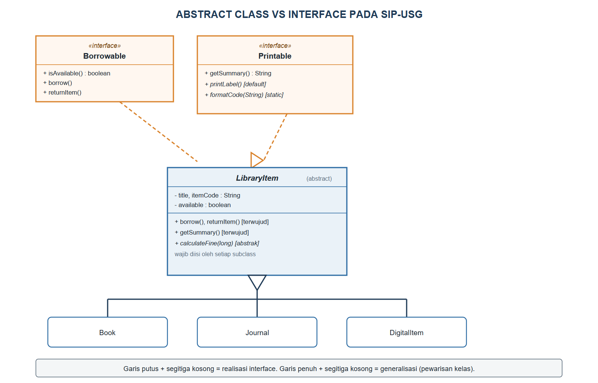
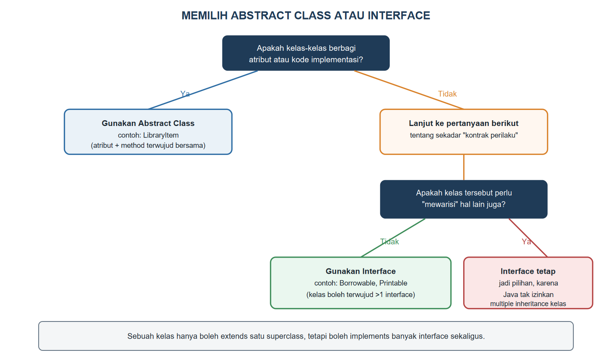

# BAB VII.
# (ABSTRAKSI: ABSTRACT CLASS DAN INTERFACE)

### CPMK/ Sub-CPMK :

- **CPMK2** : Mahasiswa mampu mengimplementasikan konsep pemrograman berorientasi objek (enkapsulasi, pewarisan, polimorfisme, abstraksi, *interface*, penanganan eksepsi, *collection*, dan *generics*) dalam bahasa Java untuk menyelesaikan masalah.
- **Sub-CPMK5** : Mahasiswa mampu menerapkan abstraksi melalui *abstract class* dan *interface*.

### Indikator Penilaian:

Ketepatan menerapkan abstraksi melalui *abstract class* dan *interface*, meliputi pendeklarasian *abstract method* dan kewajiban implementasinya pada *subclass*, perumusan *interface* sebagai kontrak perilaku, pemanfaatan *default method*, *static method*, dan *functional interface*, serta pemilihan antara *abstract class* dan *interface* berdasarkan kebutuhan kasus.

### Kriteria Keberhasilan (Rubrik):

- Sangat Baik (≥ 85): Mahasiswa mampu mengidentifikasi perilaku yang perlu diabstraksikan dari sebuah kasus, merumuskan *abstract class* dan *interface* yang tepat dengan argumen yang membandingkan beberapa alternatif rancangan, serta menghasilkan implementasi yang dapat dikompilasi dan diperluas.
- Baik (70-84): Mahasiswa mampu membuat *abstract class* dan *interface* yang berjalan dengan benar, tetapi alasan pemilihan salah satunya belum mempertimbangkan dampak terhadap pengembangan kelas di masa mendatang.
- Cukup (55-69): Mahasiswa mampu menulis sintaksis *abstract class* dan *interface*, tetapi belum mampu menentukan perilaku mana yang layak dijadikan kontrak pada kasus yang diberikan.

### Deskripsi Kemampuan yang Diharapkan:

Setelah mempelajari bab ini, mahasiswa diharapkan mampu memisahkan apa yang harus dilakukan sebuah objek dari bagaimana objek tersebut melakukannya, dengan merumuskan kontrak melalui *abstract class* dan *interface*. Dalam konteks Sistem Informasi, abstraksi memungkinkan modul-modul aplikasi, seperti modul peminjaman dan modul pencetakan laporan perpustakaan, saling bekerja sama melalui kontrak yang jelas sehingga satu modul dapat diganti atau dikembangkan tanpa merusak modul lainnya.

## A. Pendahuluan

Kelas `LibraryItem` yang dibangun sejak Bab V sesungguhnya menyimpan sebuah kejanggalan konseptual: kode `new LibraryItem("Sesuatu", "X001")` dapat dikompilasi dan dijalankan, padahal tidak ada satu pun koleksi perpustakaan nyata yang hanya berupa "item perpustakaan" tanpa jenis yang jelas. Setiap koleksi yang benar-benar ada di rak pastilah sebuah buku, jurnal, atau koleksi digital; `LibraryItem` hanyalah gagasan umum yang menyatukan ketiganya, bukan sesuatu yang seharusnya berdiri sendiri. Kejanggalan serupa muncul pada `calculateFine`: Bab VI membiarkan `Book` "mewarisi" rumus denda dasar begitu saja tanpa mengharuskannya berpikir ulang, padahal setiap jenis koleksi seharusnya secara sadar menentukan rumus dendanya sendiri.

Bab ini memperkenalkan pilar keempat pemrograman berorientasi objek, yaitu abstraksi, untuk menuntaskan kedua kejanggalan tersebut. `LibraryItem` diubah menjadi *abstract class* yang tidak dapat dibuat objeknya secara langsung, dan `calculateFine` diwajibkan diisi oleh setiap *subclass* melalui *abstract method*. Bab ini juga memperkenalkan *interface* sebagai bentuk abstraksi yang lebih murni, dipakai untuk merumuskan kontrak `Borrowable` (dapat dipinjam) dan `Printable` (dapat dicetak labelnya) yang dapat diterapkan lintas hierarki kelas. Kemampuan ini menopang Tugas 2 pada bagian F, sekaligus menutup cakupan materi Ujian Tengah Semester.

## B. Abstract Class dan Abstract Method

*Abstract class* adalah kelas yang sengaja dirancang tidak lengkap: ia boleh memiliki atribut dan *method* biasa seperti kelas pada umumnya, tetapi juga boleh memiliki *abstract method*, yaitu *method* yang hanya dituliskan tanda tangannya tanpa badan kode sama sekali, diberi kata kunci `abstract`. Java melarang pembuatan objek langsung dari *abstract class* menggunakan `new`, justru untuk memastikan konsep yang belum lengkap seperti "item perpustakaan tanpa jenis" tidak pernah benar-benar mewujud menjadi objek. Setiap *subclass* konkret wajib mengisi seluruh *abstract method* yang diwariskannya, atau ia sendiri juga harus dideklarasikan `abstract`.

Kode Program {{kp:libraryitem-abstract-1}} dan Kode Program {{kp:libraryitem-abstract-2}} menuliskan kelas `LibraryItem` yang telah diubah menjadi *abstract class*, dipecah menjadi dua bagian karena panjangnya.

Kode Program #libraryitem-abstract-1. LibraryItem sebagai abstract class (bagian 1)

```java
public abstract class LibraryItem
        implements Borrowable, Printable {
    private String title;
    private String itemCode;
    private boolean available;

    public LibraryItem(String title, String code) {
        if (title == null || title.isBlank()) {
            throw new IllegalArgumentException(
                "Judul tidak boleh kosong");
        }
        this.title = title;
        this.itemCode = code;
        this.available = true;
    }
    public String getTitle() {
        return title;
    }
    public String getItemCode() {
        return itemCode;
    }
    @Override
    public boolean isAvailable() {
        return available;
    }
    @Override
    public void borrow() {
        available = false;
    }
    @Override
    public void returnItem() {
        available = true;
    }
    // ... lanjutan pada Kode Program berikutnya
```

Kode Program #libraryitem-abstract-2. LibraryItem sebagai abstract class (bagian 2, lanjutan)

```java
    // lanjutan LibraryItem dari kode sebelumnya

    public abstract double calculateFine(
        long daysLate);

    @Override
    public String getSummary() {
        String s =
            available ? "Tersedia" : "Dipinjam";
        return title + " [" + itemCode
            + ", " + s + "]";
    }
    public void displayInfo() {
        System.out.println(getSummary());
    }
}
```

Baris `public abstract double calculateFine(long daysLate);` tidak memiliki tanda kurung kurawal maupun badan kode, hanya diakhiri titik koma. Setiap *subclass* konkret, yaitu `Book`, `Journal`, dan `DigitalItem`, kini wajib menyediakan implementasi *method* ini; jika salah satu lupa melakukannya, kompiler akan menolak kode tersebut dengan pesan galat yang jelas, bukan diam-diam mewarisi rumus yang mungkin tidak sesuai seperti pada Bab VI. Kode Program {{kp:book-calculatefine}} menunjukkan bagaimana `Book` kini secara eksplisit mengisi kewajiban tersebut.

Kode Program #book-calculatefine. Cuplikan Book.java: mengisi abstract method

```java
public class Book extends LibraryItem {
    // ... atribut, constructor, dan getter/setter
    // lain tidak berubah dari Bab V

    @Override
    public double calculateFine(long daysLate) {
        return Math.max(0, daysLate) * 500.0;
    }

    @Override
    public String getSummary() {
        return super.getSummary() + " oleh "
            + author + " (" + publicationYear + ")";
    }
}
```

## C. Interface: Kontrak Perilaku

Jika *abstract class* menggabungkan bagian yang sudah terwujud dan bagian yang masih abstrak dalam satu hierarki pewarisan, *interface* melangkah lebih jauh: ia murni merumuskan kontrak perilaku tanpa keadaan (atribut) sama sekali, dan sebuah kelas boleh menerapkan (*implements*) lebih dari satu *interface* sekaligus, berbeda dengan pewarisan kelas yang membatasi satu *superclass* saja. Kode Program {{kp:interface-borrowable}} merumuskan kontrak `Borrowable` yang menyatakan bahwa "sesuatu yang dapat dipinjam" harus sanggup melaporkan ketersediaannya, dipinjam, dan dikembalikan, tanpa peduli bagaimana detail penyimpanan statusnya.

Kode Program #interface-borrowable. Interface Borrowable

```java
package id.ac.usg.sip.model;

public interface Borrowable {
    boolean isAvailable();

    void borrow();

    void returnItem();
}
```

Bandingkan dengan formulir peminjaman fisik di perpustakaan: formulir tersebut hanya menyatakan "kolom apa yang harus diisi" (nama peminjam, judul, tanggal), tanpa peduli apakah petugas mencatatnya di buku besar atau di komputer. `Borrowable` berperan serupa: `LibraryItem` menyatakan `implements Borrowable` pada Kode Program {{kp:libraryitem-abstract-1}}, lalu menyediakan implementasi konkretnya sendiri melalui `borrow()` dan `returnItem()` yang mengubah atribut `available`.

## D. Default Method, Static Method, dan Functional Interface (Java 8+)

Sejak Java 8, *interface* dapat memiliki *default method*, yaitu *method* dengan badan kode lengkap yang otomatis tersedia bagi seluruh kelas yang menerapkan *interface* tersebut, kecuali kelas itu memilih menimpanya sendiri. *Interface* juga dapat memiliki *static method*, yaitu *method* yang dipanggil langsung lewat nama *interface*-nya, mirip *method* statis pada kelas biasa. Kode Program {{kp:interface-printable}} menerapkan keduanya pada *interface* `Printable`.

Kode Program #interface-printable. Interface Printable dengan default dan static method

```java
package id.ac.usg.sip.model;

public interface Printable {
    String getSummary();

    default void printLabel() {
        System.out.println("=== LABEL RAK ===");
        System.out.println(getSummary());
        System.out.println("=================");
    }

    static String formatCode(String code) {
        return "[" + code.toUpperCase() + "]";
    }
}
```

Perhatikan bahwa `printLabel()` sebagai *default method* memanggil `getSummary()`, sebuah *abstract method* dalam konteks *interface* ini yang wajib disediakan oleh kelas yang menerapkannya; karena `LibraryItem` sudah memiliki `getSummary()` sejak Bab V, `LibraryItem` otomatis memenuhi kontrak `Printable` tanpa perlu menulis `printLabel()` sendiri, kecuali ingin tampilan label yang berbeda. Adapun `formatCode(String code)` dipanggil langsung sebagai `Printable.formatCode(...)`, tanpa memerlukan objek apa pun, sebagaimana terlihat pada praktikum di bagian F.

*Functional interface* adalah *interface* yang hanya memiliki tepat satu *abstract method* (*default* dan *static method* tidak dihitung), sehingga dapat diringkas penulisannya memakai ekspresi *lambda*. Kode Program {{kp:functional-interface}} merumuskan `DueDateReminder` sebagai *functional interface* untuk mengingatkan anggota tentang batas waktu pengembalian.

Kode Program #functional-interface. Functional interface DueDateReminder

```java
package id.ac.usg.sip.model;

@FunctionalInterface
public interface DueDateReminder {
    void remind(String memberName, String title);
}
```

Anotasi `@FunctionalInterface` bukan keharusan, tetapi berguna agar kompiler menolak jika suatu saat ditambahkan *abstract method* kedua yang akan merusak sifat fungsionalnya. Praktikum pada bagian F akan menunjukkan bagaimana `DueDateReminder` dipakai dengan ekspresi *lambda* tanpa perlu membuat kelas terpisah yang mengimplementasikannya.

## E. Memilih Abstract Class atau Interface

Gambar {{g:bab07-abstract-vs-interface}} membandingkan langsung struktur `LibraryItem` sebagai *abstract class* dengan `Borrowable` dan `Printable` sebagai *interface* dalam satu diagram.



Tabel {{t:abstract-vs-interface}} merangkum perbedaan mendasar keduanya sebagai rujukan cepat.

Tabel #abstract-vs-interface. Perbandingan abstract class dan interface

| Aspek | Abstract Class | Interface |
|---|---|---|
| Atribut (keadaan) | Boleh memiliki atribut biasa | Hanya konstanta (`public static final`) |
| Jumlah yang diwarisi | Satu *superclass* saja (`extends`) | Boleh banyak sekaligus (`implements`) |
| Campuran kode | Boleh terwujud sebagian, abstrak sebagian | Sejak Java 8 boleh punya *default*/*static method* |
| Hubungan yang cocok | "adalah sebuah" dengan kode bersama | "sanggup melakukan" lintas hierarki |
| Contoh SIP-USG | `LibraryItem` | `Borrowable`, `Printable` |

Gambar {{g:bab07-pohon-keputusan}} menyajikan pohon keputusan sederhana untuk memilih di antara keduanya ketika merancang kelas baru.



Pertimbangan intinya adalah: gunakan *abstract class* ketika beberapa kelas berbagi kode implementasi dan keadaan yang sama, seperti `title` dan `itemCode` pada seluruh jenis `LibraryItem`; gunakan *interface* ketika yang ingin dinyatakan hanyalah "kesanggupan melakukan sesuatu" yang mungkin dimiliki kelas-kelas dari hierarki yang sama sekali berbeda. `Member` pada SIP-USG, misalnya, kelak juga dapat menerapkan `Printable` untuk mencetak kartu anggotanya, walaupun `Member` sama sekali tidak mewarisi `LibraryItem`.

## F. Praktikum Terbimbing: Interface Borrowable dan Printable pada SIP-USG

Praktikum ini menuntun penerapan seluruh kode pada bagian B hingga D, lalu menguji hasilnya melalui satu program demonstrasi.

1. Buat *interface* `Borrowable` pada paket `id.ac.usg.sip.model`, lalu salin Kode Program {{kp:interface-borrowable}}.
2. Buat *interface* `Printable` pada paket yang sama, lalu salin Kode Program {{kp:interface-printable}}.
3. Buat *interface* `DueDateReminder` pada paket yang sama, lalu salin Kode Program {{kp:functional-interface}}.
4. Ubah kelas `LibraryItem` mengikuti Kode Program {{kp:libraryitem-abstract-1}} dan Kode Program {{kp:libraryitem-abstract-2}}: tambahkan `abstract` pada deklarasi kelas, tambahkan `implements Borrowable, Printable`, dan ubah `calculateFine` menjadi *abstract method*.
5. Tambahkan `@Override` pada `calculateFine` milik `Book` mengikuti Kode Program {{kp:book-calculatefine}}. Kelas `Journal` dan `DigitalItem` yang sudah menimpa `calculateFine` sejak Bab VI tidak perlu diubah.
6. Buat kelas `Bab07Demo` pada paket `id.ac.usg.sip.app`, lalu salin Kode Program {{kp:bab07-demo}}.
7. Jalankan `Bab07Demo`, lalu amati bahwa `printLabel()` dan `formatCode(...)` dapat dipakai langsung walau `LibraryItem` tidak pernah mendefinisikan *method* tersebut sendiri.

Kode Program #bab07-demo. Menguji interface, default/static method, dan lambda

```java
package id.ac.usg.sip.app;

import id.ac.usg.sip.model.Book;
import id.ac.usg.sip.model.DueDateReminder;
import id.ac.usg.sip.model.Journal;
import id.ac.usg.sip.model.Printable;

public class Bab07Demo {
    public static void main(String[] args) {
        Book b1 = new Book("Basis Data", "B001",
            "Kadir, A.", "978-602-04-0001-1", 2012);
        Journal j1 = new Journal(
            "Jurnal SI", "J001",
            "USG Press", 12);

        b1.printLabel();
        System.out.println(
            Printable.formatCode(b1.getItemCode()));

        System.out.println(
            "Tersedia? " + b1.isAvailable());
        b1.borrow();
        System.out.println(
            "Tersedia? " + b1.isAvailable());
        b1.returnItem();

        DueDateReminder pengingat =
            (nama, judul) -> System.out.println(
                nama + ", segera kembalikan "
                + judul);
        pengingat.remind("Nadia", j1.getTitle());
    }
}
```

Keluaran Program:

```
=== LABEL RAK ===
Basis Data [B001, Tersedia] oleh Kadir, A. (2012)
=================
[B001]
Tersedia? true
Tersedia? false
Nadia, segera kembalikan Jurnal SI
```

Perhatikan bahwa `b1.printLabel()` dipanggil seolah *method* itu memang bagian dari `Book`, padahal `printLabel()` hanyalah *default method* milik `Printable` yang tidak pernah dituliskan ulang oleh `LibraryItem` maupun `Book`. Baris `pengingat.remind(...)` menunjukkan bahwa ekspresi *lambda* `(nama, judul) -> ...` diperlakukan sebagai implementasi `DueDateReminder` tanpa perlu membuat kelas baru yang menerapkannya secara eksplisit, karena `DueDateReminder` hanya memiliki tepat satu *abstract method*.

#### Catatan Asesmen

| Butir | Keterangan |
|---|---|
| Nama tugas | Tugas 2. Implementasi Inheritance, Polimorfisme, dan Abstraksi |
| Sub-CPMK | Sub-CPMK4, Sub-CPMK5 |
| Penugasan | Implementasikan program Java yang menerapkan pewarisan, polimorfisme, dan abstraksi (*abstract class*/*interface*) untuk satu kasus. |
| Ruang lingkup | *Inheritance*, *polymorphism*, *abstract class*, *interface*. |
| Cara pengerjaan | Individu; kode dan laporan via LMS. |
| Batas waktu | Minggu ke-8 |
| Luaran | Berkas kode sumber (.java) dan laporan singkat (PDF). |

Bab ini menutup cakupan Ujian Tengah Semester (Sub-CPMK1 sampai Sub-CPMK5). Kisi-kisi dan latihan komprehensif tersedia pada Lampiran A.

#### Kesalahan Umum dan Cara Mengatasinya

| Gejala/Pesan Error | Penyebab | Perbaikan |
|---|---|---|
| `error: LibraryItem is abstract; cannot be instantiated` | Kode masih mencoba `new LibraryItem(...)` langsung | Buat objek dari *subclass* konkret seperti `Book`, `Journal`, atau `DigitalItem` |
| `error: Book is not abstract and does not override abstract method calculateFine` | *Subclass* konkret belum mengimplementasikan seluruh *abstract method* yang diwariskan | Tambahkan `@Override` beserta implementasi *method* yang dimaksud pada *subclass* tersebut |
| `error: Borrowable is not a functional interface` pada penggunaan lambda | *Interface* yang dipakai memiliki lebih dari satu *abstract method*, sehingga tidak dapat diringkas dengan lambda | Gunakan lambda hanya untuk *interface* dengan tepat satu *abstract method*, atau buat kelas implementasi biasa |
| *Default method* tidak tampil sebagai pilihan saat mengetik kode di IDE | Kelas belum benar-benar menyatakan `implements` terhadap *interface* yang memuat *default method* tersebut | Pastikan klausa `implements` dituliskan lengkap pada deklarasi kelas |

### Rangkuman

Abstraksi menyembunyikan detail implementasi di balik kontrak yang jelas, diwujudkan melalui *abstract class* dan *interface*. *Abstract class*, seperti `LibraryItem`, boleh mencampur *method* yang sudah terwujud dengan *abstract method* yang wajib diisi *subclass* konkretnya, serta tidak dapat dibuat objeknya secara langsung. *Interface*, seperti `Borrowable` dan `Printable`, murni merumuskan kontrak perilaku tanpa keadaan dan dapat diterapkan lebih dari satu sekaligus oleh satu kelas, berbeda dengan pewarisan kelas yang terbatas pada satu *superclass*. Sejak Java 8, *interface* dapat memiliki *default method* dengan badan kode siap pakai dan *static method* yang dipanggil langsung lewat nama *interface*-nya, sedangkan *functional interface* dengan tepat satu *abstract method* dapat diringkas penulisannya memakai ekspresi *lambda*. Pemilihan antara *abstract class* dan *interface* bergantung pada apakah kelas-kelas yang terlibat berbagi kode implementasi (abstract class) atau sekadar berbagi kesanggupan melakukan sesuatu lintas hierarki (interface).

### Soal/Pertanyaan

1. (C2) Jelaskan mengapa `LibraryItem` sebaiknya dijadikan *abstract class*, bukan kelas biasa yang dapat dibuat objeknya!
2. (C2) Jelaskan perbedaan *default method* dan *static method* pada *interface*, masing-masing disertai contoh dari `Printable`!
3. (C3) Perhatikan Kode Program {{kp:libraryitem-abstract-2}}. Jelaskan mengapa `calculateFine` dideklarasikan `abstract`, sedangkan `getSummary` tidak, walau keduanya sama-sama dipakai seluruh *subclass*!
4. (C3) Telusuri Kode Program {{kp:bab07-demo}}, lalu jelaskan bagaimana ekspresi *lambda* pada variabel `pengingat` dapat dianggap sebagai implementasi `DueDateReminder`!
5. (C4) Bandingkan `LibraryItem` sebagai *abstract class* dengan `Borrowable` sebagai *interface*. Analisis mengapa `Member` dapat menerapkan `Printable` tanpa perlu mewarisi `LibraryItem`!
6. (C4) Perhatikan Tabel {{t:abstract-vs-interface}} dan Gambar {{g:bab07-pohon-keputusan}}. Jelaskan mengapa Java tidak mengizinkan sebuah kelas mewarisi lebih dari satu *superclass*, tetapi mengizinkan menerapkan banyak *interface*!
7. (C5) Rancanglah (dalam bentuk kerangka kode) sebuah *interface* `Searchable` dengan satu *abstract method* `matches(String keyword) : boolean`, lalu jelaskan bagaimana `Catalog` dapat memanfaatkannya untuk pencarian yang lebih fleksibel daripada Kode Program pada Bab VI!
8. (C6) SIP-USG kini memiliki `LibraryItem` sebagai *abstract class* serta `Borrowable` dan `Printable` sebagai *interface*. Nilailah apakah `calculateFine` sebaiknya tetap berada di `LibraryItem` sebagai *abstract method*, atau dipindahkan menjadi *abstract method* pada *interface* terpisah bernama `Fineable`, dan jelaskan pertimbangan Anda berdasarkan Gambar {{g:bab07-pohon-keputusan}}!

### Rujukan Bab

- Bloch, J. (2018). *Effective Java* (3rd ed.). Addison-Wesley Professional.
- Deitel, P. J., & Deitel, H. M. (2018). *Java how to program, early objects* (11th ed.). Pearson Education.
