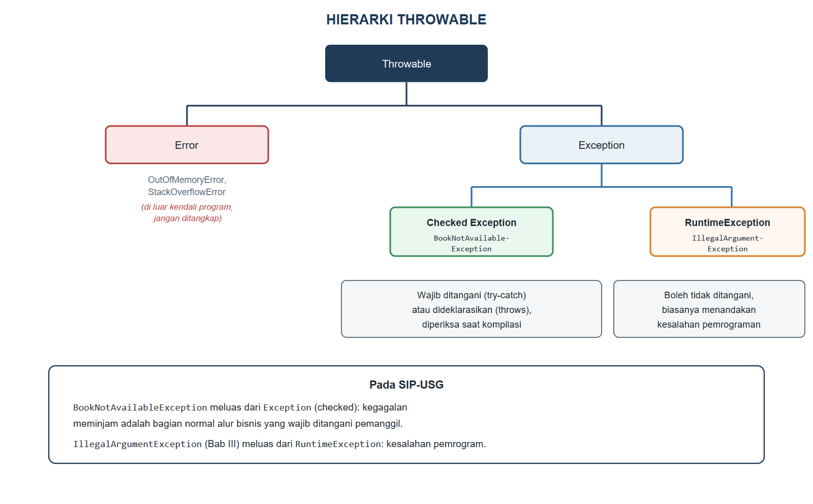
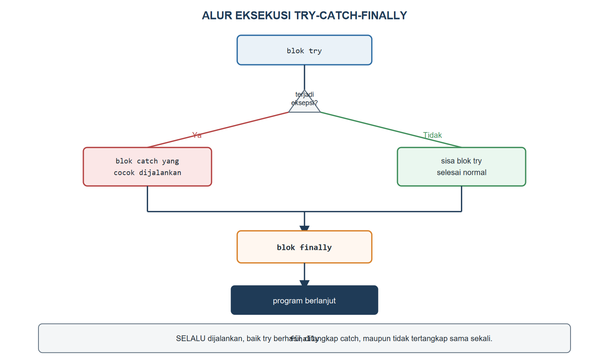

# BAB VIII.
# (PENANGANAN EKSEPSI / EXCEPTION HANDLING)

### CPMK/ Sub-CPMK :

- **CPMK2** : Mahasiswa mampu mengimplementasikan konsep pemrograman berorientasi objek (enkapsulasi, pewarisan, polimorfisme, abstraksi, *interface*, penanganan eksepsi, *collection*, dan *generics*) dalam bahasa Java untuk menyelesaikan masalah.
- **Sub-CPMK6** : Mahasiswa mampu mengimplementasikan penanganan eksepsi (*exception handling*), *collection*, dan *generics*.

### Indikator Penilaian:

Ketepatan mengimplementasikan `try-catch-finally` dan *custom exception*, meliputi pembedaan *checked exception*, *unchecked exception*, dan *error*, penggunaan `try-with-resources` untuk sumber daya, perambatan eksepsi melalui `throw` dan `throws`, serta perancangan kelas eksepsi khusus dengan pesan kesalahan yang bermakna bagi pengguna.

### Kriteria Keberhasilan (Rubrik):

- Sangat Baik (≥ 85): Mahasiswa mampu mengidentifikasi titik-titik rawan kegagalan pada sebuah proses bisnis, merancang *custom exception* yang tepat, dan menentukan di lapisan mana eksepsi ditangani atau diteruskan dengan penalaran yang dapat dipertanggungjawabkan.
- Baik (70-84): Mahasiswa mampu menerapkan `try-catch-finally` dan *custom exception* dengan benar, tetapi masih terdapat blok `catch` yang terlalu umum atau pesan kesalahan yang kurang informatif.
- Cukup (55-69): Mahasiswa mampu menulis blok `try-catch` sederhana, tetapi belum mampu membedakan jenis eksepsi maupun merancang eksepsi khusus sesuai aturan bisnis.

### Deskripsi Kemampuan yang Diharapkan:

Setelah mempelajari bab ini, mahasiswa diharapkan mampu membuat program yang tetap berperilaku terkendali ketika terjadi kondisi tidak normal, dengan mendeteksi, menangani, dan melaporkan kesalahan secara tepat. Dalam konteks Sistem Informasi, kemampuan ini menjamin aplikasi tidak berhenti mendadak saat pengguna memasukkan data yang salah atau saat buku yang akan dipinjam ternyata tidak tersedia, sekaligus memberikan pesan yang jelas bagi petugas perpustakaan.

## A. Pendahuluan

Perhatikan kembali *method* `borrow()` pada `LibraryItem`: sejak Bab V, *method* ini selalu berhasil mengubah `available` menjadi `false`, tanpa pernah memeriksa apakah item tersebut sesungguhnya sedang dipinjam orang lain. Dalam dunia nyata, petugas sirkulasi yang mendapati buku yang diminta ternyata sedang dipinjam tidak akan memaksakan transaksi; ia akan menolaknya dan menjelaskan alasannya kepada mahasiswa yang bersangkutan. Kode SIP-USG saat ini tidak memiliki mekanisme semacam itu: jika dua anggota mencoba meminjam buku yang sama, keduanya akan "berhasil" meminjam menurut catatan sistem, sebuah cacat yang bisa berakibat serius pada aplikasi produksi.

Bab ini memperkenalkan penanganan eksepsi sebagai mekanisme Java untuk menghadapi kondisi tidak normal semacam ini secara terkendali. Mahasiswa akan mempelajari hierarki `Throwable`, blok `try-catch-finally`, cara meneruskan eksepsi antar-*method* melalui `throw` dan `throws`, hingga merancang eksepsi khusus bernama `BookNotAvailableException` yang akan menghentikan `borrow()` secara sopan ketika item memang tidak tersedia. Kemampuan ini menjadi penopang penting sebelum SIP-USG mengelola data dalam jumlah besar pada Bab IX dan seterusnya, karena semakin banyak data yang dikelola, semakin banyak pula kemungkinan kondisi tidak normal yang harus diantisipasi.

## B. Hierarki Throwable: Error, Checked, dan Unchecked Exception

Seluruh kondisi tidak normal dalam Java diwakili oleh objek yang merupakan turunan kelas `Throwable`. Gambar {{g:bab08-hierarki-throwable}} memetakan hierarki ini beserta contoh nyata dari SIP-USG.



`Error` mewakili kondisi fatal di luar kendali program itu sendiri, misalnya kehabisan memori (`OutOfMemoryError`); program aplikasi hampir tidak pernah menangkap `Error`, karena penyebabnya biasanya sudah di luar kemampuan kode untuk pulih. `Exception` terbagi menjadi dua kelompok besar. *Checked exception*, seperti `BookNotAvailableException` yang akan dibangun pada bagian E, wajib ditangani dengan `try-catch` atau dideklarasikan lewat `throws`; kompiler akan menolak kode yang mengabaikannya sama sekali. *Unchecked exception*, yang seluruhnya merupakan turunan `RuntimeException` seperti `IllegalArgumentException` yang telah dipakai sejak Bab III, boleh dibiarkan tidak ditangani secara eksplisit, karena biasanya menandakan kesalahan pemrograman yang seharusnya diperbaiki, bukan kondisi bisnis yang wajar. Tabel {{t:eksepsi-umum}} merangkum beberapa eksepsi umum Java beserta pemicunya.

Tabel #eksepsi-umum. Eksepsi umum Java dan pemicunya

| Eksepsi | Jenis | Pemicu Umum |
|---|---|---|
| `NullPointerException` | Unchecked | Memanggil *method* pada referensi bernilai `null` |
| `ArrayIndexOutOfBoundsException` | Unchecked | Indeks larik di luar rentang valid |
| `NumberFormatException` | Unchecked | `Integer.parseInt` menerima teks bukan angka |
| `IllegalArgumentException` | Unchecked | Argumen tidak memenuhi aturan validasi (Bab III) |
| `ClassCastException` | Unchecked | *Downcasting* ke tipe yang salah (Bab VI) |
| `IOException` | Checked | Kegagalan operasi berkas (dibahas Bab X) |

## C. try-catch-finally dan try-with-resources

Blok `try` membungkus kode yang berpotensi melempar eksepsi, blok `catch` menangkap dan menangani eksepsi tersebut, dan blok `finally` selalu dijalankan setelahnya apa pun yang terjadi, baik `try` berhasil, `catch` menangani eksepsi, maupun eksepsi yang sama sekali tidak tertangkap. Gambar {{g:bab08-alur-try-catch}} menelusuri alur ini secara lengkap.



Sejak Java 7, konstruksi `try-with-resources` menyederhanakan penutupan sumber daya yang mengimplementasikan `AutoCloseable`, dengan menjamin *method* `close()` dipanggil otomatis begitu blok `try` selesai, tanpa perlu menuliskan `finally` secara manual untuk keperluan itu. Kode Program {{kp:loan-session}} membangun kelas `LoanSession` yang mengimplementasikan `AutoCloseable` sebagai ilustrasi sederhana sebelum operasi berkas sesungguhnya dibahas pada Bab X.

Kode Program #loan-session. Kelas LoanSession yang mengimplementasikan AutoCloseable

```java
package id.ac.usg.sip.model;

public class LoanSession implements AutoCloseable {
    private String memberName;

    public LoanSession(String memberName) {
        this.memberName = memberName;
        System.out.println(
            "Sesi dibuka: " + memberName);
    }

    public void process() {
        System.out.println("Memproses peminjaman");
    }

    @Override
    public void close() {
        System.out.println(
            "Sesi ditutup: " + memberName);
    }
}
```

Pernyataan `try (LoanSession sesi = new LoanSession("Nadia")) { sesi.process(); }` pada praktikum bagian F akan memanggil `close()` secara otomatis tepat setelah `process()` selesai, bahkan seandainya `process()` melemparkan eksepsi di tengah jalan. Ini jauh lebih aman dibandingkan menutup sumber daya secara manual di dalam `finally`, yang mudah terlupa ketika kode bercabang menjadi rumit.

## D. throw, throws, dan Perambatan Eksepsi

Kata kunci `throw` (tanpa huruf "s") dipakai untuk benar-benar melemparkan sebuah objek eksepsi pada satu titik kode, sedangkan kata kunci `throws` (dengan huruf "s") dituliskan pada deklarasi *method* untuk menyatakan bahwa *method* tersebut *mungkin* melemparkan eksepsi tertentu kepada pemanggilnya, sebuah kewajiban khusus untuk *checked exception*. Kode Program {{kp:loan-service}} menunjukkan perambatan eksepsi antar dua lapisan: `LibraryItem.borrow()` yang melempar eksepsi, dan `LoanService.borrowItem(...)` yang meneruskannya tanpa menanganinya sendiri.

Kode Program #loan-service. Kelas LoanService: meneruskan eksepsi ke pemanggil

```java
package id.ac.usg.sip.model;

public class LoanService {
    public Loan borrowItem(Member member,
            LibraryItem item, String loanDate)
            throws BookNotAvailableException {
        item.borrow();
        return new Loan(member, item, loanDate);
    }
}
```

Perhatikan bahwa `borrowItem` tidak menangkap `BookNotAvailableException` yang mungkin dilemparkan `item.borrow()` sama sekali; ia hanya menambahkan `throws BookNotAvailableException` pada deklarasinya sendiri, meneruskan tanggung jawab penanganan kepada kode yang memanggil `borrowItem`. Perambatan berjenjang seperti ini lazim terjadi pada aplikasi berlapis: lapisan bawah (`LibraryItem`) mendeteksi masalah, lapisan tengah (`LoanService`) meneruskannya, dan lapisan atas (kode pada bagian F) akhirnya menanganinya dengan cara yang sesuai bagi pengguna, misalnya menampilkan pesan pada antarmuka.

## E. Custom Exception dan Pesan Kesalahan yang Bermakna

Java menyediakan banyak kelas eksepsi bawaan, tetapi tidak satu pun yang secara spesifik menyatakan "buku sedang tidak tersedia untuk dipinjam" sebagai bagian dari aturan bisnis SIP-USG. *Custom exception* dibuat dengan menurunkan `Exception` (untuk *checked exception*) atau `RuntimeException` (untuk *unchecked exception*), lalu diberi *constructor* yang menerima pesan kesalahan yang bermakna. Kode Program {{kp:book-not-available}} merancang `BookNotAvailableException` sebagai *checked exception*, sengaja dipilih *checked* karena kegagalan meminjam adalah bagian normal dari alur bisnis perpustakaan yang wajib dipikirkan pemanggilnya, bukan kesalahan pemrograman yang tidak terduga.

Kode Program #book-not-available. Custom exception BookNotAvailableException

```java
package id.ac.usg.sip.model;

public class BookNotAvailableException
        extends Exception {
    public BookNotAvailableException(
            String message) {
        super(message);
    }
}
```

Kelas ini kemudian dipakai pada `borrow()` milik `LibraryItem`, sebagaimana terlihat pada Kode Program {{kp:libraryitem-borrow}}: pesan yang dilemparkan menyebutkan judul item secara eksplisit, jauh lebih bermakna dibandingkan pesan generik seperti "operation failed".

Kode Program #libraryitem-borrow. Cuplikan LibraryItem.java: borrow() melempar custom exception

```java
public abstract class LibraryItem
        implements Borrowable, Printable {
    // ... atribut, constructor, dan method lain
    // tidak berubah dari Bab VII

    @Override
    public void borrow()
            throws BookNotAvailableException {
        if (!available) {
            throw new BookNotAvailableException(
                title + " sedang tidak tersedia");
        }
        available = false;
    }
    // ... returnItem(), calculateFine(),
    // getSummary(), dan displayInfo() tidak berubah
}
```

Perhatikan bahwa mengubah tanda tangan `borrow()` pada `LibraryItem` mengharuskan tanda tangan `borrow()` pada *interface* `Borrowable` ikut diperbarui dengan `throws BookNotAvailableException`, karena setiap *method* yang mengimplementasikan *method* *interface* harus konsisten dengan eksepsi yang boleh dilemparkannya.

## F. Praktikum Terbimbing: BookNotAvailableException pada Proses Peminjaman

Praktikum ini merangkai seluruh kode pada bagian C hingga E menjadi satu alur peminjaman yang tervalidasi.

1. Buat kelas `BookNotAvailableException` pada paket `id.ac.usg.sip.model`, lalu salin Kode Program {{kp:book-not-available}}.
2. Ubah *interface* `Borrowable` agar *method* `borrow()` mendeklarasikan `throws BookNotAvailableException`.
3. Ubah *method* `borrow()` pada `LibraryItem` mengikuti Kode Program {{kp:libraryitem-borrow}}.
4. Buat kelas `LoanService` pada paket yang sama, lalu salin Kode Program {{kp:loan-service}}.
5. Buat kelas `LoanSession` pada paket yang sama, lalu salin Kode Program {{kp:loan-session}}.
6. Buat kelas `Bab08Demo` pada paket `id.ac.usg.sip.app`, lalu salin Kode Program {{kp:bab08-demo}}.
7. Jalankan `Bab08Demo`, lalu amati bagaimana percobaan meminjam buku yang sama untuk kedua kalinya ditolak dengan pesan yang jelas, bukan membuat program berhenti.

Kode Program #bab08-demo. Menguji perambatan eksepsi dan try-with-resources

```java
package id.ac.usg.sip.app;

import id.ac.usg.sip.model.Book;
import id.ac.usg.sip.model.BookNotAvailableException;
import id.ac.usg.sip.model.Loan;
import id.ac.usg.sip.model.LoanService;
import id.ac.usg.sip.model.LoanSession;
import id.ac.usg.sip.model.Member;

public class Bab08Demo {
    public static void main(String[] args) {
        Book b1 = new Book("Basis Data", "B001",
            "Kadir, A.", "978-602-04-0001-1", 2012);
        Member m1 = new Member("20240001",
            "Nadia Ramadhani", "nadia@usg.ac.id");
        LoanService layanan = new LoanService();

        try {
            Loan p1 = layanan.borrowItem(
                m1, b1, "2026-09-14");
            System.out.println(p1.getSummary());
        } catch (BookNotAvailableException e) {
            System.out.println("Gagal: "
                + e.getMessage());
        }

        try {
            layanan.borrowItem(
                m1, b1, "2026-09-15");
        } catch (BookNotAvailableException e) {
            System.out.println("Gagal: "
                + e.getMessage());
        }

        try (LoanSession sesi =
                new LoanSession("Nadia")) {
            sesi.process();
        }
    }
}
```

Keluaran Program:

```
Nadia Ramadhani meminjam Basis Data pada 2026-09-14
Gagal: Basis Data sedang tidak tersedia
Sesi dibuka: Nadia
Memproses peminjaman
Sesi ditutup: Nadia
```

Perhatikan bahwa percobaan pertama berhasil karena `b1` masih tersedia, sehingga `borrow()` mengubah `available` menjadi `false` tanpa melempar eksepsi. Percobaan kedua pada buku yang sama gagal karena `available` sudah bernilai `false`, sehingga `borrow()` melemparkan `BookNotAvailableException` yang merambat melalui `LoanService.borrowItem` hingga akhirnya ditangkap oleh blok `catch` pada `Bab08Demo`. Baris terakhir menunjukkan `close()` pada `LoanSession` terpanggil otomatis begitu blok `try-with-resources` selesai, tanpa satu baris kode pun ditulis khusus untuk itu.

#### Kesalahan Umum dan Cara Mengatasinya

| Gejala/Pesan Error | Penyebab | Perbaikan |
|---|---|---|
| `error: unreported exception BookNotAvailableException; must be caught or declared to be thrown` | Kode memanggil *method* yang mendeklarasikan *checked exception* tanpa `try-catch` maupun `throws` pada pemanggilnya | Bungkus pemanggilan dengan `try-catch`, atau tambahkan `throws` pada *method* pemanggil |
| Program berhenti dengan *stack trace* panjang tanpa pesan yang jelas bagi pengguna | Eksepsi dibiarkan merambat hingga ke `main` tanpa pernah ditangkap | Tangkap eksepsi pada lapisan yang tepat, lalu tampilkan pesan `e.getMessage()` yang ramah pengguna |
| `error: LibraryItem is not abstract and does not override abstract method borrow()` pada *interface* | Tanda tangan *method* pada kelas yang mengimplementasikan *interface* tidak sama persis dengan *interface*-nya, termasuk klausa `throws` | Samakan klausa `throws` pada kelas implementasi dengan yang dideklarasikan *interface* |
| Sumber daya seperti `LoanSession` tidak pernah tertutup meski program tidak *crash* | Penutupan dilakukan manual dan terlupa pada salah satu jalur percabangan kode | Gunakan `try-with-resources` agar `close()` terjamin terpanggil otomatis |

### Rangkuman

Penanganan eksepsi memungkinkan program tetap berperilaku terkendali ketika terjadi kondisi tidak normal, melalui hierarki `Throwable` yang terbagi menjadi `Error` (fatal, di luar kendali program), *checked exception* (wajib ditangani atau dideklarasikan, diperiksa kompiler), dan *unchecked exception* atau `RuntimeException` (boleh dibiarkan, biasanya menandakan kesalahan pemrograman). Blok `try-catch-finally` menangkap dan menangani eksepsi, dengan `finally` yang selalu dijalankan apa pun hasilnya, sedangkan `try-with-resources` menyederhanakan penutupan sumber daya yang mengimplementasikan `AutoCloseable` secara otomatis. Kata kunci `throw` melemparkan sebuah eksepsi, sedangkan `throws` mendeklarasikan bahwa sebuah *method* mungkin meneruskan eksepsi tersebut ke pemanggilnya, memungkinkan perambatan eksepsi berjenjang antar lapisan aplikasi. *Custom exception* seperti `BookNotAvailableException` dirancang dengan menurunkan `Exception` atau `RuntimeException`, disertai pesan kesalahan yang bermakna sesuai aturan bisnis, sehingga SIP-USG kini menolak peminjaman buku yang sedang tidak tersedia secara sopan dan informatif.

### Soal/Pertanyaan

1. (C2) Jelaskan perbedaan `Error`, *checked exception*, dan *unchecked exception*, masing-masing disertai satu contoh!
2. (C2) Jelaskan perbedaan kata kunci `throw` dan `throws`, termasuk kapan masing-masing dituliskan!
3. (C3) Perhatikan Kode Program {{kp:libraryitem-borrow}}. Jelaskan mengapa `BookNotAvailableException` dilemparkan sebagai *checked exception*, bukan *unchecked exception* seperti `IllegalArgumentException` pada Bab III!
4. (C3) Telusuri Kode Program {{kp:bab08-demo}}, lalu jelaskan mengapa percobaan peminjaman kedua terhadap `b1` menghasilkan pesan "Gagal", padahal `b1` adalah objek yang sama dengan percobaan pertama!
5. (C4) Bandingkan Gambar {{g:bab08-alur-try-catch}} dengan Kode Program {{kp:bab08-demo}} pada bagian `try (LoanSession sesi = ...)`. Analisis kapan `close()` pada `LoanSession` dipanggil relatif terhadap `process()`!
6. (C4) Perhatikan Kode Program {{kp:loan-service}}. Jelaskan mengapa `borrowItem` tidak perlu menangkap `BookNotAvailableException` sendiri, cukup mendeklarasikan `throws`!
7. (C5) Rancanglah (dalam bentuk kerangka kode) sebuah *custom exception* `InvalidLoanDateException` yang dilemparkan `LoanService` apabila tanggal peminjaman berada di masa depan. Tentukan apakah eksepsi ini sebaiknya *checked* atau *unchecked*, disertai alasannya!
8. (C6) SIP-USG saat ini hanya menolak peminjaman buku yang sudah dipinjam. Nilailah apakah `returnItem()` pada `LibraryItem` juga memerlukan penanganan eksepsi serupa untuk kasus mengembalikan buku yang sebenarnya belum pernah dipinjam, dan rancang alasannya berdasarkan prinsip pada bagian E!

### Rujukan Bab

- Bloch, J. (2018). *Effective Java* (3rd ed.). Addison-Wesley Professional.
- Deitel, P. J., & Deitel, H. M. (2018). *Java how to program, early objects* (11th ed.). Pearson Education.
