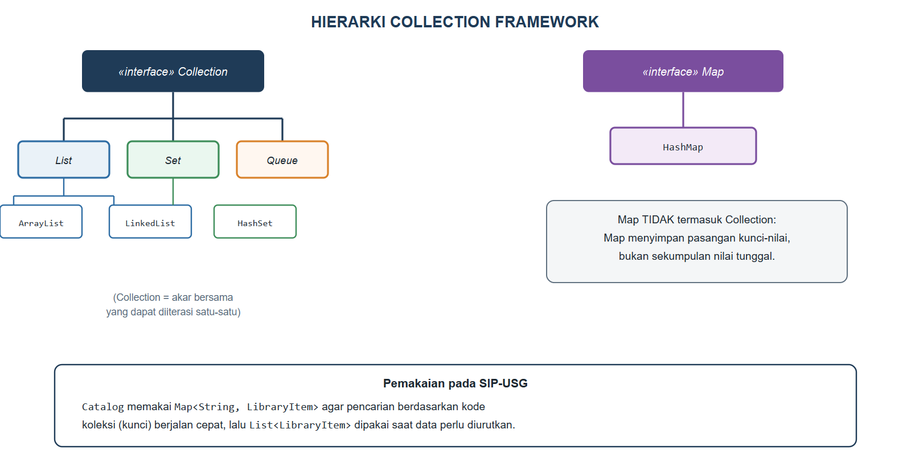
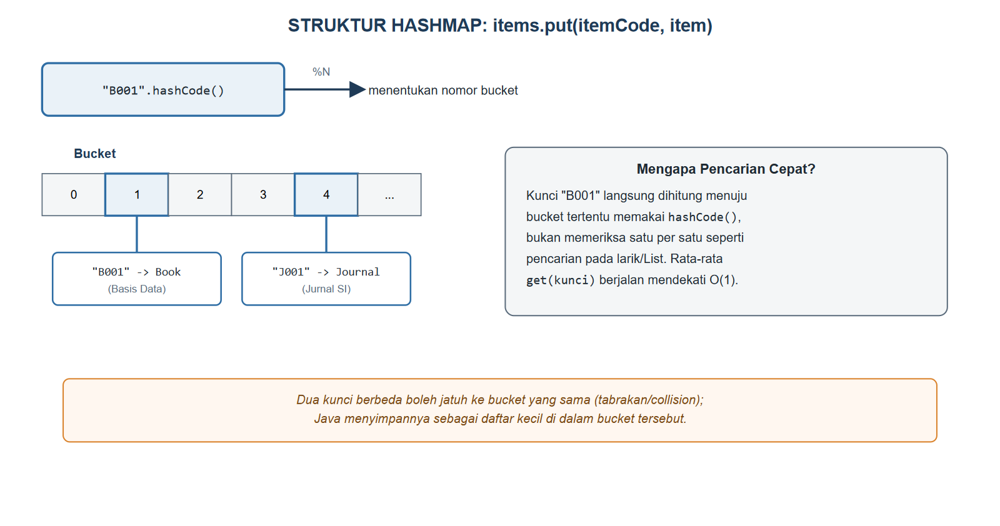

# BAB IX.
# (COLLECTION FRAMEWORK DAN GENERICS)

### CPMK/ Sub-CPMK :

- **CPMK2** : Mahasiswa mampu mengimplementasikan konsep pemrograman berorientasi objek (enkapsulasi, pewarisan, polimorfisme, abstraksi, *interface*, penanganan eksepsi, *collection*, dan *generics*) dalam bahasa Java untuk menyelesaikan masalah.
- **Sub-CPMK6** : Mahasiswa mampu mengimplementasikan penanganan eksepsi (*exception handling*), *collection*, dan *generics*.

### Indikator Penilaian:

Ketepatan mengimplementasikan *collection* (`List`, `Set`, `Map`) dan *generics*, meliputi pemilihan struktur `ArrayList`, `LinkedList`, `HashSet`, dan `HashMap` berdasarkan karakteristik dan kebutuhan kasus, penulisan kelas dan *method* bertipe generik yang aman tipe, serta iterasi dan pengurutan objek dengan `Comparable` dan `Comparator`.

### Kriteria Keberhasilan (Rubrik):

- Sangat Baik (≥ 85): Mahasiswa mampu menjawab soal kuis tentang *collection* dan *generics* secara tepat, memilih struktur koleksi berdasarkan pertimbangan operasi dan kinerja pada kasus, serta menerapkan pengurutan objek dengan `Comparator` secara benar dan ringkas.
- Baik (70-84): Mahasiswa mampu menggunakan `List`, `Set`, dan `Map` beserta *generics* dengan benar, tetapi alasan pemilihan struktur koleksi belum mempertimbangkan karakteristik operasinya.
- Cukup (55-69): Mahasiswa mampu menyimpan dan menampilkan objek menggunakan `ArrayList`, tetapi belum mampu menerapkan `Map`, *bounded type*, maupun pengurutan objek secara mandiri.

### Deskripsi Kemampuan yang Diharapkan:

Setelah mempelajari bab ini, mahasiswa diharapkan mampu mengelola sekumpulan objek dalam jumlah besar menggunakan struktur koleksi yang tepat serta menulis kode yang aman tipe melalui *generics*. Dalam konteks Sistem Informasi, kemampuan ini diperlukan untuk menyimpan, mencari, menyaring, dan mengurutkan data operasional di memori, misalnya katalog buku perpustakaan yang dicari berdasarkan kode panggil dan diurutkan berdasarkan judul atau tahun terbit.

## A. Pendahuluan

Kelas `Catalog` yang dibangun sejak Bab IV menyimpan koleksinya dalam larik `LibraryItem[]` berukuran tetap, ditentukan sekali saat objek `Catalog` dibuat. Pendekatan ini mulai menyulitkan begitu SIP-USG dibayangkan menangani ribuan koleksi yang terus bertambah dan berkurang sepanjang waktu: larik tidak dapat "membesar" begitu saja, dan mencari satu koleksi berdasarkan kode panggilnya berarti memeriksa seluruh elemen larik satu per satu dari awal hingga ditemukan. Bagi katalog perpustakaan kampus yang sesungguhnya, kelemahan ini akan terasa nyata setiap kali petugas mencari satu judul di antara puluhan ribu koleksi.

Bab ini memperkenalkan *Collection Framework*, kumpulan struktur data siap pakai yang disediakan Java untuk mengelola sekumpulan objek secara dinamis dan efisien, beserta *generics*, mekanisme yang menjaga struktur data tersebut tetap aman tipe. `Catalog` akan dirombak menggunakan `Map<String, LibraryItem>` agar pencarian berdasarkan kode koleksi menjadi jauh lebih cepat, sementara `Book` akan dilengkapi kemampuan mengurutkan dirinya sendiri melalui `Comparable`. Kemampuan ini menopang Kuis 2 pada Minggu ke-10, sekaligus menjadi bekal penting sebelum SIP-USG menyimpan data ke berkas pada Bab X dan ke basis data pada Bab XI.

## B. Arsitektur Collection Framework: Collection, List, Set, Map

Bayangkan tiga cara mengelola arsip fisik di perpustakaan: daftar antrean peminjaman yang urut dan boleh berulang (mirip `List`), kumpulan nomor anggota aktif yang tidak boleh ada duplikat (mirip `Set`), dan kartu katalog yang dicari berdasarkan kode panggil sebagai kunci (mirip `Map`). Java mengorganisasikan struktur data ini ke dalam *Collection Framework* yang digambarkan pada Gambar {{g:bab09-hierarki-collection}}.



`List`, `Set`, dan `Queue` seluruhnya merupakan turunan `Collection`, sebuah *interface* akar yang menyatakan kontrak untuk menyimpan sekumpulan elemen yang dapat diiterasi satu per satu. `List` mempertahankan urutan penyisipan dan mengizinkan elemen duplikat, `Set` menolak elemen duplikat, dan `Queue` mengelola elemen menurut urutan pemrosesan tertentu. Perlu diperhatikan bahwa `Map` **tidak** merupakan turunan `Collection`; `Map` menyimpan pasangan kunci-nilai, bukan sekumpulan nilai tunggal, sehingga berdiri sebagai hierarki tersendiri.

## C. ArrayList, LinkedList, HashSet, HashMap: Karakteristik dan Pemilihan

Tabel {{t:koleksi-karakteristik}} membandingkan empat implementasi koleksi yang paling sering dipakai beserta kasus penggunaannya pada SIP-USG.

Tabel #koleksi-karakteristik. Perbandingan karakteristik koleksi Java

| Struktur | Duplikat | Urutan | Akses berdasarkan indeks | Kasus pakai SIP-USG |
|---|---|---|---|---|
| `ArrayList` | Boleh | Urutan sisip | Cepat | Daftar buku hasil pencarian |
| `LinkedList` | Boleh | Urutan sisip | Lambat | Antrean permintaan pemesanan |
| `HashSet` | Tidak | Tidak terjamin | Tidak ada | Kumpulan NIM unik yang aktif |
| `HashMap` | Kunci tidak boleh | Tidak terjamin | Berdasarkan kunci | `Catalog` berdasarkan kode koleksi |

`HashMap` dipilih untuk `Catalog` karena kebutuhan utamanya adalah pencarian cepat berdasarkan kode koleksi yang unik, bukan urutan penyimpanan. Gambar {{g:bab09-struktur-hashmap}} menjelaskan mengapa pencarian pada `HashMap` jauh lebih cepat dibandingkan menelusuri larik satu per satu seperti pada Bab IV hingga Bab VIII.



## D. Generics: Type Parameter, Bounded Type, dan Type Safety

*Generics* memungkinkan sebuah kelas atau *method* ditulis satu kali agar dapat bekerja dengan berbagai tipe data tanpa kehilangan keamanan tipe (*type safety*) saat kompilasi. Kode Program {{kp:kelas-repository}} membangun kelas generik `Repository<T>` yang dapat menyimpan daftar objek bertipe apa pun.

Kode Program #kelas-repository. Kelas generik Repository dan method bounded type

```java
package id.ac.usg.sip.model;

import java.util.ArrayList;
import java.util.List;

public class Repository<T> {
    private List<T> data = new ArrayList<>();

    public void add(T item) {
        data.add(item);
    }

    public T getAt(int index) {
        return data.get(index);
    }

    public List<T> getAll() {
        return data;
    }

    public int count() {
        return data.size();
    }

    public static <E extends LibraryItem>
            int countAvailable(List<E> items) {
        int total = 0;
        for (E it : items) {
            if (it.isAvailable()) {
                total++;
            }
        }
        return total;
    }
}
```

Huruf `T` di dalam `Repository<T>` adalah *type parameter*, sebuah nama sementara yang akan digantikan tipe data sesungguhnya ketika kelas ini dipakai, misalnya `Repository<Member>` atau `Repository<Book>`. Kompiler memastikan `Repository<Member>` hanya dapat diisi objek `Member`, sehingga kesalahan seperti menambahkan `Book` ke dalamnya akan ditolak saat kompilasi, jauh sebelum program dijalankan.

*Method* statis `countAvailable` memakai *bounded type parameter* `<E extends LibraryItem>`, yang menyatakan bahwa `E` boleh berupa tipe apa pun asalkan merupakan `LibraryItem` atau turunannya. Batasan ini memungkinkan badan *method* memanggil `it.isAvailable()`, sesuatu yang tidak mungkin dilakukan jika `E` benar-benar tipe sembarangan tanpa batasan, karena kompiler tidak dapat menjamin tipe sembarangan tersebut memiliki *method* `isAvailable()`.

## E. Iterasi, Comparable/Comparator, dan Pengurutan Objek

Sebuah kelas dapat menentukan urutan alaminya sendiri dengan mengimplementasikan `Comparable<T>` dan menyediakan *method* `compareTo`. Kode Program {{kp:book-comparable}} menambahkan kemampuan ini pada `Book`, mengurutkan berdasarkan judul.

Kode Program #book-comparable. Cuplikan Book.java: implementasi Comparable

```java
public class Book extends LibraryItem
        implements Comparable<Book> {
    // ... atribut, constructor, dan method lain
    // tidak berubah dari Bab VII

    @Override
    public int compareTo(Book other) {
        return this.getTitle()
            .compareTo(other.getTitle());
    }
}
```

Ketika `Collections.sort(daftarBuku)` dipanggil pada praktikum bagian F, Java memakai `compareTo` ini sebagai aturan pengurutan alami. Namun, terkadang dibutuhkan urutan lain yang berbeda dari urutan alami, misalnya berdasarkan tahun terbit alih-alih judul. `Comparator<T>` menyediakan cara mendefinisikan aturan pengurutan tambahan tanpa mengubah kelas aslinya sama sekali, seperti `Comparator.comparingInt(Book::getPublicationYear)` yang dipakai pada praktikum untuk mengurutkan ulang daftar yang sama berdasarkan tahun. Perbedaan mendasarnya: `Comparable` menyatakan "urutan alami bawaan kelas itu sendiri", sedangkan `Comparator` menyatakan "urutan alternatif yang ditentukan dari luar kelas", dan satu kelas boleh memiliki banyak `Comparator` berbeda untuk kebutuhan yang berbeda pula.

## F. Praktikum Terbimbing: Katalog SIP-USG Berbasis Map<String, Book> dengan Pengurutan

Praktikum ini merombak `Catalog` menjadi berbasis `Map`, menambahkan `Comparable` pada `Book`, lalu menguji keduanya bersama `Repository` generik.

1. Ubah kelas `Catalog` mengikuti Kode Program {{kp:catalog-map}}: ganti atribut `LibraryItem[]` menjadi `Map<String, LibraryItem>`, tambahkan `addItem`, `findByCode`, dan `sortedByTitle`.
2. Ubah kelas `Book` mengikuti Kode Program {{kp:book-comparable}}: tambahkan `implements Comparable<Book>` beserta `compareTo`.
3. Buat kelas generik `Repository` pada paket `id.ac.usg.sip.model`, lalu salin Kode Program {{kp:kelas-repository}}.
4. Buat kelas `Bab09Demo` pada paket `id.ac.usg.sip.app`, lalu salin Kode Program {{kp:bab09-demo-1}} dan Kode Program {{kp:bab09-demo-2}}.
5. Jalankan `Bab09Demo`, lalu bandingkan hasil `findByCode` yang langsung menemukan objek dengan hasil penelusuran manual pada bab-bab sebelumnya.

Kode Program #catalog-map. Catalog berbasis Map dengan pengurutan

```java
package id.ac.usg.sip.model;

import java.util.ArrayList;
import java.util.Comparator;
import java.util.HashMap;
import java.util.List;
import java.util.Map;

public class Catalog {
    private String catalogName;
    private Map<String, LibraryItem> items =
        new HashMap<>();

    public Catalog(String catalogName) {
        this.catalogName = catalogName;
    }
    public void addItem(LibraryItem item) {
        items.put(item.getItemCode(), item);
    }

    public LibraryItem findByCode(String code) {
        return items.get(code);
    }

    public List<LibraryItem> sortedByTitle() {
        List<LibraryItem> list =
            new ArrayList<>(items.values());
        list.sort(Comparator.comparing(
            LibraryItem::getTitle));
        return list;
    }

    public void displayAll() {
        System.out.println("Katalog: " + catalogName);
        for (LibraryItem it : sortedByTitle()) {
            System.out.println(
                "- " + it.getSummary());
        }
    }
}
```

Kode Program #bab09-demo-1. Menguji Catalog berbasis Map (bagian 1)

```java
// Bab09Demo.java -- bagian 1 dari 2
package id.ac.usg.sip.app;

import id.ac.usg.sip.model.Book;
import id.ac.usg.sip.model.Catalog;
import id.ac.usg.sip.model.Journal;
import id.ac.usg.sip.model.LibraryItem;
import id.ac.usg.sip.model.Member;
import id.ac.usg.sip.model.Repository;
import java.util.ArrayList;
import java.util.Collections;
import java.util.Comparator;
import java.util.List;

public class Bab09Demo {
    public static void main(String[] args) {
        Book b1 = new Book("Jaringan", "B002",
            "Sofana, I.", "978-602-04-0002-8",
            2010);
        Book b2 = new Book("Basis Data", "B001",
            "Kadir, A.", "978-602-04-0001-1", 2012);
        Journal j1 = new Journal("Jurnal SI", "J001",
            "USG Press", 12);

        Catalog katalog =
            new Catalog("Rak Ilmu Komputer");
        katalog.addItem(b1);
        katalog.addItem(b2);
        katalog.addItem(j1);
        katalog.displayAll();
        System.out.println("Cari B001: "
            + katalog.findByCode("B001").getTitle());
        // ... lanjutan pada Kode Program berikutnya
```

Kode Program #bab09-demo-2. Menguji pengurutan dan generics (bagian 2, lanjutan)

```java
        // lanjutan Bab09Demo dari kode sebelumnya

        List<Book> daftar = new ArrayList<>();
        daftar.add(b2);
        daftar.add(b1);
        Collections.sort(daftar);
        System.out.println("Urut judul: "
            + daftar.get(0).getTitle());

        daftar.sort(Comparator.comparingInt(
            Book::getPublicationYear));
        System.out.println("Urut tahun: "
            + daftar.get(0).getTitle());

        Repository<Member> anggota =
            new Repository<>();
        anggota.add(new Member("20240001",
            "Nadia Ramadhani", "nadia@usg.ac.id"));
        System.out.println(
            "Jumlah anggota: " + anggota.count());

        List<LibraryItem> semua =
            katalog.sortedByTitle();
        int tersedia =
            Repository.countAvailable(semua);
        System.out.println(
            "Item tersedia: " + tersedia);
    }
}
```

Keluaran Program:

```
Katalog: Rak Ilmu Komputer
- Basis Data [B001, Tersedia] oleh Kadir, A. (2012)
- Jaringan [B002, Tersedia] oleh Sofana, I. (2010)
- Jurnal SI [J001, Tersedia] - USG Press, edisi 12
Cari B001: Basis Data
Urut judul: Basis Data
Urut tahun: Jaringan
Jumlah anggota: 1
Item tersedia: 3
```

Perhatikan bahwa `katalog.findByCode("B001")` langsung mengembalikan objek yang dicari tanpa menuliskan satu pun perulangan manual, berbeda dengan `search(String title)` pada Bab VI yang harus memeriksa setiap elemen larik satu per satu. Perhatikan pula urutan `daftar` yang berubah antara pengurutan judul dan tahun: `Collections.sort(daftar)` memakai `compareTo` sehingga "Basis Data" tampil lebih dulu (`B` mendahului `J` secara alfabetis), sedangkan `daftar.sort(Comparator.comparingInt(Book::getPublicationYear))` menata ulang larik yang sama berdasarkan tahun terbit sehingga "Jaringan" (2010) kini tampil lebih dulu daripada "Basis Data" (2012), bukti nyata bahwa `Comparator` dapat memberi urutan berbeda dari urutan alami `Comparable` tanpa mengubah kelas `Book` sedikit pun. Perhatikan pula bahwa `displayAll()` selalu menampilkan koleksi terurut berdasarkan judul walau data disisipkan ke `HashMap` tanpa urutan tertentu, karena `sortedByTitle()` selalu mengurutkannya kembali ke dalam `List` sebelum ditampilkan.

#### Kesalahan Umum dan Cara Mengatasinya

| Gejala/Pesan Error | Penyebab | Perbaikan |
|---|---|---|
| `error: incompatible types` saat memasukkan objek ke koleksi generik | Tipe objek tidak sesuai dengan *type parameter* yang dideklarasikan, misalnya memasukkan `Book` ke `Repository<Member>` | Sesuaikan tipe objek dengan *type parameter* koleksi, atau perbaiki deklarasi koleksinya |
| `NullPointerException` setelah memanggil `map.get(kunci)` | Kunci yang dicari tidak pernah dimasukkan ke `Map`, sehingga `get` mengembalikan `null` | Periksa keberadaan kunci dengan `containsKey` sebelum memakai hasil `get`, atau tangani nilai `null` |
| Urutan elemen `HashMap`/`HashSet` tampak berubah-ubah setiap dijalankan | `HashMap` dan `HashSet` memang tidak menjamin urutan penyimpanan | Gunakan `List` beserta pengurutan eksplisit jika urutan tampilan penting |
| `error: bound mismatch` pada *method* dengan *bounded type parameter* | Tipe yang dipakai tidak memenuhi batasan `extends` yang dideklarasikan | Pastikan tipe yang dipakai benar-benar merupakan turunan batasan yang disyaratkan |

### Rangkuman

*Collection Framework* menyediakan struktur data siap pakai untuk mengelola sekumpulan objek secara dinamis, terbagi menjadi `Collection` (mencakup `List`, `Set`, `Queue`) dan `Map` sebagai hierarki terpisah karena menyimpan pasangan kunci-nilai. `ArrayList` cocok untuk akses berdasarkan indeks, `LinkedList` untuk penyisipan/penghapusan di ujung daftar, `HashSet` untuk menjamin keunikan elemen, dan `HashMap` untuk pencarian cepat berdasarkan kunci melalui mekanisme *hashing* yang memetakan kunci ke *bucket* tertentu. *Generics* menjaga koleksi tetap aman tipe melalui *type parameter* seperti `Repository<T>`, sedangkan *bounded type parameter* seperti `<E extends LibraryItem>` membatasi tipe yang boleh dipakai sekaligus mengizinkan pemanggilan *method* yang dijamin dimiliki batasannya. `Comparable` menentukan urutan alami sebuah kelas melalui `compareTo`, sedangkan `Comparator` menyediakan aturan pengurutan alternatif dari luar kelas. `Catalog` pada SIP-USG kini berbasis `Map<String, LibraryItem>` untuk pencarian cepat, dilengkapi pengurutan melalui `Comparable` pada `Book`.

### Soal/Pertanyaan

1. (C2) Jelaskan mengapa `Map` tidak termasuk turunan `Collection`, walau sama-sama menyimpan banyak elemen!
2. (C2) Sebutkan tiga struktur koleksi Java beserta satu kasus pakai yang tepat untuk masing-masing pada SIP-USG!
3. (C3) Perhatikan Kode Program {{kp:catalog-map}}. Jelaskan mengapa `findByCode` pada `HashMap` lebih cepat dibandingkan `search(String)` pada larik di Bab VI!
4. (C3) Telusuri Kode Program {{kp:bab09-demo-2}}, lalu jelaskan mengapa hasil `Collections.sort(daftar)` dan `daftar.sort(Comparator...)` menghasilkan urutan yang berbeda pada larik `daftar` yang sama!
5. (C4) Bandingkan `Comparable` pada Kode Program {{kp:book-comparable}} dengan `Comparator.comparingInt(Book::getPublicationYear)` pada praktikum. Analisis kapan sebaiknya memakai yang mana!
6. (C4) Perhatikan Kode Program {{kp:kelas-repository}}. Jelaskan mengapa *method* `countAvailable` memerlukan `<E extends LibraryItem>`, bukan sekadar `<E>` tanpa batasan!
7. (C5) Rancanglah (dalam bentuk kerangka kode) sebuah *method* generik `findFirst(List<T> list, T target)` yang mengembalikan indeks pertama kemunculan `target` pada `list`, atau `-1` jika tidak ditemukan!
8. (C6) SIP-USG kini memakai `HashMap` untuk `Catalog`. Nilailah apakah `HashSet<String>` juga sebaiknya dipakai untuk menyimpan seluruh NIM anggota aktif, dan jelaskan keuntungannya dibandingkan menyimpan NIM pada `ArrayList<String>` biasa!

### Rujukan Bab

- Deitel, P. J., & Deitel, H. M. (2018). *Java how to program, early objects* (11th ed.). Pearson Education.
- Horstmann, C. S. (2022). *Core Java, Volume I: Fundamentals* (12th ed.). Oracle Press/Pearson.
