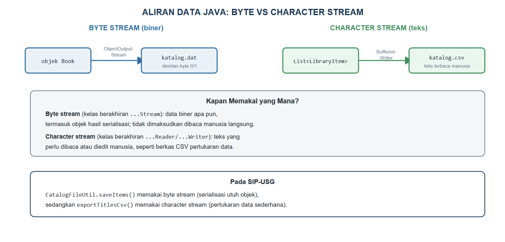
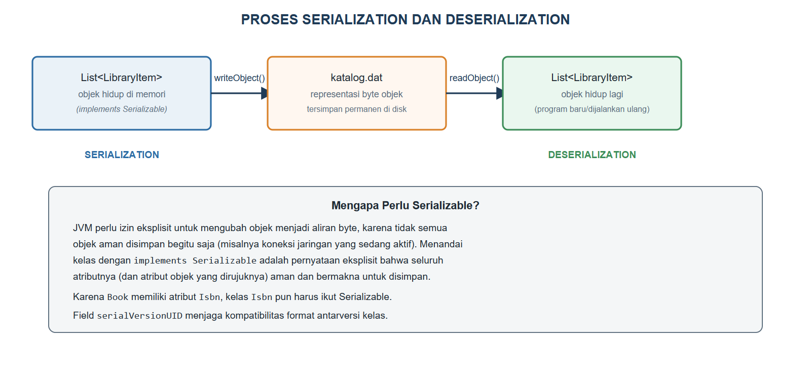

# BAB X.
# (OPERASI BERKAS DAN OBJECT PERSISTENCE)

### CPMK/ Sub-CPMK :

- **CPMK3** : Melalui proyek pemrograman, mahasiswa mampu membangun aplikasi berorientasi objek yang terintegrasi dengan basis data dan antarmuka grafis (GUI) sebagai produk.
- **Sub-CPMK7** : Mahasiswa mampu membangun aplikasi berorientasi objek yang terintegrasi dengan operasi berkas/*persistence*, basis data (JDBC/CRUD), dan antarmuka grafis (GUI).

### Indikator Penilaian:

Ketepatan mengimplementasikan operasi berkas dan *object persistence*/*serialization*, meliputi pembedaan *byte stream* dan *character stream*, pembacaan dan penulisan berkas teks serta CSV, penyimpanan dan pemuatan ulang objek melalui *serialization* dan *deserialization*, serta pemanfaatan API NIO.2 (`Path`, `Files`) disertai penanganan eksepsi berkas.

### Kriteria Keberhasilan (Rubrik):

- Sangat Baik (≥ 85): Mahasiswa mampu menganalisis kebutuhan penyimpanan data pada kasus, memilih format dan kelas I/O yang tepat beserta alasannya, serta membangun fitur simpan dan muat ulang yang menjaga keutuhan data meskipun terjadi kegagalan berkas.
- Baik (70-84): Mahasiswa mampu menyimpan dan membaca data ke berkas teks, CSV, atau berkas objek dengan benar, tetapi penanganan kondisi berkas tidak ditemukan atau data rusak belum lengkap.
- Cukup (55-69): Mahasiswa mampu menulis data ke berkas teks, tetapi belum mampu memuat ulang data menjadi objek maupun menerapkan *serialization* secara mandiri.

### Deskripsi Kemampuan yang Diharapkan:

Setelah mempelajari bab ini, mahasiswa diharapkan mampu membuat data objek bertahan setelah program ditutup dengan menyimpannya ke berkas teks, CSV, atau berkas objek, lalu memuatnya kembali secara utuh. Dalam konteks Sistem Informasi, kemampuan ini dipakai untuk pencadangan data, pertukaran data dengan aplikasi lain melalui berkas CSV, serta impor dan ekspor katalog perpustakaan sebelum data dipindahkan ke sistem basis data.

## A. Pendahuluan

Seluruh data SIP-USG yang telah dibangun sejak Bab II, mulai dari koleksi `Book` hingga struktur `Catalog` berbasis `Map` pada Bab IX, hanya hidup selama program berjalan. Begitu `Bab09Demo` selesai dieksekusi, seluruh objek yang dibuatnya lenyap dari memori tanpa bekas; menjalankan program itu kembali akan selalu menghasilkan katalog kosong yang harus diisi ulang dari awal. Padahal, katalog perpustakaan sungguhan tidak boleh hilang setiap kali aplikasi ditutup, dan data yang sama kadang perlu dipertukarkan dengan program lain, misalnya dibuka pada aplikasi lembar kerja untuk keperluan pelaporan.

Bab ini menutup celah tersebut dengan memperkenalkan operasi berkas: kemampuan menulis data ke penyimpanan permanen (disk) dan membacanya kembali kapan pun diperlukan. Mahasiswa akan mempelajari dua pendekatan penyimpanan yang saling melengkapi: *serialization*, yang menyimpan objek Java apa adanya secara utuh ke dalam berkas biner, dan penulisan berkas teks/CSV, yang menyimpan data dalam format yang dapat dibaca manusia dan dipertukarkan dengan program lain. Kemampuan ini menjadi jembatan penting menuju Bab XI, tempat SIP-USG akan berpindah dari penyimpanan berkas menuju basis data sungguhan.

## B. Aliran Data Java: Byte Stream dan Character Stream

Java mengelola seluruh operasi masukan/keluaran (I/O) melalui konsep aliran (*stream*): data mengalir sepotong demi sepotong antara program dan sumber/tujuannya, baik berupa berkas, jaringan, maupun memori. Gambar {{g:bab10-aliran-data}} membandingkan dua kelompok besar aliran yang dipakai pada bab ini.



*Byte stream*, diwakili kelas-kelas berakhiran `...Stream` seperti `ObjectOutputStream` dan `FileInputStream`, memproses data sebagai deretan byte mentah tanpa mempedulikan maknanya; cocok untuk data biner apa pun, termasuk objek hasil *serialization*. *Character stream*, diwakili kelas-kelas berakhiran `...Reader`/`...Writer` seperti `BufferedWriter`, memproses data sebagai karakter teks yang mempertimbangkan pengkodean (*encoding*) sehingga hasilnya dapat dibaca dan diedit manusia secara langsung, cocok untuk berkas seperti CSV yang perlu dipertukarkan dengan program lain atau dibuka di lembar kerja.

## C. Membaca dan Menulis Berkas Teks serta CSV

Kode Program {{kp:catalog-file-csv}} menuliskan `exportTitlesCsv` dan `readTitlesCsv` pada kelas utilitas `CatalogFileUtil`, memakai *character stream* untuk menghasilkan berkas CSV berisi kode dan judul setiap koleksi.

Kode Program #catalog-file-csv. CatalogFileUtil: ekspor dan impor CSV memakai NIO.2

```java
// CatalogFileUtil.java -- bagian CSV (NIO.2)
public class CatalogFileUtil {
    // ... saveItems() dan loadItems() dibahas
    // pada bagian D

    public static void exportTitlesCsv(
            List<LibraryItem> items, String path)
            throws IOException {
        Path tujuan = Path.of(path);
        try (BufferedWriter w =
                Files.newBufferedWriter(tujuan)) {
            w.write("itemCode,title");
            w.newLine();
            for (LibraryItem it : items) {
                w.write(it.getItemCode() + ","
                    + it.getTitle());
                w.newLine();
            }
        }
    }

    public static List<String> readTitlesCsv(
            String path) throws IOException {
        List<String> baris =
            Files.readAllLines(Path.of(path));
        List<String> judul = new ArrayList<>();
        for (int i = 1; i < baris.size(); i++) {
            String[] kolom = baris.get(i).split(",");
            judul.add(kolom[1]);
        }
        return judul;
    }
}
```

Setiap baris CSV pada `exportTitlesCsv` dipisahkan koma antara `itemCode` dan `title`, diawali satu baris judul kolom agar berkas mudah dibaca aplikasi lain. Perhatikan bahwa pola `try (BufferedWriter w = ...)` memakai *try-with-resources* yang telah dipelajari pada Bab VIII, menjamin berkas selalu tertutup rapi setelah selesai ditulis, bahkan seandainya terjadi kesalahan di tengah proses penulisan.

## D. Serialization dan Deserialization Objek

*Serialization* mengubah sebuah objek beserta seluruh isinya menjadi deretan byte yang dapat disimpan ke berkas, sedangkan *deserialization* melakukan kebalikannya: membaca deretan byte tersebut dan membentuknya kembali menjadi objek yang utuh, seolah objek tersebut baru saja dibuat. Gambar {{g:bab10-proses-serialisasi}} menggambarkan proses ini pada `List<LibraryItem>` milik SIP-USG.



Agar sebuah kelas dapat diserialisasi, kelas tersebut wajib mengimplementasikan *interface* penanda `Serializable`, sebagaimana ditambahkan pada `LibraryItem` melalui Kode Program {{kp:libraryitem-serializable}}. Karena `Book` memiliki atribut bertipe `Isbn`, kelas `Isbn` juga wajib ikut `Serializable`, sebab seluruh objek yang dirujuk oleh objek yang diserialisasi harus ikut serta memenuhi syarat yang sama.

Kode Program #libraryitem-serializable. Cuplikan LibraryItem.java: menambahkan Serializable

```java
public abstract class LibraryItem
        implements Borrowable, Printable,
        Serializable {
    private static final long
        serialVersionUID = 1L;
    // ... atribut dan method lain tidak berubah
    // dari Bab VIII
}
```

Kode Program {{kp:catalog-file-serial}} menuliskan `saveItems` dan `loadItems` yang memakai `ObjectOutputStream` dan `ObjectInputStream`, sepasang *byte stream* khusus untuk *serialization* objek Java.

Kode Program #catalog-file-serial. CatalogFileUtil: serialization dan deserialization

```java
// CatalogFileUtil.java -- bagian serialization
package id.ac.usg.sip.model;

import java.io.FileInputStream;
import java.io.FileOutputStream;
import java.io.IOException;
import java.io.ObjectInputStream;
import java.io.ObjectOutputStream;
import java.util.List;

public class CatalogFileUtil {
    public static void saveItems(
            List<LibraryItem> items, String path)
            throws IOException {
        try (ObjectOutputStream out =
                new ObjectOutputStream(
                    new FileOutputStream(path))) {
            out.writeObject(items);
        }
    }

    @SuppressWarnings("unchecked")
    public static List<LibraryItem> loadItems(
            String path)
            throws IOException,
            ClassNotFoundException {
        try (ObjectInputStream in =
                new ObjectInputStream(
                    new FileInputStream(path))) {
            return (List<LibraryItem>)
                in.readObject();
        }
    }
    // ... exportTitlesCsv() dan readTitlesCsv()
    // pada Kode Program bagian C
}
```

Perhatikan bahwa `saveItems` menyimpan seluruh `List<LibraryItem>` dalam satu pemanggilan `writeObject`, bukan satu per satu; Java secara otomatis menelusuri dan menyimpan setiap elemen `List` beserta objek `Isbn` yang dirujuk masing-masing `Book` di dalamnya. `loadItems` memerlukan `@SuppressWarnings("unchecked")` karena `readObject()` mengembalikan tipe `Object` yang di-*downcast* menjadi `List<LibraryItem>`; kompiler tidak dapat memverifikasi keamanan *downcasting* generik semacam ini pada waktu kompilasi, sehingga anotasi tersebut menandai bahwa pemrogram telah memeriksa dan menjamin keamanannya secara manual.

## E. NIO.2 (Path, Files) dan Penanganan Eksepsi Berkas

*New I/O 2* (NIO.2), tersedia sejak Java 7 melalui paket `java.nio.file`, menawarkan API operasi berkas yang lebih ringkas dibandingkan kelas `java.io` klasik. Kelas `Path` mewakili lokasi berkas atau folder tanpa harus benar-benar ada di disk, sedangkan kelas `Files` menyediakan *method* statis siap pakai seperti `Files.readAllLines` dan `Files.newBufferedWriter` yang telah dipakai pada Kode Program {{kp:catalog-file-csv}}, menggantikan rangkaian kelas `FileReader`/`BufferedReader` yang lebih panjang penulisannya.

Seluruh *method* operasi berkas pada bab ini mendeklarasikan `throws IOException`, sebuah *checked exception* yang telah dipelajari pada Bab VIII, karena operasi berkas rentan gagal akibat sebab-sebab di luar kendali program, seperti berkas tidak ditemukan, izin akses ditolak, atau media penyimpanan penuh. Praktikum pada bagian F akan membiarkan `main` meneruskan `throws Exception` demi keringkasan; pada aplikasi produksi, kegagalan semacam ini semestinya ditangkap dan ditampilkan sebagai pesan yang ramah bagi petugas perpustakaan, bukan dibiarkan menghentikan program secara kasar.

## F. Praktikum Terbimbing: Menyimpan dan Memuat Ulang Katalog SIP-USG ke Berkas .dat dan .csv

Praktikum ini merangkai seluruh kode pada bagian C hingga E untuk menyimpan dan memuat ulang katalog SIP-USG.

1. Tambahkan `implements Serializable` dan `serialVersionUID` pada kelas `LibraryItem` mengikuti Kode Program {{kp:libraryitem-serializable}}, lalu lakukan hal yang sama pada kelas `Isbn`.
2. Buat kelas `CatalogFileUtil` pada paket `id.ac.usg.sip.model`, lalu gabungkan Kode Program {{kp:catalog-file-serial}} dan Kode Program {{kp:catalog-file-csv}} menjadi satu berkas.
3. Buat kelas `Bab10Demo` pada paket `id.ac.usg.sip.app`, lalu salin Kode Program {{kp:bab10-demo-1}} dan Kode Program {{kp:bab10-demo-2}}.
4. Jalankan `Bab10Demo`, lalu periksa folder proyek: berkas `katalog.dat` dan `katalog.csv` akan muncul.
5. Buka `katalog.csv` dengan editor teks biasa untuk membuktikan isinya dapat dibaca manusia, lalu bandingkan dengan `katalog.dat` yang berisi data biner.

Kode Program #bab10-demo-1. Menyiapkan katalog sebelum disimpan (bagian 1)

```java
// Bab10Demo.java -- bagian 1 dari 2
package id.ac.usg.sip.app;

import id.ac.usg.sip.model.Book;
import id.ac.usg.sip.model.Catalog;
import id.ac.usg.sip.model.CatalogFileUtil;
import id.ac.usg.sip.model.Journal;
import id.ac.usg.sip.model.LibraryItem;
import java.util.List;

public class Bab10Demo {
    public static void main(String[] args)
            throws Exception {
        Book b1 = new Book("Basis Data", "B001",
            "Kadir, A.", "978-602-04-0001-1", 2012);
        Journal j1 = new Journal("Jurnal SI", "J001",
            "USG Press", 12);

        Catalog katalog =
            new Catalog("Rak Ilmu Komputer");
        katalog.addItem(b1);
        katalog.addItem(j1);
        List<LibraryItem> semua =
            katalog.sortedByTitle();
        // ... lanjutan pada Kode Program berikutnya
```

Kode Program #bab10-demo-2. Menyimpan dan memuat ulang katalog (bagian 2, lanjutan)

```java
        // lanjutan Bab10Demo dari kode sebelumnya

        CatalogFileUtil.saveItems(
            semua, "katalog.dat");
        CatalogFileUtil.exportTitlesCsv(
            semua, "katalog.csv");
        System.out.println("Tersimpan ke berkas");

        List<LibraryItem> hasilMuat =
            CatalogFileUtil.loadItems(
                "katalog.dat");
        System.out.println("Dimuat dari .dat:");
        for (LibraryItem it : hasilMuat) {
            System.out.println(
                "- " + it.getSummary());
        }

        List<String> judul =
            CatalogFileUtil.readTitlesCsv(
                "katalog.csv");
        System.out.println(
            "Judul dari .csv: " + judul);
    }
}
```

Keluaran Program:

```
Tersimpan ke berkas
Dimuat dari .dat:
- Basis Data [B001, Tersedia] oleh Kadir, A. (2012)
- Jurnal SI [J001, Tersedia] - USG Press, edisi 12
Judul dari .csv: [Basis Data, Jurnal SI]
```

Perhatikan bahwa `hasilMuat` yang dicetak pada baris "Dimuat dari .dat" menampilkan `getSummary()` yang identik dengan objek aslinya sebelum disimpan, termasuk `Book` yang benar-benar kembali menjadi objek `Book` (bukan sekadar teks), lengkap dengan `Isbn` di dalamnya. Ini membuktikan bahwa *deserialization* mengembalikan struktur objek yang utuh, bukan hanya nilai atributnya secara terpisah. Bandingkan dengan `judul` dari `katalog.csv`, yang hanya berisi teks judul polos tanpa satu pun perilaku objek `LibraryItem`, karena format CSV tidak menyimpan tipe maupun *method* apa pun.

#### Kesalahan Umum dan Cara Mengatasinya

| Gejala/Pesan Error | Penyebab | Perbaikan |
|---|---|---|
| `java.io.NotSerializableException` | Kelas yang diserialisasi (atau salah satu atributnya) belum mengimplementasikan `Serializable` | Tambahkan `implements Serializable` pada kelas tersebut dan seluruh kelas yang dirujuknya |
| `java.io.FileNotFoundException` saat memuat ulang | Berkas belum pernah dibuat, atau `saveItems`/`exportTitlesCsv` belum pernah dijalankan | Pastikan proses penyimpanan berhasil dijalankan lebih dahulu sebelum memuat ulang |
| `ClassCastException` pada `(List<LibraryItem>) in.readObject()` | Berkas `.dat` berisi objek dari kelas yang berbeda dari yang diharapkan | Pastikan berkas `.dat` benar-benar dihasilkan oleh `saveItems` dengan tipe data yang sama |
| Kolom pada CSV tertukar atau hilang saat dibaca ulang | Judul atau atribut lain mengandung tanda koma, sehingga `split(",")` salah membagi kolom | Gunakan pemisah lain yang lebih aman, atau bungkus nilai dengan tanda kutip sesuai standar format CSV |

### Rangkuman

Java mengelola operasi masukan/keluaran melalui aliran data yang terbagi menjadi *byte stream*, untuk data biner seperti hasil *serialization*, dan *character stream*, untuk data teks seperti berkas CSV yang perlu dibaca manusia. *Serialization* melalui `ObjectOutputStream` mengubah objek beserta seluruh isinya menjadi byte yang dapat disimpan permanen, sedangkan *deserialization* melalui `ObjectInputStream` mengembalikannya menjadi objek utuh; setiap kelas yang ingin diserialisasi wajib mengimplementasikan `Serializable`, termasuk seluruh kelas yang dirujuknya. NIO.2 melalui kelas `Path` dan `Files` menyederhanakan penulisan dan pembacaan berkas teks dibandingkan `java.io` klasik. Seluruh operasi berkas rentan menimbulkan `IOException`, sebuah *checked exception* yang wajib ditangani atau dideklarasikan sesuai prinsip Bab VIII. Katalog SIP-USG kini dapat disimpan ke `katalog.dat` (utuh sebagai objek) maupun `katalog.csv` (sebagai teks yang dapat dipertukarkan), keduanya menjadi fondasi sebelum data dipindahkan ke basis data sungguhan pada Bab XI.

### Soal/Pertanyaan

1. (C2) Jelaskan perbedaan *byte stream* dan *character stream*, masing-masing disertai satu contoh kelasnya!
2. (C2) Jelaskan mengapa kelas `Isbn` harus ikut mengimplementasikan `Serializable` walau yang ingin disimpan hanyalah objek `Book`!
3. (C3) Perhatikan Kode Program {{kp:catalog-file-serial}}. Jelaskan mengapa `loadItems` memerlukan anotasi `@SuppressWarnings("unchecked")`!
4. (C3) Telusuri Kode Program {{kp:bab10-demo-2}}, lalu jelaskan mengapa `hasilMuat.get(0).getSummary()` dapat menghasilkan teks yang sama persis dengan `b1.getSummary()` sebelum disimpan!
5. (C4) Bandingkan isi `katalog.dat` dan `katalog.csv` yang dihasilkan Kode Program {{kp:bab10-demo-2}}. Analisis mengapa `katalog.csv` dapat dibuka dengan editor teks biasa, sedangkan `katalog.dat` tidak!
6. (C4) Perhatikan Gambar {{g:bab10-proses-serialisasi}}. Jelaskan apa yang akan terjadi jika `Book` diubah menambah atribut baru, lalu berkas `.dat` lama (hasil serialisasi sebelum perubahan) dicoba dimuat ulang!
7. (C5) Rancanglah (dalam bentuk kerangka kode) sebuah *method* `exportMembersCsv(List<Member> members, String path)` yang mengekspor data anggota ke berkas CSV, mengikuti pola Kode Program {{kp:catalog-file-csv}}!
8. (C6) SIP-USG kini dapat menyimpan katalog ke berkas `.dat` maupun `.csv`. Nilailah situasi bisnis apa yang lebih cocok memakai `.dat` dan situasi apa yang lebih cocok memakai `.csv`, dikaitkan dengan kebutuhan pencadangan data internal dibandingkan pertukaran data dengan pihak luar!

### Rujukan Bab

- Deitel, P. J., & Deitel, H. M. (2018). *Java how to program, early objects* (11th ed.). Pearson Education.
- Oracle Corporation. (2023). *Java Platform, Standard Edition & JDK documentation (JDK 21)*. https://docs.oracle.com/en/java/javase/21/
