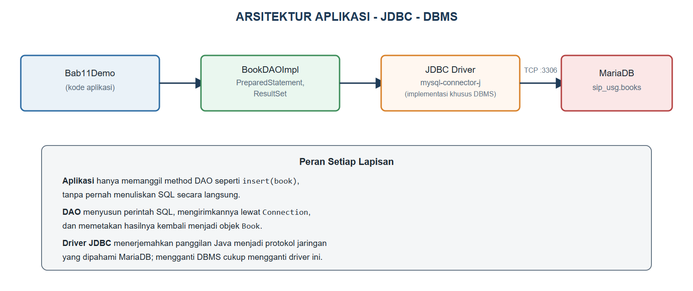
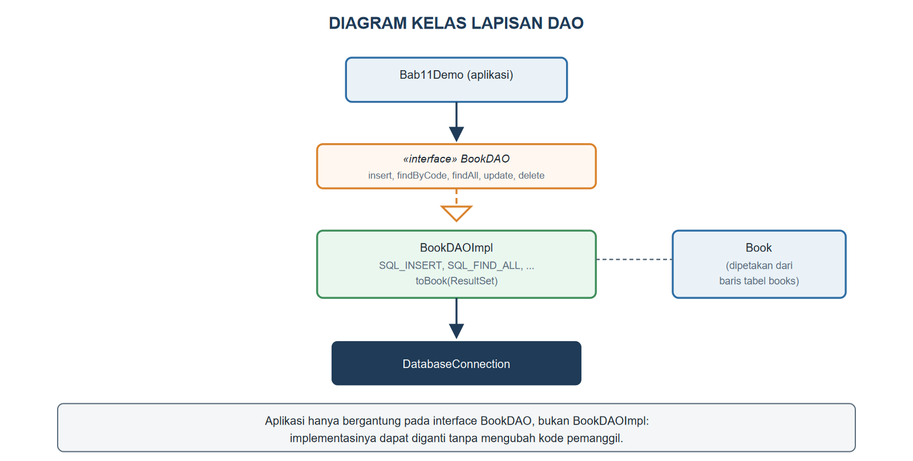

# BAB XI.
# (KONEKSI BASIS DATA / JDBC DAN OPERASI CRUD)

### CPMK/ Sub-CPMK :

- **CPMK3** : Melalui proyek pemrograman, mahasiswa mampu membangun aplikasi berorientasi objek yang terintegrasi dengan basis data dan antarmuka grafis (GUI) sebagai produk.
- **Sub-CPMK7** : Mahasiswa mampu membangun aplikasi berorientasi objek yang terintegrasi dengan operasi berkas/*persistence*, basis data (JDBC/CRUD), dan antarmuka grafis (GUI).

### Indikator Penilaian:

Ketepatan mengimplementasikan koneksi basis data (JDBC) dan operasi CRUD, meliputi konfigurasi *driver* dan *connection string* MySQL/MariaDB, penggunaan `PreparedStatement` untuk mencegah *SQL injection*, pemetaan baris `ResultSet` menjadi objek Java, serta pemisahan logika akses data ke dalam lapisan *Data Access Object* (DAO).

### Kriteria Keberhasilan (Rubrik):

- Sangat Baik (≥ 85): Mahasiswa mampu menganalisis kebutuhan data pada kasus, merancang tabel dan kelas DAO yang sesuai, serta mengimplementasikan operasi CRUD lengkap menggunakan `PreparedStatement` dan `try-with-resources` dengan penanganan kegagalan koneksi yang tepat.
- Baik (70-84): Mahasiswa mampu melakukan operasi CRUD melalui JDBC dengan benar, tetapi pemisahan lapisan DAO belum konsisten atau sumber daya koneksi belum ditutup dengan tepat.
- Cukup (55-69): Mahasiswa mampu menghubungkan program ke basis data dan menampilkan data, tetapi operasi tambah, ubah, dan hapus belum lengkap serta masih menyusun kueri dengan penggabungan teks.

### Deskripsi Kemampuan yang Diharapkan:

Setelah mempelajari bab ini, mahasiswa diharapkan mampu menghubungkan aplikasi berorientasi objek dengan sistem manajemen basis data relasional serta melakukan operasi tambah, baca, ubah, dan hapus data secara aman dan terstruktur. Dalam konteks Sistem Informasi, kemampuan ini merupakan inti dari hampir setiap aplikasi organisasi karena data transaksi, seperti peminjaman dan pengembalian buku, harus tersimpan secara permanen, konsisten, dan dapat diakses bersama oleh banyak pengguna.

## A. Pendahuluan

Bab X telah membuat data SIP-USG bertahan lebih lama dengan menyimpannya ke berkas `.dat` dan `.csv`. Namun, penyimpanan berbasis berkas memiliki batas yang nyata: dua petugas sirkulasi yang membuka aplikasi secara bersamaan di komputer berbeda tidak dapat berbagi berkas yang sama secara aman, pencarian data dalam jumlah besar pada berkas teks jauh lebih lambat dibandingkan basis data yang memiliki indeks, dan tidak ada mekanisme baku untuk memastikan dua transaksi tidak saling menimpa perubahan satu sama lain. Perpustakaan kampus yang sesungguhnya memerlukan sistem manajemen basis data (DBMS) yang dirancang khusus untuk menangani persoalan tersebut.

Bab ini menghubungkan SIP-USG dengan MariaDB, DBMS yang dibakukan sepanjang buku ini, melalui *Java Database Connectivity* (JDBC). Mahasiswa akan mempelajari arsitektur JDBC, cara menyusun kueri SQL yang aman dengan `PreparedStatement`, memetakan hasil kueri menjadi objek `Book`, dan memisahkan seluruh logika akses data ke dalam lapisan *Data Access Object* (DAO) agar kelas `Book` sendiri tidak perlu mengetahui detail SQL sedikit pun. Kemampuan ini menopang Tugas 3 pada bagian F, sekaligus menjadi dasar bagi antarmuka grafis yang akan dibangun pada Bab XII.

## B. Arsitektur JDBC, Driver, dan Connection String

JDBC adalah API standar Java untuk berkomunikasi dengan berbagai DBMS melalui satu antarmuka yang seragam, sementara detail komunikasi sesungguhnya dengan tiap DBMS ditangani oleh *driver* khusus. Gambar {{g:bab11-arsitektur-jdbc}} menggambarkan alur permintaan data pada SIP-USG, dari kode aplikasi hingga baris data tersimpan di MariaDB.



Sebelum SIP-USG dapat menyimpan data, skema basis data `sip_usg` beserta tabel `books` perlu disiapkan lebih dahulu, sebagaimana terlihat pada Kode Program {{kp:sql-sip-usg}}.

Kode Program #sql-sip-usg. Skrip SQL pembuatan skema sip_usg

```sql
CREATE DATABASE IF NOT EXISTS sip_usg;
USE sip_usg;

CREATE TABLE IF NOT EXISTS books (
    item_code VARCHAR(10) PRIMARY KEY,
    title VARCHAR(150) NOT NULL,
    author VARCHAR(100),
    isbn VARCHAR(20),
    publication_year INT,
    available BOOLEAN DEFAULT TRUE
);
```

Kode Program {{kp:database-connection}} membangun kelas `DatabaseConnection` yang menyimpan *connection string*, yaitu alamat yang memberi tahu JDBC lokasi server MariaDB, nama basis data, serta kredensial masuk.

Kode Program #database-connection. Kelas DatabaseConnection

```java
package id.ac.usg.sip.model;

import java.sql.Connection;
import java.sql.DriverManager;
import java.sql.SQLException;

public class DatabaseConnection {
    private static final String URL =
        "jdbc:mysql://127.0.0.1:3306/sip_usg";
    private static final String USER = "root";
    private static final String PASSWORD = "";

    public static Connection getConnection()
            throws SQLException {
        return DriverManager.getConnection(
            URL, USER, PASSWORD);
    }
}
```

*Connection string* `jdbc:mysql://127.0.0.1:3306/sip_usg` terdiri atas skema `jdbc:mysql:`, alamat dan porta server (`127.0.0.1:3306`, porta baku MySQL/MariaDB), dan nama basis data (`sip_usg`). `DriverManager.getConnection` menyerahkan alamat ini kepada *driver* JDBC yang telah didaftarkan (pustaka `mysql-connector-j` pada praktikum ini), yang kemudian membuka koneksi jaringan sesungguhnya menuju MariaDB. Pola ini memungkinkan SIP-USG kelak berpindah ke server basis data yang berbeda, atau bahkan DBMS lain yang kompatibel, hanya dengan mengubah nilai `URL`, tanpa mengubah kode lain yang memanggil `DatabaseConnection.getConnection()`.

## C. Statement, PreparedStatement, dan ResultSet

Java menyediakan `Statement` untuk mengirim perintah SQL apa adanya, tetapi menyusun kueri dengan menggabungkan teks secara langsung, misalnya `"SELECT * FROM books WHERE title = '" + judul + "'"`, membuka celah *SQL injection*: seorang pengguna jahat dapat memasukkan potongan SQL berbahaya melalui data yang seharusnya berupa judul buku biasa. `PreparedStatement` menutup celah ini dengan memisahkan kerangka kueri dari nilai yang disisipkan, memakai tanda tanya (`?`) sebagai penampung nilai yang akan diisi lewat `setString`, `setInt`, dan sejenisnya, sebagaimana diterapkan pada seluruh kueri di kelas `BookDAOImpl` pada bagian E.

Tabel {{t:pemetaan-tipe}} merangkum pemetaan tipe data antara Java dan SQL yang dipakai pada tabel `books`.

Tabel #pemetaan-tipe. Pemetaan tipe data Java dan SQL

| Kolom SQL | Tipe SQL | Tipe Java | Method PreparedStatement/ResultSet |
|---|---|---|---|
| item_code | VARCHAR | String | setString / getString |
| title | VARCHAR | String | setString / getString |
| publication_year | INT | int | setInt / getInt |
| available | BOOLEAN | boolean | setBoolean / getBoolean |

Setiap baris hasil kueri `SELECT` diwakili oleh objek `ResultSet`, sebuah kursor yang menunjuk satu baris pada satu waktu; pemanggilan `rs.next()` memajukan kursor ke baris berikutnya dan mengembalikan `false` ketika tidak ada baris lagi, sedangkan `rs.getString("kolom")` atau `rs.getInt("kolom")` membaca nilai kolom pada baris yang sedang ditunjuk kursor tersebut.

## D. Operasi CRUD Berorientasi Objek

*Create, Read, Update, Delete* (CRUD) adalah empat operasi dasar yang hampir selalu dibutuhkan aplikasi berbasis data. Kode Program {{kp:bookdao-interface}} merumuskan kontrak keempat operasi tersebut sebagai *interface* `BookDAO`, dipisahkan dari implementasi sesungguhnya agar kode aplikasi hanya bergantung pada kontrak ini, bukan detail JDBC di baliknya.

Kode Program #bookdao-interface. Interface BookDAO

```java
package id.ac.usg.sip.model;

import java.sql.SQLException;
import java.util.List;

public interface BookDAO {
    void insert(Book book) throws SQLException;

    Book findByCode(String itemCode)
        throws SQLException;

    List<Book> findAll() throws SQLException;

    void update(Book book) throws SQLException;

    void delete(String itemCode)
        throws SQLException;
}
```

Setiap *method* pada `BookDAO` mendeklarasikan `throws SQLException`, sebuah *checked exception* yang telah dipelajari pada Bab VIII, karena operasi basis data rentan gagal akibat sebab di luar kendali program seperti koneksi terputus atau kueri yang tidak valid.

## E. Pola DAO dan Pemisahan Lapisan Data

Kode Program {{kp:bookdao-impl-1}}, Kode Program {{kp:bookdao-impl-2}}, dan Kode Program {{kp:bookdao-impl-3}} mengimplementasikan `BookDAO` menggunakan `PreparedStatement` untuk seluruh operasi, dipisahkan menjadi tiga bagian karena panjangnya.

Kode Program #bookdao-impl-1. BookDAOImpl: insert, findByCode, dan findAll (bagian 1)

```java
// BookDAOImpl.java -- bagian 1 dari 3
package id.ac.usg.sip.model;

import java.sql.Connection;
import java.sql.PreparedStatement;
import java.sql.ResultSet;
import java.sql.SQLException;
import java.util.ArrayList;
import java.util.List;

public class BookDAOImpl implements BookDAO {
    private static final String SQL_INSERT =
        "INSERT INTO books (item_code, title, "
        + "author, isbn, publication_year) "
        + "VALUES (?, ?, ?, ?, ?)";
    private static final String SQL_FIND_BY_CODE =
        "SELECT * FROM books WHERE item_code = ?";
    private static final String SQL_FIND_ALL =
        "SELECT * FROM books ORDER BY title";

    @Override
    public void insert(Book book)
            throws SQLException {
        try (Connection conn =
                DatabaseConnection.getConnection();
            PreparedStatement ps = conn
                .prepareStatement(SQL_INSERT)) {
            ps.setString(1, book.getItemCode());
            ps.setString(2, book.getTitle());
            ps.setString(3, book.getAuthor());
            ps.setString(4,
                book.getIsbn().getValue());
            ps.setInt(5,
                book.getPublicationYear());
            ps.executeUpdate();
        }
    }
    // ... lanjutan pada Kode Program berikutnya
```

Kode Program #bookdao-impl-2. BookDAOImpl: findByCode, findAll, update, delete, dan toBook (bagian 2, lanjutan)

```java
    // lanjutan BookDAOImpl dari kode sebelumnya

    @Override
    public Book findByCode(String itemCode)
            throws SQLException {
        try (Connection conn =
                DatabaseConnection.getConnection();
            PreparedStatement ps = conn
                .prepareStatement(
                    SQL_FIND_BY_CODE)) {
            ps.setString(1, itemCode);
            try (ResultSet rs =
                    ps.executeQuery()) {
                return rs.next()
                    ? toBook(rs) : null;
            }
        }
    }

    @Override
    public List<Book> findAll()
            throws SQLException {
        List<Book> hasil = new ArrayList<>();
        try (Connection conn =
                DatabaseConnection.getConnection();
            PreparedStatement ps = conn
                .prepareStatement(SQL_FIND_ALL);
            ResultSet rs = ps.executeQuery()) {
            while (rs.next()) {
                hasil.add(toBook(rs));
            }
        }
        return hasil;
    }
    // ... update(), delete(), dan toBook()
    // pada Kode Program berikutnya
}
```

Kode Program #bookdao-impl-3. BookDAOImpl: pemetaan ResultSet menjadi objek Book (bagian 3, lanjutan)

```java
    // lanjutan BookDAOImpl: pemetaan hasil kueri

    private Book toBook(ResultSet rs)
            throws SQLException {
        Book b = new Book(
            rs.getString("title"),
            rs.getString("item_code"),
            rs.getString("author"),
            rs.getString("isbn"),
            rs.getInt("publication_year"));
        b.setAvailable(
            rs.getBoolean("available"));
        return b;
    }
    // ... update() dan delete() mengikuti pola
    // yang sama seperti insert() dan findByCode(),
    // menggunakan SQL_UPDATE dan SQL_DELETE
```

Perhatikan *method* privat `toBook` yang memetakan satu baris `ResultSet` menjadi satu objek `Book` lengkap, termasuk membentuk kembali objek `Isbn` melalui *constructor* `Book`. Pemetaan ini adalah inti dari pendekatan CRUD berorientasi objek: kode pemanggil `BookDAO` tidak pernah berurusan dengan baris tabel secara langsung, melainkan selalu menerima dan mengirim objek `Book` yang utuh, konsisten dengan seluruh cara SIP-USG bekerja sejak Bab II. Gambar {{g:bab11-diagram-dao}} merangkum hubungan antara aplikasi, *interface* `BookDAO`, implementasinya, dan kelas `Book`.



Perhatikan pula bahwa `setAvailable` pada `toBook` sengaja diberi akses *default* (sepaket) di dalam `LibraryItem`, bukan `public`: satu-satunya cara mengubah ketersediaan dari kode aplikasi tetaplah `borrow()` dan `returnItem()` yang tervalidasi sesuai Bab VIII, sedangkan lapisan DAO pada paket yang sama diberi keleluasaan untuk merekonstruksi status apa adanya dari basis data.

## F. Praktikum Terbimbing: BookDAO Lengkap terhadap Basis Data sip_usg

Praktikum ini menyiapkan basis data MariaDB, lalu menjalankan operasi CRUD lengkap melaluinya.

1. Jalankan Kode Program {{kp:sql-sip-usg}} pada MariaDB, misalnya melalui *command line* `mysql` atau aplikasi HeidiSQL/DBeaver, untuk membuat skema `sip_usg` dan tabel `books`.
2. Unduh pustaka *driver* `mysql-connector-j` (berkas `.jar`), lalu tambahkan sebagai *library* pada proyek NetBeans.
3. Buat kelas `DatabaseConnection` pada paket `id.ac.usg.sip.model`, lalu salin Kode Program {{kp:database-connection}}.
4. Buat *interface* `BookDAO` pada paket yang sama, lalu salin Kode Program {{kp:bookdao-interface}}.
5. Buat kelas `BookDAOImpl` pada paket yang sama, lalu gabungkan Kode Program {{kp:bookdao-impl-1}}, Kode Program {{kp:bookdao-impl-2}}, dan Kode Program {{kp:bookdao-impl-3}}, lengkapi `update` dan `delete` mengikuti pola `insert`.
6. Tambahkan *method* `void setAvailable(boolean available)` beraksek *default* pada kelas `LibraryItem` khusus untuk keperluan rekonstruksi oleh DAO.
7. Buat kelas `Bab11Demo` pada paket `id.ac.usg.sip.app`, lalu salin Kode Program {{kp:bab11-demo}}.
8. Jalankan `Bab11Demo`, lalu periksa isi tabel `books` melalui aplikasi klien MariaDB untuk memastikan data benar-benar tersimpan.

Kode Program #bab11-demo. Menguji operasi CRUD lengkap terhadap sip_usg

```java
package id.ac.usg.sip.app;

import id.ac.usg.sip.model.Book;
import id.ac.usg.sip.model.BookDAO;
import id.ac.usg.sip.model.BookDAOImpl;
import java.util.List;

public class Bab11Demo {
    public static void main(String[] args)
            throws Exception {
        BookDAO dao = new BookDAOImpl();
        dao.delete("B001");

        Book b1 = new Book("Basis Data", "B001",
            "Kadir, A.", "978-602-04-0001-1", 2012);
        dao.insert(b1);
        System.out.println("-- Setelah insert --");
        System.out.println(
            dao.findByCode("B001").getSummary());

        b1.borrow();
        dao.update(b1);
        Book hasil = dao.findByCode("B001");
        System.out.println("-- Setelah update --");
        System.out.println(hasil.getSummary());

        List<Book> semua = dao.findAll();
        System.out.println(
            "Jumlah baris: " + semua.size());

        dao.delete("B001");
        System.out.println("Setelah hapus: "
            + dao.findByCode("B001"));
    }
}
```

Keluaran Program:

```
-- Setelah insert --
Basis Data [B001, Tersedia] oleh Kadir, A. (2012)
-- Setelah update --
Basis Data [B001, Dipinjam] oleh Kadir, A. (2012)
Jumlah baris: 1
Setelah hapus: null
```

Perhatikan bahwa `dao.delete("B001")` dipanggil di awal `main` sebelum data dimasukkan, bukan kelalaian, melainkan langkah pencegahan agar program dapat dijalankan berulang kali tanpa gagal akibat data lama dengan `item_code` yang sama masih tersisa dari percobaan sebelumnya. Perhatikan pula bahwa `hasil.getSummary()` menampilkan status "Dipinjam" setelah `b1.borrow()` dan `dao.update(b1)` dipanggil, membuktikan bahwa perubahan status di memori berhasil disimpan ke MariaDB dan berhasil dibaca ulang dari sana, bukan sekadar dari objek `b1` yang masih ada di memori.

#### Catatan Asesmen

| Butir | Keterangan |
|---|---|
| Nama tugas | Tugas 3. Program CRUD Berorientasi Objek (JDBC) |
| Sub-CPMK | Sub-CPMK7 |
| Penugasan | Kembangkan program Java berorientasi objek dengan operasi CRUD atas satu entitas menggunakan JDBC. |
| Ruang lingkup | Kelas, objek, *exception*, JDBC, CRUD. |
| Cara pengerjaan | Individu; kode dan laporan via LMS. |
| Batas waktu | Minggu ke-13 |
| Luaran | Berkas kode sumber (.java) dan laporan (PDF). |

#### Kesalahan Umum dan Cara Mengatasinya

| Gejala/Pesan Error | Penyebab | Perbaikan |
|---|---|---|
| `java.sql.SQLException: No suitable driver found` | Pustaka *driver* `mysql-connector-j` belum ditambahkan ke *classpath* proyek | Tambahkan berkas `.jar` *driver* sebagai *library* pada proyek NetBeans |
| `Communications link failure` atau *connection refused* | Server MariaDB belum berjalan, atau *connection string* menunjuk alamat/porta yang salah | Pastikan MariaDB aktif dan `URL` pada `DatabaseConnection` sesuai konfigurasi server |
| Data yang dimasukkan mengandung karakter aneh setelah disisipkan lewat teks langsung | Kueri disusun dengan menggabungkan teks (`Statement`), rentan kesalahan format maupun *SQL injection* | Gunakan `PreparedStatement` dengan tanda tanya (`?`) dan `setString`/`setInt` |
| `java.sql.SQLIntegrityConstraintViolationException` saat `insert` | Nilai `item_code` yang dimasukkan sudah ada sebagai *primary key* pada tabel | Gunakan `item_code` yang belum ada, atau panggil `update` jika bertujuan mengubah data lama |

### Rangkuman

JDBC adalah API standar Java untuk berkomunikasi dengan berbagai DBMS melalui *driver* khusus yang diserahi tugas menerjemahkan panggilan Java menjadi protokol yang dipahami DBMS bersangkutan, dihubungkan melalui *connection string* yang memuat alamat server, porta, dan nama basis data. `PreparedStatement` menyusun kueri SQL dengan memisahkan kerangka kueri dari nilai yang disisipkan, mencegah *SQL injection* sekaligus menyederhanakan pengisian tipe data, sedangkan `ResultSet` menjadi kursor untuk membaca hasil kueri baris demi baris. Empat operasi dasar CRUD (*create, read, update, delete*) dirumuskan sebagai kontrak pada *interface* `BookDAO`, lalu diimplementasikan pada `BookDAOImpl` yang memetakan setiap baris tabel `books` menjadi objek `Book` yang utuh melalui *method* `toBook`. Pola pemisahan ini, dikenal sebagai *Data Access Object* (DAO), membuat kode aplikasi hanya bergantung pada kontrak `BookDAO`, sehingga implementasi maupun DBMS yang dipakai di baliknya dapat diganti tanpa mengubah kode yang memanggilnya.

### Soal/Pertanyaan

1. (C2) Jelaskan mengapa `PreparedStatement` lebih aman dibandingkan `Statement` yang menggabungkan teks secara langsung!
2. (C2) Sebutkan komponen penyusun *connection string* `jdbc:mysql://127.0.0.1:3306/sip_usg` beserta arti masing-masing!
3. (C3) Perhatikan Kode Program {{kp:bookdao-impl-2}}. Jelaskan langkah demi langkah bagaimana `toBook` mengubah satu baris `ResultSet` menjadi objek `Book`!
4. (C3) Telusuri Kode Program {{kp:bab11-demo}}, lalu jelaskan mengapa `dao.delete("B001")` dipanggil sebelum `dao.insert(b1)` pada awal `main`!
5. (C4) Bandingkan *interface* `BookDAO` pada Kode Program {{kp:bookdao-interface}} dengan implementasinya pada `BookDAOImpl`. Analisis manfaat memisahkan keduanya, dikaitkan dengan Gambar {{g:bab11-diagram-dao}}!
6. (C4) Perhatikan Gambar {{g:bab11-arsitektur-jdbc}}. Jelaskan apa yang perlu diubah seandainya SIP-USG berpindah dari MariaDB ke DBMS lain yang kompatibel!
7. (C5) Rancanglah (dalam bentuk kerangka kode) *method* `existsByCode(String itemCode) : boolean` pada `BookDAO` yang memeriksa keberadaan sebuah kode koleksi tanpa mengembalikan seluruh data `Book`-nya!
8. (C6) SIP-USG kini menyimpan data buku di MariaDB, menggantikan berkas `.dat` pada Bab X. Nilailah apakah `LoanService` dan `Loan` yang dibangun pada Bab VIII dan Bab IV juga perlu dipindahkan ke basis data, dan jelaskan pertimbangan Anda!

### Rujukan Bab

- Deitel, P. J., & Deitel, H. M. (2018). *Java how to program, early objects* (11th ed.). Pearson Education.
- Horstmann, C. S. (2022). *Core Java, Volume I: Fundamentals* (12th ed.). Oracle Press/Pearson.
