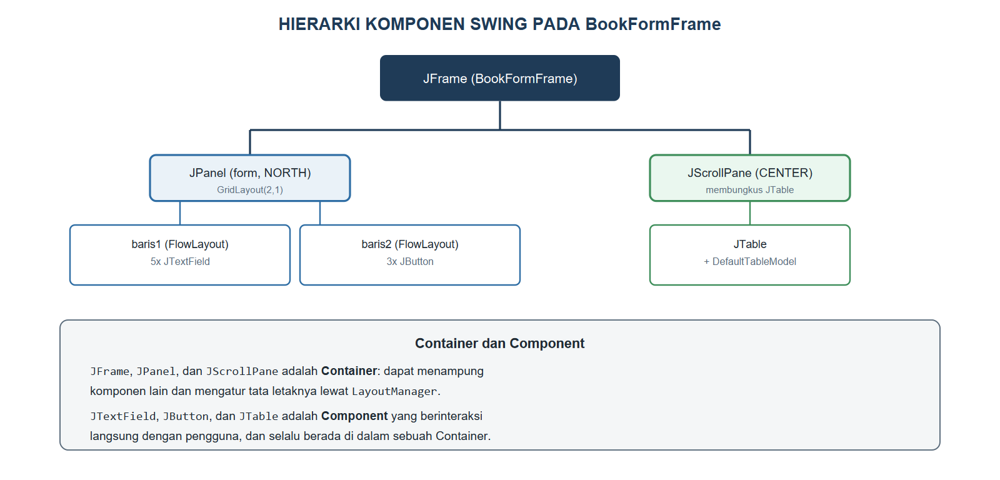
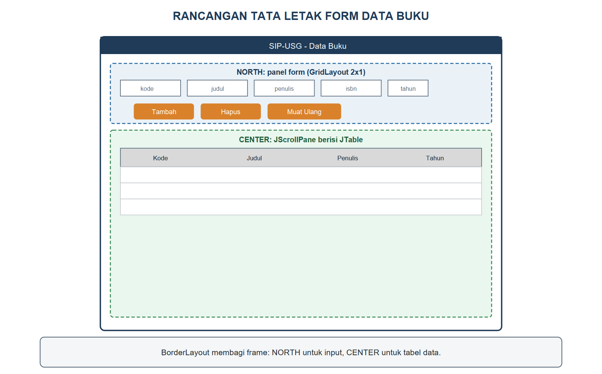
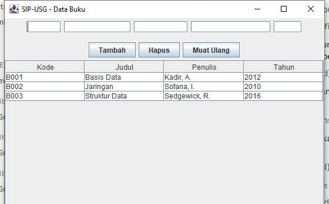

# BAB XII.
# (ANTARMUKA GRAFIS / GUI DAN EVENT HANDLING)

### CPMK/ Sub-CPMK :

- **CPMK3** : Melalui proyek pemrograman, mahasiswa mampu membangun aplikasi berorientasi objek yang terintegrasi dengan basis data dan antarmuka grafis (GUI) sebagai produk.
- **Sub-CPMK7** : Mahasiswa mampu membangun aplikasi berorientasi objek yang terintegrasi dengan operasi berkas/*persistence*, basis data (JDBC/CRUD), dan antarmuka grafis (GUI).

### Indikator Penilaian:

Ketepatan membangun antarmuka grafis (GUI) dan *event handling*, meliputi penyusunan komponen Swing dalam hierarki *container*, pengaturan tata letak dengan *layout manager*, penanganan aksi pengguna melalui *listener* dan ekspresi *lambda*, serta penghubungan formulir dengan lapisan DAO untuk menampilkan dan mengubah data.

### Kriteria Keberhasilan (Rubrik):

- Sangat Baik (≥ 85): Mahasiswa mampu menganalisis kebutuhan interaksi pengguna pada kasus, merancang formulir yang runtut dan mudah digunakan, serta menghubungkan setiap aksi pengguna dengan operasi DAO disertai validasi masukan dan pesan umpan balik yang jelas.
- Baik (70-84): Mahasiswa mampu membangun formulir Swing yang menjalankan operasi CRUD dengan benar, tetapi tata letak atau validasi masukan pengguna belum sepenuhnya tertata.
- Cukup (55-69): Mahasiswa mampu menampilkan komponen Swing dan menangani klik tombol, tetapi formulir belum terhubung secara utuh dengan basis data.

### Deskripsi Kemampuan yang Diharapkan:

Setelah mempelajari bab ini, mahasiswa diharapkan mampu membangun antarmuka grafis berbasis Java Swing yang merespons aksi pengguna dan terhubung dengan lapisan data aplikasi. Dalam konteks Sistem Informasi, antarmuka grafis adalah titik temu antara sistem dan penggunanya sehingga kemampuan ini menentukan apakah petugas perpustakaan dapat mengelola data buku, anggota, dan transaksi secara cepat, tepat, dan nyaman.

## A. Pendahuluan

Sepanjang Bab II hingga Bab XI, satu-satunya cara berinteraksi dengan SIP-USG adalah melalui kode Java yang dijalankan langsung, sebuah cara yang sama sekali tidak praktis bagi petugas sirkulasi perpustakaan yang sehari-hari bekerja dengan formulir, tabel, dan tombol pada layar komputer. `BookDAO` yang dibangun pada Bab XI sudah mampu menyimpan dan mengambil data dari MariaDB dengan andal, tetapi tanpa antarmuka grafis, kemampuan itu hanya dapat dinikmati oleh sesama pemrogram.

Bab ini menutup jarak tersebut dengan membangun formulir Java Swing yang menampilkan data buku dalam tabel, menyediakan kolom isian untuk menambah data baru, serta tombol untuk memicu operasi tambah, hapus, dan muat ulang. Mahasiswa akan mempelajari komponen dasar Swing, pengaturan tata letak, penanganan aksi pengguna melalui *event listener* dan ekspresi *lambda*, hingga menghubungkan seluruhnya dengan `BookDAO` yang telah dibangun pada Bab XI. Bab ini menjadi langkah terakhir sebelum SIP-USG dirapikan strukturnya melalui prinsip desain pada Bab XIII dan pola MVC pada Bab XIV.

## B. Komponen Swing dan Hierarki Container

Java Swing membedakan dua peran komponen antarmuka: *Container*, yang dapat menampung komponen lain dan mengatur tata letaknya, dan *Component*, yang berinteraksi langsung dengan pengguna. Gambar {{g:bab12-hierarki-swing}} memetakan hierarki ini pada `BookFormFrame` yang akan dibangun sepanjang bab ini.



`JFrame` adalah jendela utama aplikasi, sebuah *Container* tingkat atas yang menampung seluruh komponen lainnya. Di dalamnya, `JPanel` mengelompokkan komponen yang berkaitan (misalnya seluruh kolom isian dan tombol), sedangkan `JScrollPane` membungkus `JTable` agar data yang panjang dapat digulirkan tanpa memperbesar jendela. Tabel {{t:komponen-swing}} merangkum komponen Swing yang paling sering dipakai beserta kegunaannya pada SIP-USG.

Tabel #komponen-swing. Komponen Swing yang paling sering dipakai

| Komponen | Peran | Pemakaian pada SIP-USG |
|---|---|---|
| `JFrame` | Jendela utama aplikasi | `BookFormFrame` |
| `JPanel` | Pengelompok komponen dan pengatur tata letak | Baris kolom isian dan baris tombol |
| `JTextField` | Kolom isian teks satu baris | Kode, judul, penulis, ISBN, tahun |
| `JButton` | Tombol pemicu aksi | Tambah, Hapus, Muat Ulang |
| `JTable` | Tabel data yang dapat digulirkan | Daftar buku dari `BookDAO` |
| `JScrollPane` | Pembungkus penggulir | Membungkus `JTable` |

## C. Layout Manager

*Layout manager* menentukan bagaimana komponen di dalam sebuah *Container* diatur posisi dan ukurannya, tanpa mengharuskan pemrogram menghitung koordinat piksel secara manual. Kode Program {{kp:layout-demo}} mendemonstrasikan `BorderLayout`, yang membagi *Container* menjadi lima wilayah: `NORTH`, `SOUTH`, `EAST`, `WEST`, dan `CENTER`.

Kode Program #layout-demo. Demonstrasi BorderLayout

```java
package id.ac.usg.sip.app;

import java.awt.BorderLayout;
import javax.swing.JLabel;
import javax.swing.JPanel;

public class LayoutDemo {
    public static void main(String[] args) {
        JPanel panel = new JPanel(
            new BorderLayout());
        panel.add(new JLabel("Judul Form"),
            BorderLayout.NORTH);
        panel.add(new JLabel("Tabel Data"),
            BorderLayout.CENTER);
        panel.add(new JLabel("Tombol Aksi"),
            BorderLayout.SOUTH);
        System.out.println(
            "Komponen ditambahkan: "
            + panel.getComponentCount());
    }
}
```

Keluaran Program:

```
Komponen ditambahkan: 3
```

`BookFormFrame` memakai `BorderLayout` pada tingkat `JFrame`, menempatkan panel formulir di `NORTH` dan tabel data di `CENTER`, sebagaimana dirancang pada Gambar {{g:bab12-rancangan-tata-letak}}.



Di dalam panel formulir, `FlowLayout` menyusun komponen berurutan dari kiri ke kanan sesuai lebar yang tersedia, cocok untuk sekumpulan kolom isian atau tombol yang jumlahnya tidak terlalu banyak. `GridLayout(2, 1)` kemudian menyusun dua `FlowLayout` tersebut, satu berisi kolom isian dan satu berisi tombol, menjadi dua baris yang sejajar.

## D. Event Handling: Listener, Event Object, dan Lambda

Setiap kali pengguna menekan tombol, mengetik pada kolom isian, atau berinteraksi dengan komponen Swing lainnya, Java menghasilkan sebuah *event*. *Listener* adalah objek yang "mendengarkan" *event* tertentu dan menjalankan kode tertentu saat *event* itu terjadi. Kode Program {{kp:event-demo}} mendemonstrasikan `ActionListener` pada `JButton` memakai ekspresi *lambda*.

Kode Program #event-demo. Demonstrasi ActionListener dengan lambda

```java
package id.ac.usg.sip.app;

import javax.swing.JButton;

public class EventDemo {
    public static void main(String[] args) {
        JButton tombolSimpan =
            new JButton("Simpan");
        tombolSimpan.addActionListener(
            e -> System.out.println(
                "Tombol Simpan ditekan"));

        System.out.println("Simulasi klik:");
        tombolSimpan.doClick();
    }
}
```

Keluaran Program:

```
Simulasi klik:
Tombol Simpan ditekan
```

Sebelum Java 8, menangani *event* memerlukan kelas tersendiri yang mengimplementasikan *interface* `ActionListener`, dituliskan sebagai kelas anonim yang memuat banyak kode tambahan hanya untuk satu baris tindakan. Karena `ActionListener` hanya memiliki satu *abstract method*, yaitu `actionPerformed(ActionEvent e)`, *interface* ini tergolong *functional interface* seperti yang telah dipelajari pada Bab VII, sehingga dapat diringkas menjadi ekspresi *lambda* `e -> ...`. Parameter `e` pada lambda adalah objek `ActionEvent`, yang memuat informasi tentang *event* yang terjadi, meskipun pada contoh sederhana ini informasinya tidak dipakai. Pemanggilan `tombolSimpan.doClick()` mensimulasikan klik tombol secara terprogram, memicu `actionPerformed` tanpa memerlukan interaksi pengguna sungguhan, cara yang berguna untuk menguji *event handling* secara otomatis.

## E. Menghubungkan Form dengan Lapisan DAO

Kode Program {{kp:bookform-1}} membangun kerangka `BookFormFrame`, memuat atribut komponen Swing beserta `BookDAO` yang telah dibangun pada Bab XI.

Kode Program #bookform-1. BookFormFrame: atribut dan constructor (bagian 1)

```java
// BookFormFrame.java -- bagian 1 dari 4
// (import javax.swing.* diringkas untuk cetakan;
// berkas asli memakai import eksplisit per kelas)
package id.ac.usg.sip.app;

import id.ac.usg.sip.model.Book;
import id.ac.usg.sip.model.BookDAO;
import id.ac.usg.sip.model.BookDAOImpl;
import java.awt.BorderLayout;
import java.awt.FlowLayout;
import java.awt.GridLayout;
import javax.swing.*;
import javax.swing.table.DefaultTableModel;
public class BookFormFrame extends JFrame {
    private final BookDAO dao = new BookDAOImpl();
    private final JTextField kodeField =
        new JTextField(5);
    private final JTextField judulField =
        new JTextField(10);
    private final JTextField penulisField =
        new JTextField(8);
    private final JTextField isbnField =
        new JTextField(12);
    private final JTextField tahunField =
        new JTextField(4);
    private final String[] kolom =
        {"Kode", "Judul", "Penulis", "Tahun"};
    private final DefaultTableModel model =
        new DefaultTableModel(kolom, 0);
    private final JTable tabel = new JTable(model);
    public BookFormFrame() {
        super("SIP-USG - Data Buku");
        setLayout(new BorderLayout());
        add(buatPanelForm(), BorderLayout.NORTH);
        add(new JScrollPane(tabel),
            BorderLayout.CENTER);
        setSize(560, 360);
        muatUlang();
    }
    // ... lanjutan pada Kode Program berikutnya
```

Kode Program {{kp:bookform-2}} menyusun panel formulir sekaligus mendaftarkan ketiga `ActionListener` tombolnya memakai ekspresi *lambda*.

Kode Program #bookform-2. BookFormFrame: tata letak dan event handling (bagian 2, lanjutan)

```java
    // lanjutan BookFormFrame: tata letak form

    private JPanel buatPanelForm() {
        JPanel baris1 = new JPanel(new FlowLayout());
        baris1.add(kodeField);
        baris1.add(judulField);
        baris1.add(penulisField);
        baris1.add(isbnField);
        baris1.add(tahunField);

        JButton tambah = new JButton("Tambah");
        tambah.addActionListener(e -> tambahBuku());
        JButton hapus = new JButton("Hapus");
        hapus.addActionListener(e -> hapusBuku());
        JButton muat = new JButton("Muat Ulang");
        muat.addActionListener(e -> muatUlang());

        JPanel baris2 = new JPanel(new FlowLayout());
        baris2.add(tambah);
        baris2.add(hapus);
        baris2.add(muat);

        JPanel panel = new JPanel(
            new GridLayout(2, 1));
        panel.add(baris1);
        panel.add(baris2);
        return panel;
    }
```

Perhatikan bahwa `tambah.addActionListener(e -> tambahBuku())` tidak menuliskan logika penambahan data langsung di dalam lambda, melainkan memanggil *method* `tambahBuku()` yang dideklarasikan terpisah pada Kode Program {{kp:bookform-3}}. Pemisahan ini menjaga lambda tetap ringkas dan membuat logika bisnis (memanggil DAO) mudah diuji maupun dibaca ulang tanpa harus menelusuri kode pengaturan tata letak.

Kode Program #bookform-3. BookFormFrame: menghubungkan aksi dengan BookDAO (bagian 3, lanjutan)

```java
    // lanjutan BookFormFrame: aksi dan DAO

    private void tambahBuku() {
        try {
            Book b = new Book(judulField.getText(),
                kodeField.getText(),
                penulisField.getText(),
                isbnField.getText(),
                Integer.parseInt(
                    tahunField.getText()));
            dao.insert(b);
            muatUlang();
        } catch (Exception ex) {
            System.out.println(
                "Gagal tambah: " + ex.getMessage());
        }
    }

    private void hapusBuku() {
        try {
            dao.delete(kodeField.getText());
            muatUlang();
        } catch (Exception ex) {
            System.out.println(
                "Gagal hapus: " + ex.getMessage());
        }
    }
    // ... lanjutan pada Kode Program berikutnya
```

Kode Program #bookform-4. BookFormFrame: memuat ulang tabel dari BookDAO (bagian 4, lanjutan)

```java
    // lanjutan BookFormFrame: memuat ulang tabel

    private void muatUlang() {
        try {
            model.setRowCount(0);
            for (Book b : dao.findAll()) {
                model.addRow(new Object[] {
                    b.getItemCode(), b.getTitle(),
                    b.getAuthor(),
                    b.getPublicationYear()});
            }
        } catch (Exception ex) {
            System.out.println(
                "Gagal muat: " + ex.getMessage());
        }
    }
}
```

Perhatikan bahwa `muatUlang()` selalu mengosongkan `model` lebih dahulu lewat `setRowCount(0)` sebelum mengisinya kembali dari `dao.findAll()`, memastikan tabel selalu mencerminkan keadaan basis data yang sesungguhnya, bukan sekadar menambah baris di atas data lama. `tambahBuku()` dan `hapusBuku()` memanggil `muatUlang()` di akhir agar tabel langsung memperbarui tampilannya setelah setiap perubahan data, tanpa mengharuskan pengguna menutup dan membuka ulang formulir.

## F. Praktikum Terbimbing: Form Data Buku SIP-USG dengan Tabel dan Tombol CRUD

Praktikum ini merangkai seluruh kode pada bagian C hingga E menjadi satu formulir yang berjalan penuh terhadap basis data `sip_usg`.

1. Buat kelas `BookFormFrame` pada paket `id.ac.usg.sip.app`, lalu gabungkan Kode Program {{kp:bookform-1}}, Kode Program {{kp:bookform-2}}, Kode Program {{kp:bookform-3}}, dan Kode Program {{kp:bookform-4}} menjadi satu berkas.
2. Buat kelas `Bab12Demo` pada paket yang sama, lalu salin Kode Program {{kp:bab12-demo}}.
3. Jalankan `Bab12Demo`, lalu amati formulir yang muncul beserta data buku yang sudah tersimpan sejak Bab XI.
4. Isi kolom kode, judul, penulis, ISBN, dan tahun, lalu tekan tombol *Tambah* untuk menambah data baru dan amati tabel diperbarui otomatis.
5. Isi kolom kode dengan kode data yang ingin dihapus, lalu tekan tombol *Hapus*, dan amati baris tersebut hilang dari tabel.

Kode Program #bab12-demo. Menjalankan BookFormFrame

```java
package id.ac.usg.sip.app;

import javax.swing.JFrame;
import javax.swing.SwingUtilities;

public class Bab12Demo {
    public static void main(String[] args) {
        SwingUtilities.invokeLater(() -> {
            BookFormFrame form = new BookFormFrame();
            form.setDefaultCloseOperation(
                JFrame.EXIT_ON_CLOSE);
            form.setVisible(true);
            System.out.println(
                "Form SIP-USG telah ditampilkan");
        });
    }
}
```

Keluaran Program:

```
Form SIP-USG telah ditampilkan
```

Gambar {{g:bab12-form-buku}} menunjukkan tangkapan layar `BookFormFrame` yang benar-benar berjalan, menampilkan tiga data buku yang telah tersimpan di MariaDB sejak praktikum Bab XI.



Perhatikan bahwa keluaran konsol pada formulir GUI jauh lebih sedikit dibandingkan bab-bab sebelumnya; sebagian besar "hasil" program kini terlihat secara visual pada jendela formulir, bukan pada teks konsol. Inilah perbedaan mendasar antara aplikasi berbasis konsol dan aplikasi berbasis GUI: keduanya menjalankan logika Java yang sama persis, tetapi cara penggunanya berinteraksi dan menerima hasilnya sama sekali berbeda.

#### Kesalahan Umum dan Cara Mengatasinya

| Gejala/Pesan Error | Penyebab | Perbaikan |
|---|---|---|
| Jendela formulir tidak pernah muncul | Kode pembuatan `JFrame` tidak dipanggil di dalam `SwingUtilities.invokeLater` maupun `main` tidak pernah memanggil `setVisible(true)` | Pastikan `form.setVisible(true)` dipanggil setelah formulir dibangun |
| Tabel tetap kosong walau data ada di basis data | `muatUlang()` tidak pernah dipanggil, atau dipanggil sebelum komponen tabel selesai dibuat | Panggil `muatUlang()` di akhir *constructor*, setelah seluruh komponen ditambahkan |
| `NumberFormatException` saat menekan tombol Tambah | Kolom tahun dibiarkan kosong atau diisi teks bukan angka sebelum `Integer.parseInt` dipanggil | Validasi isi kolom sebelum dikonversi, atau tangkap `NumberFormatException` dan tampilkan pesan yang jelas |
| Jendela aplikasi tidak tertutup sepenuhnya saat tombol *close* ditekan | `setDefaultCloseOperation` belum diatur ke `JFrame.EXIT_ON_CLOSE` | Tambahkan `form.setDefaultCloseOperation(JFrame.EXIT_ON_CLOSE)` sebelum `setVisible(true)` |

### Rangkuman

Java Swing membedakan *Container*, seperti `JFrame`, `JPanel`, dan `JScrollPane`, yang menampung dan mengatur tata letak komponen lain, dari *Component*, seperti `JTextField`, `JButton`, dan `JTable`, yang berinteraksi langsung dengan pengguna. *Layout manager* seperti `BorderLayout`, `FlowLayout`, dan `GridLayout` mengatur posisi komponen tanpa perhitungan piksel manual. Setiap interaksi pengguna menghasilkan *event* yang ditangani *listener*; karena `ActionListener` hanya memiliki satu *abstract method*, ia dapat diringkas menjadi ekspresi *lambda* yang ringkas dan mudah dibaca. `BookFormFrame` menghubungkan seluruh konsep ini dengan `BookDAO` dari Bab XI: tombol memanggil *method* yang menjalankan operasi CRUD, lalu memuat ulang `JTable` agar tampilan selalu mencerminkan keadaan terbaru basis data `sip_usg`.

### Soal/Pertanyaan

1. (C2) Jelaskan perbedaan *Container* dan *Component* pada Java Swing, masing-masing disertai dua contoh!
2. (C2) Jelaskan mengapa `ActionListener` dapat diringkas menjadi ekspresi *lambda*, dikaitkan dengan konsep *functional interface* pada Bab VII!
3. (C3) Perhatikan Kode Program {{kp:bookform-2}}. Jelaskan mengapa tombol memanggil *method* terpisah seperti `tambahBuku()`, bukan menuliskan logikanya langsung di dalam lambda!
4. (C3) Telusuri Kode Program {{kp:bookform-3}}, lalu jelaskan urutan yang terjadi setelah pengguna menekan tombol *Hapus*!
5. (C4) Bandingkan Gambar {{g:bab12-rancangan-tata-letak}} dengan Gambar {{g:bab12-form-buku}}. Analisis apakah rancangan tata letak berhasil diwujudkan sesuai rencana!
6. (C4) Perhatikan Kode Program {{kp:bookform-4}} bagian `muatUlang()`. Jelaskan mengapa `model.setRowCount(0)` dipanggil sebelum perulangan `for`!
7. (C5) Rancanglah (dalam bentuk kerangka kode) *method* `ubahBuku()` yang memanggil `dao.update(...)` menggunakan nilai dari kelima kolom isian, mengikuti pola `tambahBuku()` pada Kode Program {{kp:bookform-3}}!
8. (C6) SIP-USG kini memiliki `BookFormFrame` yang memanggil `BookDAOImpl` secara langsung dari dalam *method* seperti `tambahBuku()`. Nilailah apakah rancangan ini sudah cukup baik, atau apakah logika bisnis dan antarmuka sebaiknya dipisah lebih jauh, dikaitkan dengan prinsip yang akan dipelajari pada Bab XIII!

### Rujukan Bab

- Deitel, P. J., & Deitel, H. M. (2018). *Java how to program, early objects* (11th ed.). Pearson Education.
- Horstmann, C. S. (2022). *Core Java, Volume I: Fundamentals* (12th ed.). Oracle Press/Pearson.
- Oracle Corporation. (2024). *The Java tutorials: Object-oriented programming concepts*. https://docs.oracle.com/javase/tutorial/java/concepts/
