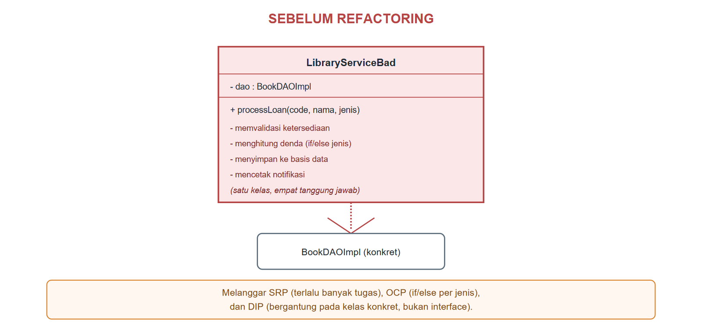
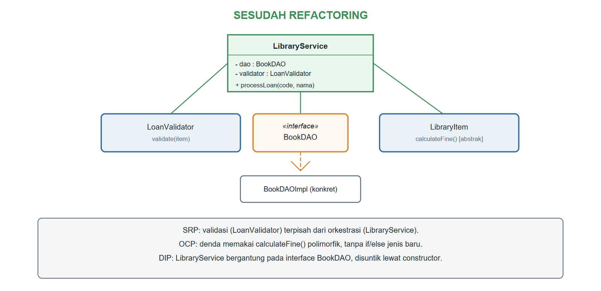

# BAB XIII.
# (PRINSIP DESAIN BERORIENTASI OBJEK / SOLID)

### CPMK/ Sub-CPMK :

- **CPMK4** : Mahasiswa mampu berkolaborasi secara efektif dan etis dalam merancang, mengembangkan, mendokumentasikan, dan mempresentasikan produk aplikasi berorientasi objek.
- **Sub-CPMK8** : Mahasiswa mampu menerapkan prinsip desain berorientasi objek (SOLID/*design pattern*) serta mengembangkan dan mempresentasikan proyek aplikasi berorientasi objek secara kolaboratif.

### Indikator Penilaian:

Ketepatan menerapkan prinsip SOLID dan mengenali *design pattern* dasar, meliputi penerapan *Single Responsibility*, *Open-Closed*, *Liskov Substitution*, *Interface Segregation*, dan *Dependency Inversion*, pengenalan gejala *code smell* pada rancangan kelas, serta pelaksanaan *refactoring* terarah terhadap kode proyek kelompok.

### Kriteria Keberhasilan (Rubrik):

- Sangat Baik (≥ 85): Mahasiswa mampu menganalisis rancangan kelas proyek secara mendalam, mengidentifikasi pelanggaran prinsip SOLID beserta dampaknya, dan menghasilkan rancangan hasil *refactoring* yang konsisten, terdokumentasi, serta disepakati bersama dalam kelompok.
- Baik (70-84): Mahasiswa mampu menjelaskan dan menerapkan kelima prinsip SOLID dengan benar, tetapi analisis pelanggaran pada kode proyek belum mencakup seluruh bagian aplikasi.
- Cukup (55-69): Mahasiswa mampu menyebutkan dan mendefinisikan kelima prinsip SOLID, tetapi penerapannya dalam *refactoring* kode proyek masih terbatas pada contoh sederhana.

### Deskripsi Kemampuan yang Diharapkan:

Setelah mempelajari bab ini, mahasiswa diharapkan mampu menilai kualitas rancangan kelas berdasarkan prinsip SOLID serta memperbaiki kode yang kaku, rapuh, dan sulit diuji melalui *refactoring* bertahap. Dalam konteks Sistem Informasi, aplikasi organisasi terus berubah mengikuti kebijakan dan kebutuhan pengguna, sehingga rancangan yang mematuhi prinsip desain memungkinkan tim pengembang menambah fitur, seperti jenis layanan perpustakaan yang baru, tanpa merusak fitur yang sudah berjalan.

## A. Pendahuluan

SIP-USG yang dibangun sejak Bab II hingga Bab XII sudah dapat mengelola data, terhubung ke basis data, dan menampilkan antarmuka grafis. Namun, sejauh ini pembahasan lebih berfokus pada *apakah* kode berjalan dengan benar, belum pada *seberapa baik* rancangannya bertahan menghadapi perubahan. Bayangkan tim pengembang SIP-USG diminta menambahkan jenis denda baru untuk koleksi digital yang dipinjam melebihi kuota unduhan; jika logika perhitungan denda tersebar di banyak tempat dan bercampur dengan logika lain yang tidak berkaitan, perubahan kecil ini dapat berisiko merusak bagian lain yang sebenarnya tidak perlu disentuh.

Bab ini memperkenalkan lima prinsip desain berorientasi objek yang dikenal sebagai SOLID: *Single Responsibility*, *Open-Closed*, *Liskov Substitution*, *Interface Segregation*, dan *Dependency Inversion*. Kelima prinsip ini bukan aturan sintaksis Java, melainkan pedoman kualitas rancangan yang teruji membuat kode lebih mudah dipahami, diuji, dan dikembangkan. Mahasiswa akan mempraktikkan langsung kelima prinsip ini dengan me-*refactor* sebuah kelas `LibraryService` yang sengaja dirancang buruk, menjadikannya rancangan yang jauh lebih tahan terhadap perubahan. Kemampuan ini menjadi dasar penting sebelum mempelajari *design pattern* pada Bab XIV dan mengerjakan proyek akhir pada Bab XV.

## B. Single Responsibility dan Open-Closed

*Single Responsibility Principle* (SRP) menyatakan bahwa sebuah kelas sebaiknya memiliki hanya satu alasan untuk berubah, yaitu satu tanggung jawab yang jelas. *Open-Closed Principle* (OCP) menyatakan bahwa kelas sebaiknya terbuka untuk diperluas tetapi tertutup untuk dimodifikasi: menambah perilaku baru semestinya tidak mengharuskan kode yang sudah ada dan sudah teruji diubah kembali. Kode Program {{kp:library-service-bad}} menuliskan `LibraryServiceBad`, sebuah kelas yang melanggar kedua prinsip ini sekaligus.

Kode Program #library-service-bad. LibraryServiceBad: melanggar SRP dan OCP

```java
package id.ac.usg.sip.model;

public class LibraryServiceBad {
    private BookDAOImpl dao = new BookDAOImpl();

    public void processLoan(String itemCode,
            String memberName, String itemType)
            throws Exception {
        Book b = dao.findByCode(itemCode);
        if (b == null) {
            System.out.println("Tidak ditemukan");
            return;
        }
        if (!b.isAvailable()) {
            System.out.println("Tidak tersedia");
            return;
        }
        double denda;
        if (itemType.equals("BOOK")) {
            denda = 500;
        } else if (itemType.equals("JOURNAL")) {
            denda = 300;
        } else {
            denda = 0;
        }
        b.borrow();
        dao.update(b);
        System.out.println(memberName
            + " pinjam " + b.getTitle()
            + ", denda/hari Rp" + denda);
    }
}
```

Satu *method* `processLoan` pada Kode Program {{kp:library-service-bad}} sekaligus melakukan validasi, menentukan rumus denda, menyimpan perubahan, dan mencetak notifikasi, empat alasan berbeda yang masing-masing dapat memicu perubahan kode ini di masa depan, jelas melanggar SRP. Percabangan `if (itemType.equals("BOOK"))` juga melanggar OCP: setiap kali SIP-USG menambah jenis koleksi baru, *method* ini harus dibuka kembali dan ditambah satu cabang lagi, padahal Bab VI dan Bab VII telah menyediakan cara yang lebih baik, yaitu `calculateFine()` yang polimorfik, untuk menghitung denda tanpa percabangan semacam ini sama sekali. Gambar {{g:bab13-uml-sebelum}} menggambarkan struktur bermasalah ini.



## C. Liskov Substitution

*Liskov Substitution Principle* (LSP) menyatakan bahwa objek dari *subclass* harus dapat menggantikan objek *superclass*-nya tanpa mengubah kebenaran program. Dengan kata lain, jika kode memanggil `item.borrow()` pada sebuah `LibraryItem`, pemanggilan tersebut harus tetap berperilaku wajar apa pun *subclass* konkret yang sesungguhnya dipakai. Kode Program {{kp:archived-bad}} menunjukkan pelanggaran LSP yang halus namun berbahaya.

Kode Program #archived-bad. ArchivedBookBad: melanggar Liskov Substitution

```java
package id.ac.usg.sip.model;

public class ArchivedBookBad extends Book {
    public ArchivedBookBad(String title,
            String itemCode, String author,
            String isbnValue, int year) {
        super(title, itemCode, author,
            isbnValue, year);
    }

    @Override
    public void borrow()
            throws BookNotAvailableException {
        throw new UnsupportedOperationException(
            "Arsip tidak dapat dipinjam");
    }
}
```

`ArchivedBookBad` tetap sebuah `Book` menurut kompiler, sehingga kode mana pun yang sebelumnya bekerja aman dengan `Book`, misalnya perulangan `for (LibraryItem it : semua) { it.borrow(); ... }` pada Bab VI, akan tiba-tiba melempar `UnsupportedOperationException` yang tidak terduga begitu larik tersebut memuat sebuah `ArchivedBookBad`. Kode Program {{kp:archived-good}} memperbaikinya dengan tidak memaksakan hubungan pewarisan yang sesungguhnya tidak berlaku.

Kode Program #archived-good. ArchivedBookGood: memenuhi Liskov Substitution

```java
package id.ac.usg.sip.model;

public class ArchivedBookGood
        implements Printable {
    private String title;
    private String itemCode;

    public ArchivedBookGood(String title,
            String itemCode) {
        this.title = title;
        this.itemCode = itemCode;
    }

    @Override
    public String getSummary() {
        return title + " [" + itemCode
            + ", Arsip]";
    }
}
```

`ArchivedBookGood` tidak lagi mewarisi `Book` maupun `LibraryItem`; ia hanya menerapkan `Printable` karena kesanggupan yang sesungguhnya dimilikinya hanyalah "dapat dicetak labelnya", bukan "dapat dipinjam". Prinsip praktis di balik LSP adalah: jika sebuah *subclass* terpaksa melemahkan atau menolak sebagian kontrak *superclass*-nya, itu adalah tanda bahwa hubungan pewarisan tersebut sesungguhnya tidak tepat, sebagaimana telah disinggung pada aturan kewajaran hierarki di Bab V.

## D. Interface Segregation dan Dependency Inversion

*Interface Segregation Principle* (ISP) menyatakan bahwa kelas sebaiknya tidak dipaksa mengimplementasikan *method* dari *interface* yang tidak pernah benar-benar dipakainya; lebih baik memecah satu *interface* besar menjadi beberapa *interface* kecil yang masing-masing fokus pada satu kesanggupan. SIP-USG sesungguhnya telah menerapkan ISP sejak Bab VII: `Borrowable` dan `Printable` sengaja dipisah, bukan digabung menjadi satu *interface* besar seperti `LibraryItemOperations` yang memaksa setiap kelas mengimplementasikan seluruh *method* peminjaman maupun pencetakan label sekaligus. `ArchivedBookGood` pada bagian C membuktikan manfaat ISP secara langsung: kelas ini hanya perlu menerapkan `Printable`, tanpa terpaksa menyediakan `borrow()` dan `returnItem()` yang tidak relevan baginya.

*Dependency Inversion Principle* (DIP) menyatakan bahwa modul tingkat tinggi sebaiknya tidak bergantung langsung pada modul tingkat rendah, melainkan keduanya bergantung pada abstraksi. Perhatikan kembali Kode Program {{kp:library-service-bad}}: atribut `private BookDAOImpl dao = new BookDAOImpl();` membuat `LibraryServiceBad` terikat erat pada satu implementasi konkret tertentu, sehingga mustahil menggantinya dengan implementasi lain, misalnya untuk keperluan pengujian, tanpa mengubah kelas ini. Kode Program {{kp:loan-validator}} dan Kode Program {{kp:library-service-good}} menerapkan SRP, OCP, dan DIP sekaligus sebagai hasil *refactoring* menyeluruh.

Kode Program #loan-validator. LoanValidator: tanggung jawab validasi terpisah

```java
package id.ac.usg.sip.model;

public class LoanValidator {
    public void validate(LibraryItem item)
            throws BookNotAvailableException {
        if (item == null) {
            throw new IllegalArgumentException(
                "Item tidak ditemukan");
        }
        if (!item.isAvailable()) {
            throw new BookNotAvailableException(
                item.getTitle()
                + " tidak tersedia");
        }
    }
}
```

Kode Program #library-service-good. LibraryService: SRP, OCP, dan DIP terpenuhi

```java
package id.ac.usg.sip.model;

public class LibraryService {
    private final BookDAO dao;
    private final LoanValidator validator;

    public LibraryService(BookDAO dao,
            LoanValidator validator) {
        this.dao = dao;
        this.validator = validator;
    }

    public void processLoan(String itemCode,
            String memberName) throws Exception {
        Book b = dao.findByCode(itemCode);
        validator.validate(b);
        b.borrow();
        dao.update(b);
        double denda = b.calculateFine(1);
        System.out.println(memberName
            + " pinjam " + b.getTitle()
            + ", denda/hari Rp" + denda);
    }
}
```

Perhatikan bahwa *constructor* `LibraryService` menerima `BookDAO` (*interface*) dan `LoanValidator`, bukan membuat sendiri objek konkretnya melalui `new` di dalam kelas; teknik ini disebut *constructor injection*, salah satu cara paling umum menerapkan DIP. Validasi kini menjadi tanggung jawab tunggal `LoanValidator` (SRP terpenuhi), sedangkan denda dihitung lewat `b.calculateFine(1)` yang polimorfik tanpa percabangan jenis apa pun (OCP terpenuhi). Gambar {{g:bab13-uml-sesudah}} merangkum struktur baru ini.



## E. Code Smell dan Refactoring Terarah

*Code smell* adalah tanda-tanda pada kode yang mengindikasikan kemungkinan pelanggaran prinsip desain, meski kode tersebut masih dapat dikompilasi dan berjalan dengan benar. Tabel {{t:solid-smell}} merangkum kelima prinsip SOLID beserta gejala pelanggaran dan arah perbaikannya, merujuk pada perbandingan `LibraryServiceBad` dan `LibraryService` pada bab ini.

Tabel #solid-smell. Lima prinsip SOLID, gejala pelanggaran, dan perbaikannya

| Prinsip | Gejala Pelanggaran (Code Smell) | Arah Perbaikan |
|---|---|---|
| Single Responsibility | Satu kelas/method melakukan banyak hal tak berkaitan | Pisahkan menjadi kelas-kelas kecil bertanggung jawab tunggal |
| Open-Closed | Percabangan `if/else` atau `switch` berdasarkan jenis objek | Gunakan polimorfisme (*override method*) |
| Liskov Substitution | *Subclass* melempar `UnsupportedOperationException` pada *method* warisan | Tinjau ulang hubungan pewarisan, pertimbangkan *interface* terpisah |
| Interface Segregation | *Interface* besar dengan banyak *method* tak semuanya relevan | Pecah menjadi beberapa *interface* kecil dan fokus |
| Dependency Inversion | Kelas membuat sendiri (`new`) objek dependensinya | Terima dependensi lewat *constructor* (*injection*), bergantung pada *interface* |

*Refactoring terarah* berarti memperbaiki kode berdasarkan gejala yang telah teridentifikasi secara sistematis, satu prinsip pada satu waktu, sambil terus memverifikasi bahwa perilaku program tidak berubah, sebagaimana dibuktikan pada praktikum bagian F melalui keluaran program yang tetap benar sebelum dan sesudah *refactoring*.

## F. Praktikum Terbimbing: Refactoring Kelas LibraryService agar Memenuhi SOLID

Praktikum ini merangkai seluruh kode pada bagian B hingga D menjadi satu pengujian *refactoring* yang lengkap.

1. Buat kelas `LibraryServiceBad` pada paket `id.ac.usg.sip.model`, lalu salin Kode Program {{kp:library-service-bad}} sebagai bukti kondisi awal yang akan diperbaiki.
2. Buat kelas `ArchivedBookBad` dan `ArchivedBookGood`, lalu salin Kode Program {{kp:archived-bad}} dan Kode Program {{kp:archived-good}}.
3. Buat kelas `LoanValidator`, lalu salin Kode Program {{kp:loan-validator}}.
4. Buat kelas `LibraryService`, lalu salin Kode Program {{kp:library-service-good}}.
5. Buat kelas `Bab13Demo` pada paket `id.ac.usg.sip.app`, lalu salin Kode Program {{kp:bab13-demo}}.
6. Jalankan `Bab13Demo`, lalu amati bahwa `LibraryService` hasil *refactoring* tetap dapat memproses peminjaman dan menolak peminjaman ganda dengan benar, persis seperti yang diharapkan dari `LibraryServiceBad` semula.

Kode Program #bab13-demo. Menguji LibraryService dan ArchivedBookGood

```java
package id.ac.usg.sip.app;

import id.ac.usg.sip.model.ArchivedBookGood;
import id.ac.usg.sip.model.BookDAO;
import id.ac.usg.sip.model.BookDAOImpl;
import id.ac.usg.sip.model.LibraryService;
import id.ac.usg.sip.model.LoanValidator;

public class Bab13Demo {
    public static void main(String[] args)
            throws Exception {
        BookDAO dao = new BookDAOImpl();
        LoanValidator validator =
            new LoanValidator();
        LibraryService layanan =
            new LibraryService(dao, validator);

        layanan.processLoan("B002", "Nadia");

        try {
            layanan.processLoan("B002", "Bima");
        } catch (Exception ex) {
            System.out.println("Ditolak: "
                + ex.getMessage());
        }

        ArchivedBookGood arsip =
            new ArchivedBookGood(
                "Skripsi 2015", "S001");
        System.out.println(arsip.getSummary());
    }
}
```

Keluaran Program:

```
Nadia pinjam Jaringan, denda/hari Rp500.0
Ditolak: Jaringan tidak tersedia
Skripsi 2015 [S001, Arsip]
```

Perhatikan bahwa `dao` bertipe `BookDAO` (*interface*), bukan `BookDAOImpl`, saat diserahkan ke `LibraryService`, persis penerapan DIP yang dibahas pada bagian D. Percobaan meminjam `"B002"` untuk kedua kalinya ditolak oleh `LoanValidator` dengan pesan yang jelas, membuktikan bahwa tanggung jawab validasi telah berpindah sepenuhnya dari `LibraryServiceBad` ke kelas barunya tanpa mengubah perilaku yang diharapkan pengguna.

#### Kesalahan Umum dan Cara Mengatasinya

| Gejala/Pesan Error | Penyebab | Perbaikan |
|---|---|---|
| Menambah jenis koleksi baru tetap memerlukan mengubah banyak `if/else` | Rumus denda masih ditulis dengan percabangan berdasarkan jenis, bukan memakai `calculateFine()` polimorfik | Pindahkan logika denda ke dalam *override* `calculateFine()` pada *subclass* terkait, sesuai Bab VI |
| Sulit menguji `LibraryService` tanpa basis data sungguhan | `LibraryService` membuat sendiri `new BookDAOImpl()` di dalamnya | Terapkan *constructor injection* seperti Kode Program {{kp:library-service-good}} |
| *Subclass* baru tiba-tiba menyebabkan `UnsupportedOperationException` di kode lama | *Subclass* dipaksa mewarisi kontrak yang sebagian tidak sanggup dipenuhinya | Tinjau ulang hubungan pewarisan; pertimbangkan *interface* terpisah seperti `ArchivedBookGood` |
| Satu perubahan kecil pada aturan bisnis memerlukan pengujian ulang seluruh aplikasi | Satu kelas menangani terlalu banyak tanggung jawab sekaligus (pelanggaran SRP) | Pecah kelas menjadi beberapa kelas kecil bertanggung jawab tunggal |

### Rangkuman

Prinsip SOLID adalah lima pedoman kualitas rancangan berorientasi objek: *Single Responsibility* (satu kelas, satu tanggung jawab), *Open-Closed* (terbuka untuk perluasan, tertutup untuk modifikasi, biasanya melalui polimorfisme), *Liskov Substitution* (*subclass* harus dapat menggantikan *superclass*-nya tanpa merusak kebenaran program), *Interface Segregation* (*interface* kecil dan fokus lebih baik daripada satu *interface* besar), dan *Dependency Inversion* (bergantung pada abstraksi/*interface*, disuntikkan lewat *constructor*, bukan membuat sendiri implementasi konkret). *Code smell* adalah tanda kemungkinan pelanggaran prinsip ini pada kode yang tetap dapat berjalan, dan *refactoring* terarah memperbaikinya tanpa mengubah perilaku program yang benar. SIP-USG membuktikan penerapan kelima prinsip ini melalui *refactoring* `LibraryServiceBad` menjadi `LibraryService` dan `LoanValidator`, serta `ArchivedBookBad` menjadi `ArchivedBookGood`, menghasilkan rancangan yang jauh lebih siap menghadapi perubahan kebutuhan di masa depan.

### Soal/Pertanyaan

1. (C2) Sebutkan kepanjangan SOLID beserta satu kalimat ringkas untuk masing-masing prinsipnya!
2. (C2) Jelaskan mengapa `ArchivedBookBad` pada Kode Program {{kp:archived-bad}} melanggar Liskov Substitution Principle!
3. (C3) Perhatikan Kode Program {{kp:library-service-bad}}. Sebutkan seluruh tanggung jawab yang ditangani `processLoan`, lalu jelaskan mengapa hal ini melanggar SRP!
4. (C3) Telusuri Kode Program {{kp:library-service-good}}, lalu jelaskan bagaimana *constructor*-nya menerapkan *Dependency Inversion Principle*!
5. (C4) Bandingkan Gambar {{g:bab13-uml-sebelum}} dan Gambar {{g:bab13-uml-sesudah}}. Analisis bagaimana jumlah kelas yang bertambah justru dapat membuat sistem lebih mudah dipelihara!
6. (C4) Perhatikan Tabel {{t:solid-smell}}. Jelaskan mengapa "membuat sendiri (`new`) objek dependensi di dalam kelas" digolongkan sebagai *code smell* untuk Dependency Inversion Principle!
7. (C5) Rancanglah (dalam bentuk kerangka kode) sebuah kelas `LoanNotifier` yang bertanggung jawab tunggal mencetak notifikasi peminjaman, lalu jelaskan bagaimana `LibraryService` pada Kode Program {{kp:library-service-good}} dapat memakainya tanpa melanggar SRP!
8. (C6) SIP-USG kini memiliki `LibraryService`, `LoanValidator`, dan `BookDAO` yang saling terpisah. Nilailah apakah proyek kelompok pada Bab XV akan lebih mudah dikembangkan bersama beberapa anggota tim berkat pemisahan ini, dan jelaskan alasannya berdasarkan prinsip SOLID yang telah dipelajari!

### Rujukan Bab

- Bloch, J. (2018). *Effective Java* (3rd ed.). Addison-Wesley Professional.
- Gamma, E., Helm, R., Johnson, R., & Vlissides, J. (1994). *Design patterns: Elements of reusable object-oriented software*. Addison-Wesley.
