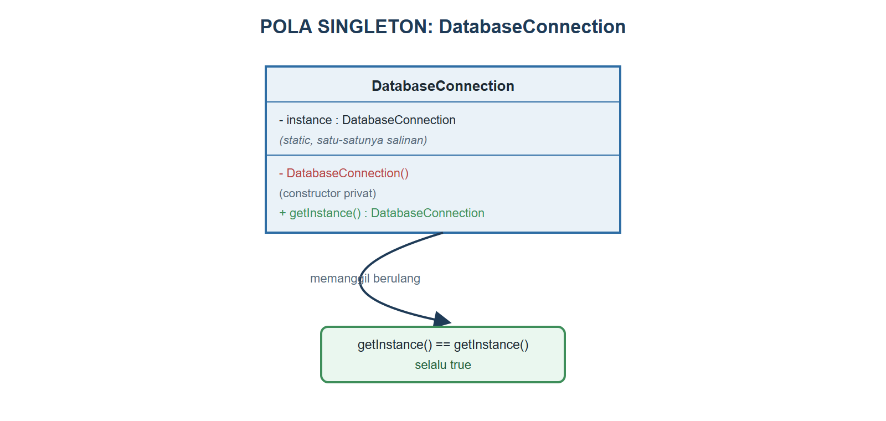
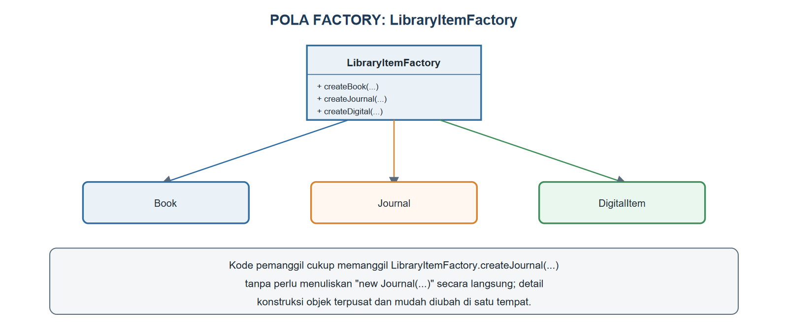
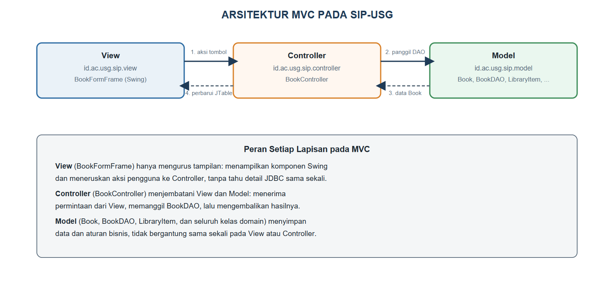

# BAB XIV.
# (PENGANTAR DESIGN PATTERN: SINGLETON, FACTORY, MVC)

### CPMK/ Sub-CPMK :

- **CPMK4** : Mahasiswa mampu berkolaborasi secara efektif dan etis dalam merancang, mengembangkan, mendokumentasikan, dan mempresentasikan produk aplikasi berorientasi objek.
- **Sub-CPMK8** : Mahasiswa mampu menerapkan prinsip desain berorientasi objek (SOLID/*design pattern*) serta mengembangkan dan mempresentasikan proyek aplikasi berorientasi objek secara kolaboratif.

### Indikator Penilaian:

Ketepatan menerapkan prinsip SOLID dan mengenali *design pattern* dasar, meliputi pemahaman klasifikasi *design pattern* menurut Gamma dkk. (1994), penerapan pola *Singleton* dan *Factory Method* pada kasus yang sesuai, serta penataan aplikasi Swing dan JDBC ke dalam arsitektur *Model-View-Controller* (MVC).

### Kriteria Keberhasilan (Rubrik):

- Sangat Baik (≥ 85): Mahasiswa mampu mengidentifikasi masalah rancangan yang berulang pada proyek, memilih *design pattern* yang tepat beserta pertimbangan untung-ruginya, dan menata ulang aplikasi kelompok ke dalam arsitektur MVC yang konsisten dan terdokumentasi.
- Baik (70-84): Mahasiswa mampu mengimplementasikan *Singleton*, *Factory Method*, dan pemisahan MVC dengan benar, tetapi alasan pemilihan pola belum dikaitkan dengan masalah nyata pada proyek.
- Cukup (55-69): Mahasiswa mampu menjelaskan tujuan ketiga pola, tetapi penerapannya pada kode proyek belum lengkap dan pemisahan lapisan MVC masih bercampur.

### Deskripsi Kemampuan yang Diharapkan:

Setelah mempelajari bab ini, mahasiswa diharapkan mampu mengenali solusi rancangan yang telah teruji untuk masalah yang sering muncul, lalu menerapkan pola *Singleton*, *Factory Method*, dan arsitektur MVC pada aplikasi yang sedang dikembangkan. Dalam konteks Sistem Informasi, *design pattern* menjadi kosakata bersama tim pengembang yang mempercepat komunikasi rancangan dan menghasilkan struktur aplikasi yang rapi, misalnya pemisahan jelas antara data perpustakaan, tampilan formulir, dan logika pengendalinya.

## A. Pendahuluan

Bab XIII telah membuktikan bahwa rancangan `LibraryService` dan `LoanValidator` hasil *refactoring* jauh lebih mudah diuji dan dikembangkan dibandingkan `LibraryServiceBad` yang bertanggung jawab ganda. Namun, prinsip SOLID hanya menjelaskan *sifat* rancangan yang baik; prinsip itu belum menyediakan *resep* siap pakai untuk masalah rancangan yang sama, yang berulang kali muncul pada proyek Sistem Informasi yang berbeda-beda. Bayangkan lima kelompok mahasiswa mengerjakan lima aplikasi berbeda: sistem informasi perpustakaan, sistem informasi akademik, sistem informasi kepegawaian. Kelimanya, tanpa saling mengetahui, kemungkinan besar akan menemukan masalah yang identik: bagaimana memastikan hanya ada satu koneksi basis data yang dipakai bersama, bagaimana membuat objek dari beberapa jenis data tanpa mengulang kode `new` di banyak tempat, dan bagaimana memisahkan tampilan dari logika pengendali agar keduanya bisa dikembangkan tanpa saling mengganggu.

*Design pattern* (pola desain) adalah solusi umum yang telah teruji untuk masalah rancangan yang berulang seperti ini, didokumentasikan pertama kali secara sistematis oleh Gamma, Helm, Johnson, dan Vlissides (1994) dalam buku yang sering disebut buku "*Gang of Four*" (GoF). Pola desain bukan potongan kode siap tempel, melainkan templat pemecahan masalah pada tingkat struktur kelas dan objek, yang harus disesuaikan pemrogram dengan konteks masing-masing. Bab ini memperkenalkan tiga pola yang paling sering ditemui pemrogram pemula: *Singleton* untuk memastikan satu-satunya koneksi basis data, *Factory Method* untuk memusatkan pembuatan objek koleksi perpustakaan, dan arsitektur *Model-View-Controller* (MVC) untuk memisahkan tiga tanggung jawab besar aplikasi SIP-USG yang selama ini masih bercampur di dalam `BookFormFrame`.

Setelah mempelajari pola-pola ini, mahasiswa akan memiliki kosakata rancangan yang sama dengan pemrogram profesional: menyebut "gunakan Singleton di sini" jauh lebih cepat dipahami tim dibandingkan menjelaskan ulang seluruh mekanismenya setiap kali. Kemampuan ini menjadi bekal langsung untuk proyek akhir pada Bab XV, tempat SIP-USG akan dirapikan menjadi aplikasi yang benar-benar tertata rapi menurut arsitektur MVC.

## B. Konsep Design Pattern dan Klasifikasi Gamma dkk. (1994)

Gamma dkk. (1994) mengelompokkan 23 pola desain klasik ke dalam tiga kategori besar berdasarkan jenis masalah yang dipecahkannya: pola *creational* (penciptaan) mengatur bagaimana objek dibuat, pola *structural* (struktural) mengatur bagaimana kelas dan objek disusun menjadi struktur yang lebih besar, dan pola *behavioral* (perilaku) mengatur bagaimana objek saling berkomunikasi dan membagi tanggung jawab. Tabel {{t:klasifikasi-pattern}} merangkum ketiga kategori ini beserta pola yang dibahas pada bab ini.

Tabel #klasifikasi-pattern. Klasifikasi design pattern menurut Gamma dkk. (1994)

| Kategori | Masalah yang Dipecahkan | Contoh pada SIP-USG |
|---|---|---|
| Creational | Bagaimana objek dibuat, tanpa proses pembuatannya tersebar dan sulit diubah | *Singleton* (koneksi basis data), *Factory Method* (pembuatan Book/Journal/DigitalItem) |
| Structural | Bagaimana kelas/objek disusun menjadi struktur yang lebih besar dan fleksibel | Hierarki `LibraryItem` dan *interface* `Borrowable`/`Printable` sejak Bab VII |
| Behavioral | Bagaimana objek berkomunikasi dan membagi tanggung jawab perilaku | `DueDateReminder` (*functional interface*) sejak Bab VIII |

Perlu dicatat bahwa arsitektur MVC yang dibahas pada bagian E bab ini sesungguhnya bukan salah satu dari 23 pola GoF; MVC adalah pola arsitektural yang beroperasi pada tingkat lebih tinggi, mengatur pembagian tanggung jawab di seluruh aplikasi, bukan hanya hubungan antara beberapa kelas. Meski demikian, MVC lazim dibahas berdampingan dengan *design pattern* GoF karena sama-sama merupakan solusi rancangan yang telah teruji dan banyak dipakai, dan pada praktiknya MVC sering *memakai* pola GoF di dalamnya, misalnya *Factory Method* untuk membuat objek Model tanpa membebani Controller dengan detail konstruksinya.

## C. Singleton: Kasus Koneksi Basis Data

*Singleton* menjamin sebuah kelas hanya memiliki tepat satu *instance* (objek) sepanjang aplikasi berjalan, sekaligus menyediakan satu titik akses global menuju *instance* tersebut. Bayangkan ruang arsip induk kampus USG: seluruh fakultas berbagi satu ruang arsip yang sama, bukan setiap fakultas membangun ruang arsipnya sendiri-sendiri, karena membuat banyak salinan ruang arsip justru memboroskan sumber daya dan berisiko datanya saling tidak sinkron. `DatabaseConnection` pada SIP-USG menghadapi masalah yang sama persis: setiap pemanggilan `new DatabaseConnection()` di berbagai bagian kode berpotensi menghasilkan konfigurasi koneksi yang berbeda-beda dan sulit dilacak, padahal seluruh bagian aplikasi semestinya berbagi satu titik pengaturan koneksi yang konsisten.

Gambar {{g:bab14-uml-singleton}} menggambarkan struktur pola Singleton yang diterapkan pada `DatabaseConnection`.



Tiga ciri Singleton tampak pada Gambar {{g:bab14-uml-singleton}}: atribut `instance` bertipe kelasnya sendiri dan bersifat `static` (satu-satunya salinan milik kelas, bukan milik objek tertentu), *constructor* bersifat `private` (mencegah kode di luar kelas memanggil `new DatabaseConnection()` secara langsung), dan sebuah *method* `static` bernama `getInstance()` sebagai satu-satunya pintu masuk untuk memperoleh *instance* tersebut. Kode Program {{kp:db-connection}} menuliskan penerapannya secara lengkap.

Kode Program #db-connection. DatabaseConnection sebagai Singleton

```java
package id.ac.usg.sip.model;

import java.sql.Connection;
import java.sql.DriverManager;
import java.sql.SQLException;

public class DatabaseConnection {
    private static DatabaseConnection instance;
    private static final String URL =
        "jdbc:mysql://127.0.0.1:3306/sip_usg";
    private static final String USER = "root";
    private static final String PASSWORD = "";

    private DatabaseConnection() {
    }

    public static DatabaseConnection getInstance() {
        if (instance == null) {
            instance = new DatabaseConnection();
        }
        return instance;
    }

    public Connection getConnection()
            throws SQLException {
        return DriverManager.getConnection(
            URL, USER, PASSWORD);
    }
}
```

Perhatikan logika `getInstance()` pada Kode Program {{kp:db-connection}}: pemanggilan pertama menemukan `instance` masih `null`, sehingga sebuah `DatabaseConnection` baru dibuat dan disimpan ke atribut `static`; setiap pemanggilan berikutnya menemukan `instance` sudah terisi dan langsung mengembalikannya tanpa membuat objek baru lagi. Akibatnya, dua pemanggilan `getInstance()` yang berbeda akan selalu menunjuk ke objek yang sama, sehingga `getInstance() == getInstance()` bernilai `true` di mana pun kode ini dipanggil, persis seperti yang ditegaskan pada bagian bawah Gambar {{g:bab14-uml-singleton}}. `BookDAOImpl` yang telah dibangun sejak Bab XI kini diperbarui memakai `getInstance()` ini alih-alih memanggil koneksi secara langsung, seperti dituliskan pada Kode Program {{kp:bookdao-singleton}}.

Kode Program #bookdao-singleton. BookDAOImpl.insert: memakai DatabaseConnection.getInstance()

```java
// BookDAOImpl.java -- cuplikan method insert,
// method findByCode/findAll/update/delete pada
// kelas yang sama mengikuti pola pemanggilan
// yang identik (lihat berkas lengkap pada
// kode/bab-14/)
@Override
public void insert(Book book)
        throws SQLException {
    try (Connection conn =
            DatabaseConnection.getInstance()
                .getConnection();
        PreparedStatement ps = conn
            .prepareStatement(SQL_INSERT)) {
        ps.setString(1, book.getItemCode());
        ps.setString(2, book.getTitle());
        ps.setString(3, book.getAuthor());
        ps.setString(4,
            book.getIsbn().getValue());
        ps.setInt(5,
            book.getPublicationYear());
        ps.executeUpdate();
    }
}
```

Satu-satunya perubahan dibandingkan `BookDAOImpl` pada Bab XI adalah pemanggilan `DatabaseConnection.getInstance().getConnection()` menggantikan pemanggilan *method* `static` lama; struktur `try`-with-resources, `PreparedStatement`, dan seluruh *method* CRUD lainnya tidak berubah sama sekali. Perubahan sekecil ini memberi manfaat nyata: apabila kelak SIP-USG perlu menambah pencatatan (*logging*) setiap kali koneksi dibuka, atau mengatur ulang jumlah koneksi maksimum, perubahan itu cukup dilakukan satu kali di dalam `DatabaseConnection`, tanpa menyentuh satu pun baris kode pada `BookDAOImpl` maupun kelas lain yang memakainya.

## D. Factory Method: Pembuatan Objek Koleksi Perpustakaan

*Factory Method* memusatkan logika pembuatan objek ke dalam satu *method* (atau satu kelas) tersendiri, sehingga kode pemanggil tidak perlu mengetahui detail konstruksi maupun menuliskan `new NamaKelas(...)` secara langsung berulang-ulang di banyak tempat. SIP-USG memiliki tiga jenis koleksi konkret sejak Bab VII, yaitu `Book`, `Journal`, dan `DigitalItem`, yang seluruhnya merupakan `LibraryItem`. Tanpa Factory Method, setiap bagian kode yang perlu membuat koleksi baru harus mengetahui dan memanggil *constructor* ketiga kelas ini satu per satu; jika kelak SIP-USG menambah validasi saat pembuatan objek, misalnya memastikan kode item selalu diawali huruf tertentu sesuai jenisnya, validasi itu harus disalin ke setiap tempat yang memanggil `new`. Gambar {{g:bab14-uml-factory}} menggambarkan bagaimana `LibraryItemFactory` memusatkan pembuatan ketiga jenis koleksi ini.



Kode Program {{kp:library-item-factory}} menuliskan `LibraryItemFactory` yang menyediakan tiga *method* `static`, satu untuk setiap jenis koleksi.

Kode Program #library-item-factory. LibraryItemFactory

```java
package id.ac.usg.sip.model;

public class LibraryItemFactory {
    public static LibraryItem createBook(
            String title, String code,
            String author, String isbn, int year) {
        return new Book(title, code, author,
            isbn, year);
    }

    public static LibraryItem createJournal(
            String title, String code,
            String publisher, int issue) {
        return new Journal(title, code,
            publisher, issue);
    }

    public static LibraryItem createDigital(
            String title, String code,
            String format, double sizeMb) {
        return new DigitalItem(title, code,
            format, sizeMb);
    }
}
```

Ketiga *method* pada Kode Program {{kp:library-item-factory}} mengembalikan tipe `LibraryItem` (bukan tipe konkretnya), sehingga kode pemanggil cukup menuliskan `LibraryItemFactory.createJournal("Jurnal AI", "J002", "USG Press", 3)` tanpa perlu mengetik `new Journal(...)` sama sekali, persis seperti dijelaskan pada kotak keterangan Gambar {{g:bab14-uml-factory}}. Manfaat pemusatan ini akan terasa langsung pada praktikum bagian F, saat `BookController` memanggil `LibraryItemFactory.createBook(...)` alih-alih membangun objek `Book` sendiri, menjaga agar detail konstruksi objek tetap berada di satu tempat yang mudah ditelusuri dan diubah.

## E. Arsitektur MVC pada Aplikasi Swing + JDBC

*Model-View-Controller* (MVC) membagi aplikasi menjadi tiga lapisan dengan tanggung jawab yang jelas terpisah: *Model* menyimpan data dan aturan bisnis, *View* menampilkan data kepada pengguna, dan *Controller* menjembatani permintaan dari *View* menuju *Model* lalu mengembalikan hasilnya. Perhatikan kembali `BookFormFrame` yang dibangun pada Bab XII: kelas Swing tunggal itu sekaligus menyusun tata letak komponen, menangani *event* tombol, *dan* memanggil `BookDAO` secara langsung di dalam *method* `tambahBuku()`, `hapusBuku()`, dan `muatUlang()`-nya. Susunan ini bekerja dengan benar, tetapi melanggar semangat *Single Responsibility Principle* yang telah dipelajari pada Bab XIII: `BookFormFrame` memikul tiga tanggung jawab besar sekaligus dalam satu kelas.

Gambar {{g:bab14-alur-mvc}} menggambarkan bagaimana SIP-USG ditata ulang mengikuti arsitektur MVC, dengan `BookController` baru berperan sebagai penjembatan antara `BookFormFrame` (View) dan `BookDAO` beserta seluruh kelas domain (Model).



Kode Program {{kp:book-controller}} menuliskan `BookController`, kelas baru yang menjadi lapisan Controller.

Kode Program #book-controller. BookController

```java
package id.ac.usg.sip.controller;

import id.ac.usg.sip.model.Book;
import id.ac.usg.sip.model.BookDAO;
import id.ac.usg.sip.model.BookDAOImpl;
import id.ac.usg.sip.model.LibraryItemFactory;
import java.util.List;

public class BookController {
    private final BookDAO dao = new BookDAOImpl();

    public List<Book> semuaBuku()
            throws Exception {
        return dao.findAll();
    }

    public void tambahBuku(String judul,
            String kode, String penulis,
            String isbn, int tahun)
            throws Exception {
        Book b = (Book) LibraryItemFactory
            .createBook(judul, kode,
                penulis, isbn, tahun);
        dao.insert(b);
    }

    public void hapusBuku(String kode)
            throws Exception {
        dao.delete(kode);
    }
}
```

`BookController` pada Kode Program {{kp:book-controller}} tidak mengurus satu pun komponen Swing; ia hanya menerjemahkan tiga permintaan sederhana ("ambil semua buku", "tambah buku", "hapus buku") menjadi pemanggilan `BookDAO` yang sesuai, sekaligus memakai `LibraryItemFactory` dari bagian D untuk membangun objek `Book` baru. Kode Program {{kp:bookform-mvc-1}} dan Kode Program {{kp:bookform-mvc-2}} menunjukkan bagaimana `BookFormFrame` pada paket `view` diperbarui agar memanggil `BookController` ini, bukan `BookDAO` secara langsung seperti pada Bab XII.

Kode Program #bookform-mvc-1. BookFormFrame (paket view): tambahBuku dan hapusBuku memanggil BookController (bagian 1)

```java
// BookFormFrame.java -- cuplikan method yang
// berubah dari Bab XII; tata letak Swing pada
// buatPanelForm() tidak berubah sama sekali
// (lihat berkas lengkap pada kode/bab-14/)
private void tambahBuku() {
    try {
        controller.tambahBuku(
            judulField.getText(),
            kodeField.getText(),
            penulisField.getText(),
            isbnField.getText(),
            Integer.parseInt(
                tahunField.getText()));
        muatUlang();
    } catch (Exception ex) {
        System.out.println(
            "Gagal tambah: " + ex.getMessage());
    }
}

private void hapusBuku() {
    try {
        controller.hapusBuku(
            kodeField.getText());
        muatUlang();
    } catch (Exception ex) {
        System.out.println(
            "Gagal hapus: " + ex.getMessage());
    }
}
    // ... lanjutan pada Kode Program berikutnya
```

Kode Program #bookform-mvc-2. BookFormFrame (paket view): muatUlang memanggil BookController (bagian 2, lanjutan)

```java
    // lanjutan BookFormFrame dari kode sebelumnya
private void muatUlang() {
    try {
        model.setRowCount(0);
        for (Book b : controller.semuaBuku()) {
            model.addRow(new Object[] {
                b.getItemCode(), b.getTitle(),
                b.getAuthor(),
                b.getPublicationYear()});
        }
    } catch (Exception ex) {
        System.out.println(
            "Gagal muat: " + ex.getMessage());
    }
}
```

Bandingkan Kode Program {{kp:bookform-mvc-1}} dan Kode Program {{kp:bookform-mvc-2}} dengan Kode Program {{kp:bookform-3}} dan Kode Program {{kp:bookform-4}} pada Bab XII: satu-satunya perbedaan adalah kata `controller` menggantikan `dao` pada setiap pemanggilan, sedangkan atribut `dao` bertipe `BookDAO` sendiri kini dihapus sepenuhnya dari `BookFormFrame`. Tampilan formulir yang dihasilkan persis sama dengan Gambar {{g:bab12-form-buku}} pada Bab XII, karena `buatPanelForm()` yang mengatur tata letak Swing tidak disentuh sama sekali; inilah bukti nyata manfaat MVC yang paling mudah dirasakan: perubahan besar pada arsitektur internal aplikasi tidak berdampak apa pun pada tampilan yang dilihat pengguna.

## F. Praktikum Terbimbing: Menyusun Ulang SIP-USG ke dalam Paket model, view, controller

Praktikum ini melanjutkan hasil *refactoring* Bab XIII dengan menata ulang paket SIP-USG agar sesuai arsitektur MVC, lalu membuktikan pola Singleton dan Factory Method bekerja sebagaimana mestinya.

1. Pastikan seluruh kelas domain (`Book`, `BookDAO`, `BookDAOImpl`, `LibraryItem`, dan sejenisnya) tetap berada pada paket `id.ac.usg.sip.model`, lalu perbarui `DatabaseConnection` mengikuti Kode Program {{kp:db-connection}}.
2. Perbarui seluruh *method* pada `BookDAOImpl` agar memanggil `DatabaseConnection.getInstance().getConnection()`, mengikuti pola pada Kode Program {{kp:bookdao-singleton}}.
3. Buat kelas `LibraryItemFactory` pada paket `id.ac.usg.sip.model`, lalu salin Kode Program {{kp:library-item-factory}}.
4. Buat paket baru `id.ac.usg.sip.controller`, lalu buat kelas `BookController` di dalamnya sesuai Kode Program {{kp:book-controller}}.
5. Buat paket baru `id.ac.usg.sip.view`, lalu pindahkan kelas `BookFormFrame` dari Bab XII ke paket ini, dan perbarui tiga *method*-nya mengikuti Kode Program {{kp:bookform-mvc-1}} dan Kode Program {{kp:bookform-mvc-2}}.
6. Buat kelas `Bab14Demo` pada paket `id.ac.usg.sip.app`, lalu salin Kode Program {{kp:bab14-demo}}, untuk membuktikan pola Singleton dan Factory Method secara terpisah dari antarmuka Swing.
7. Buat kelas `Bab14FormDemo` pada paket yang sama, lalu salin Kode Program {{kp:bab14-form-demo}}, untuk menjalankan `BookFormFrame` versi MVC secara utuh.
8. Jalankan `Bab14Demo` terlebih dahulu, amati keluarannya, lalu jalankan `Bab14FormDemo` dan pastikan tombol Tambah, Hapus, dan Muat Ulang tetap berfungsi persis seperti pada Bab XII.

Kode Program #bab14-demo. Menguji Singleton dan Factory Method

```java
package id.ac.usg.sip.app;

import id.ac.usg.sip.model.DatabaseConnection;
import id.ac.usg.sip.model.LibraryItem;
import id.ac.usg.sip.model.LibraryItemFactory;

public class Bab14Demo {
    public static void main(String[] args) {
        DatabaseConnection c1 =
            DatabaseConnection.getInstance();
        DatabaseConnection c2 =
            DatabaseConnection.getInstance();
        System.out.println(
            "Instance sama? " + (c1 == c2));

        LibraryItem j = LibraryItemFactory
            .createJournal("Jurnal AI", "J002",
                "USG Press", 3);
        System.out.println(j.getSummary());
    }
}
```

Keluaran Program:

```
Instance sama? true
Jurnal AI [J002, Tersedia] - USG Press, edisi 3
```

Baris pertama keluaran pada Kode Program {{kp:bab14-demo}} membuktikan `c1` dan `c2`, meski diperoleh dari dua pemanggilan `getInstance()` yang terpisah, sesungguhnya menunjuk ke objek yang benar-benar sama di memori, persis jaminan yang diberikan pola Singleton. Baris kedua membuktikan `LibraryItemFactory.createJournal(...)` berhasil membangun sebuah `Journal` yang utuh tanpa kode pemanggil sekalipun menuliskan `new Journal(...)`.

Kode Program #bab14-form-demo. Menjalankan BookFormFrame versi MVC

```java
package id.ac.usg.sip.app;

import id.ac.usg.sip.view.BookFormFrame;
import javax.swing.JFrame;
import javax.swing.SwingUtilities;

public class Bab14FormDemo {
    public static void main(String[] args) {
        SwingUtilities.invokeLater(() -> {
            BookFormFrame form = new BookFormFrame();
            form.setDefaultCloseOperation(
                JFrame.EXIT_ON_CLOSE);
            form.setVisible(true);
            System.out.println(
                "Form MVC telah ditampilkan");
        });
    }
}
```

Keluaran Program:

```
Form MVC telah ditampilkan
```

Setelah `Bab14FormDemo` dijalankan, tabel data buku pada jendela yang tampil tetap terisi otomatis lewat `muatUlang()` seperti pada Bab XII, membuktikan bahwa seluruh rantai pemanggilan baru (View memanggil Controller, Controller memanggil DAO lewat `DatabaseConnection.getInstance()`) bekerja dengan benar secara menyeluruh.

#### Kesalahan Umum dan Cara Mengatasinya

| Gejala/Pesan Error | Penyebab | Perbaikan |
|---|---|---|
| Setiap pemanggilan `new DatabaseConnection()` dari luar kelas menimbulkan error kompilasi | *Constructor* Singleton sengaja dibuat `private` agar hanya `getInstance()` yang boleh membentuk *instance* | Ganti seluruh pemanggilan `new DatabaseConnection()` menjadi `DatabaseConnection.getInstance()` |
| `BookController` tetap memanggil `new Book(...)` secara langsung, bukan lewat Factory | Lupa mengganti konstruksi objek lama sebelum memperkenalkan `LibraryItemFactory` | Ganti pemanggilan `new Book(...)` menjadi `LibraryItemFactory.createBook(...)`, lalu *cast* ke `Book` bila diperlukan |
| `BookFormFrame` pada paket `view` gagal dikompilasi karena tidak menemukan `BookDAO` | Paket `view` tidak mengimpor kelas `model`, atau atribut `dao` lama belum dihapus sepenuhnya | Impor `id.ac.usg.sip.controller.BookController`, hapus seluruh atribut dan pemanggilan `BookDAO` langsung dari `BookFormFrame` |
| Tampilan program tidak berubah meski `BookController` sudah dibuat | Method tombol (`tambahBuku()`, `hapusBuku()`, `muatUlang()`) belum diarahkan ulang untuk memanggil `controller`, masih memanggil `dao` lama | Perbarui ketiga *method* tersebut mengikuti Kode Program {{kp:bookform-mvc-1}} dan {{kp:bookform-mvc-2}} |

### Rangkuman

*Design pattern* adalah solusi rancangan yang telah teruji untuk masalah yang berulang, diklasifikasikan Gamma dkk. (1994) menjadi *creational*, *structural*, dan *behavioral*. *Singleton* menjamin sebuah kelas hanya memiliki satu *instance* lewat kombinasi atribut `static`, *constructor* `private`, dan *method* `getInstance()`, diterapkan pada `DatabaseConnection` agar seluruh aplikasi berbagi satu titik pengaturan koneksi basis data. *Factory Method* memusatkan pembuatan objek ke dalam satu kelas, diterapkan pada `LibraryItemFactory` yang membangun `Book`, `Journal`, dan `DigitalItem` tanpa kode pemanggil perlu menuliskan `new` secara langsung. *Model-View-Controller* (MVC) memisahkan tanggung jawab data (Model), tampilan (View), dan penjembatan keduanya (Controller); `BookController` yang baru dibangun menjembatani `BookFormFrame` dengan `BookDAO`, membuktikan bahwa tampilan yang dilihat pengguna tidak berubah sama sekali meski arsitektur internal aplikasi ditata ulang secara signifikan. Ketiga pola ini menjadi bekal utama sebelum SIP-USG dirapikan sepenuhnya pada proyek akhir Bab XV.

### Soal/Pertanyaan

1. (C2) Jelaskan tiga ciri utama pola Singleton yang tampak pada Kode Program {{kp:db-connection}}!
2. (C2) Sebutkan tiga kategori besar *design pattern* menurut Gamma dkk. (1994) beserta satu contoh masalah yang dipecahkan masing-masing kategori!
3. (C3) Perhatikan Kode Program {{kp:bab14-demo}}. Jelaskan mengapa `c1 == c2` bernilai `true`, padahal keduanya diperoleh dari dua pemanggilan `getInstance()` yang terpisah!
4. (C3) Telusuri Kode Program {{kp:library-item-factory}}, lalu jelaskan bagaimana `BookController` pada Kode Program {{kp:book-controller}} memakainya untuk membuat objek `Book` baru!
5. (C4) Bandingkan `BookFormFrame` pada Bab XII dengan Kode Program {{kp:bookform-mvc-1}}. Analisis mengapa perubahan arsitektur ini tergolong penerapan *Single Responsibility Principle* dari Bab XIII!
6. (C4) Perhatikan Gambar {{g:bab14-alur-mvc}}. Jelaskan apa yang terjadi apabila Controller dihapus sepenuhnya dan View dibiarkan memanggil Model secara langsung, dikaitkan dengan tanggung jawab tiap lapisan MVC!
7. (C5) Rancanglah (dalam bentuk kerangka kode) sebuah *method* `createDigital(...)` pada `BookController` yang memakai `LibraryItemFactory.createDigital(...)`, mengikuti pola `tambahBuku()` pada Kode Program {{kp:book-controller}}!
8. (C6) SIP-USG kini memisahkan `DatabaseConnection` (Singleton), `LibraryItemFactory` (Factory Method), dan lapisan MVC. Nilailah bagaimana ketiga pola ini akan mempermudah kelompok proyek pada Bab XV apabila anggota tim yang berbeda mengerjakan tampilan, logika pengendali, dan akses data secara bersamaan!

### Rujukan Bab

- Bloch, J. (2018). *Effective Java* (3rd ed.). Addison-Wesley Professional.
- Gamma, E., Helm, R., Johnson, R., & Vlissides, J. (1994). *Design patterns: Elements of reusable object-oriented software*. Addison-Wesley.
