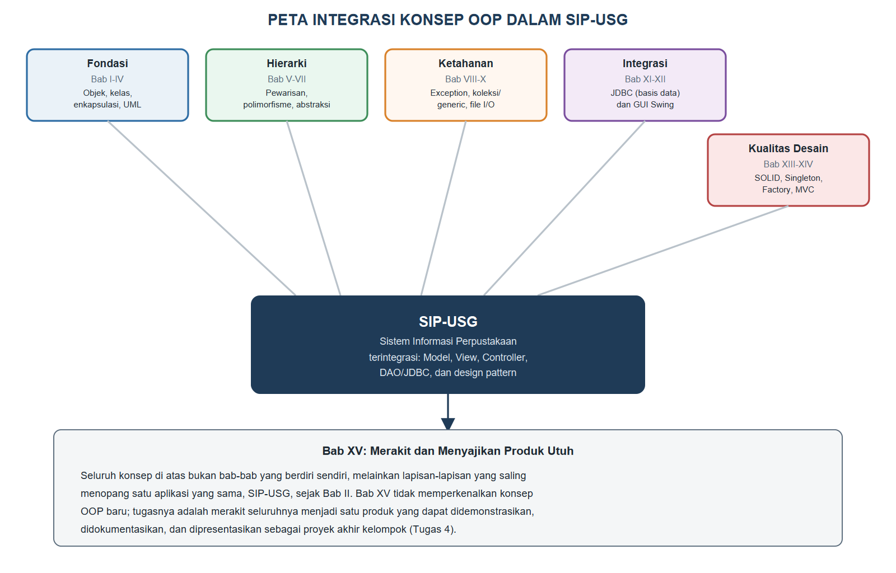
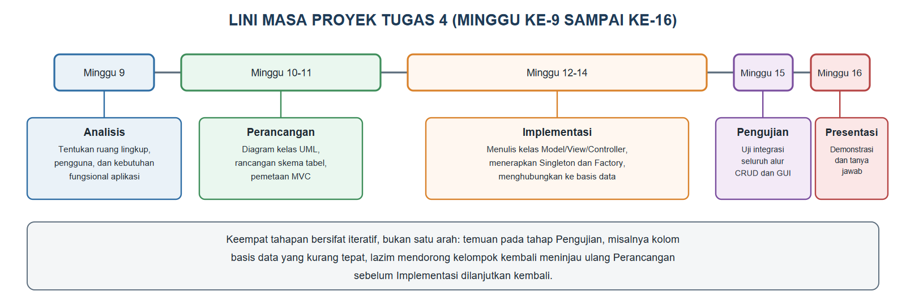
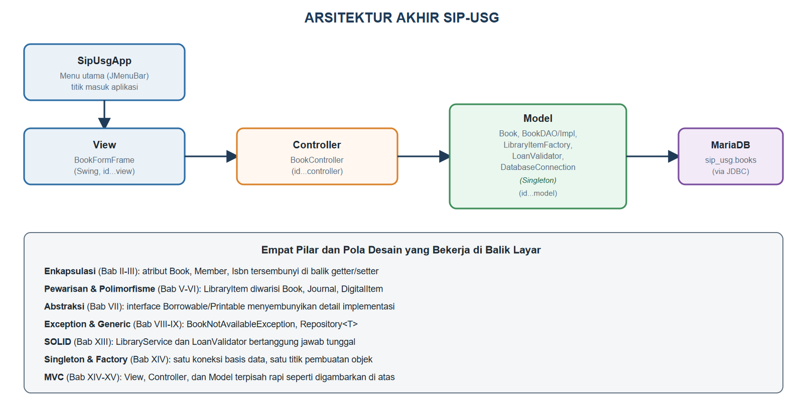
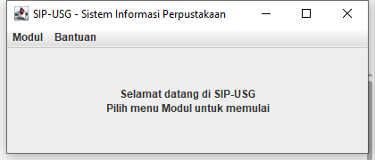

# BAB XV.
# (INTEGRASI KONSEP DALAM PROYEK APLIKASI BERORIENTASI OBJEK)

### CPMK/ Sub-CPMK :

- **CPMK3** : Melalui proyek pemrograman, mahasiswa mampu membangun aplikasi berorientasi objek yang terintegrasi dengan basis data dan antarmuka grafis (GUI) sebagai produk.
- **CPMK4** : Mahasiswa mampu berkolaborasi secara efektif dan etis dalam merancang, mengembangkan, mendokumentasikan, dan mempresentasikan produk aplikasi berorientasi objek.
- **Sub-CPMK8** : Mahasiswa mampu menerapkan prinsip desain berorientasi objek (SOLID/*design pattern*) serta mengembangkan dan mempresentasikan proyek aplikasi berorientasi objek secara kolaboratif.

### Indikator Penilaian:

Kesiapan produk proyek yang mengintegrasikan konsep OOP, meliputi keterpaduan seluruh konsep Bab I sampai Bab XIV dalam satu aplikasi, pelaksanaan tahapan analisis, perancangan, implementasi, dan pengujian, kelengkapan dokumentasi proyek, pembagian peran dan kontribusi yang etis dalam kelompok, serta kesiapan presentasi dan demonstrasi produk.

### Kriteria Keberhasilan (Rubrik):

- Sangat Baik (≥ 85): Kelompok mampu menghasilkan aplikasi yang mengintegrasikan GUI, basis data, dan prinsip desain secara utuh dengan ruang lingkup yang jelas, dokumentasi yang runtut dan orisinal, presentasi yang dikuasai seluruh anggota, serta kontribusi setiap anggota yang bermakna dan terbukti.
- Baik (70-84): Kelompok mampu menghasilkan aplikasi yang berjalan dan terdokumentasi dengan baik, tetapi integrasi prinsip desain belum merata pada seluruh modul atau pembagian peran presentasi belum seimbang.
- Cukup (55-69): Kelompok mampu menunjukkan aplikasi yang menjalankan fungsi utama, tetapi integrasi konsep, dokumentasi, dan bukti kontribusi individu masih terbatas.

### Deskripsi Kemampuan yang Diharapkan:

Setelah mempelajari bab ini, mahasiswa diharapkan mampu merakit seluruh konsep pemrograman berorientasi objek yang telah dipelajari menjadi sebuah produk aplikasi utuh, mengelola pengerjaannya secara kolaboratif dan etis, serta mempresentasikan hasilnya secara profesional. Dalam konteks Sistem Informasi, kemampuan ini mencerminkan praktik kerja nyata pengembangan sistem, di mana tim lintas peran harus menghasilkan aplikasi yang berfungsi, terdokumentasi, dan dapat dipertanggungjawabkan kepada organisasi pengguna.

## A. Pendahuluan

Empat belas bab sebelumnya telah membawa mahasiswa dari kelas dan objek yang paling sederhana pada Bab II, menembus hierarki pewarisan dan abstraksi pada Bab V hingga Bab VII, menembus penanganan galat dan struktur data pada Bab VIII hingga Bab X, hingga menghubungkan aplikasi ke basis data sungguhan dan antarmuka grafis pada Bab XI dan Bab XII, lalu menghaluskan seluruh rancangan tersebut dengan prinsip SOLID dan *design pattern* pada Bab XIII dan Bab XIV. SIP-USG, aplikasi yang menemani perjalanan ini sejak Bab II, kini telah memiliki fondasi kelas yang kokoh, koneksi basis data yang aman lewat Singleton, pembuatan objek yang terpusat lewat Factory Method, dan arsitektur MVC yang rapi. Namun, satu pertanyaan penting belum terjawab: bagaimana seluruh potongan ini dirakit menjadi satu produk yang benar-benar utuh, siap didemonstrasikan dan dipertanggungjawabkan di hadapan orang lain?

Bab ini adalah bab penutup yang secara sengaja tidak memperkenalkan satu pun konsep OOP baru. Sebaliknya, bab ini berfokus pada keterampilan yang sama pentingnya dengan penguasaan sintaksis Java: bagaimana merancang cakupan proyek yang realistis, bagaimana bekerja sama dalam kelompok secara etis dan terdokumentasi, dan bagaimana menyajikan hasil kerja teknis kepada audiens, baik dosen penguji maupun calon pengguna aplikasi. Bab ini sekaligus menjadi panduan langsung untuk Tugas 4, proyek akhir mata kuliah yang tercantum pada kotak Catatan Asesmen di bagian F, serta menjadi bekal materi yang akan diujikan pada Ujian Akhir Semester.

Dalam konteks Sistem Informasi, kemampuan merakit dan mempresentasikan produk seutuh ini adalah kemampuan yang akan langsung dipakai mahasiswa saat magang maupun bekerja: seorang pengembang jarang diminta menunjukkan satu kelas terisolasi, melainkan sebuah aplikasi yang bekerja, dapat dijelaskan rancangannya, dan dapat dipertanggungjawabkan kontribusi setiap anggota timnya. Setelah menuntaskan bab ini, mahasiswa akan menutup mata kuliah Pemrograman Berorientasi Objek dengan bukti nyata: SIP-USG versi akhir yang utuh, beserta laporan dan presentasi yang menyertainya.

## B. Peta Integrasi Seluruh Konsep Bab I–XIV

Bab I memperkenalkan empat pilar OOP sebagai peta awal yang masih kosong isinya. Gambar {{g:bab15-peta-integrasi}} menyajikan peta yang sama, kali ini terisi penuh dengan lokasi setiap konsep di sepanjang empat belas bab yang telah dipelajari, seluruhnya bermuara pada satu aplikasi yang sama.



Perhatikan bahwa Gambar {{g:bab15-peta-integrasi}} mengelompokkan empat belas bab menjadi lima kelompok besar: Fondasi (kelas, objek, enkapsulasi), Hierarki (pewarisan, polimorfisme, abstraksi), Ketahanan (penanganan eksepsi, koleksi dan generik, berkas), Integrasi (basis data dan antarmuka grafis), dan Kualitas Desain (SOLID dan *design pattern*). Kelima kelompok ini bukan modul yang berdiri sendiri-sendiri; SIP-USG yang dibangun sepanjang buku ini membuktikan bahwa kelas `Book` yang dienkapsulasi rapi pada Bab III adalah kelas yang sama yang diwariskan menjadi `LibraryItem` pada Bab V, disimpan lewat JDBC pada Bab XI, ditampilkan lewat `BookFormFrame` pada Bab XII, dan diakses lewat `DatabaseConnection` yang di-*refactor* menjadi Singleton pada Bab XIV. Merakit versi akhir SIP-USG pada bagian F, dengan demikian, bukan pekerjaan menulis kode dari nol, melainkan memastikan seluruh lapisan yang telah dibangun ini benar-benar saling terhubung tanpa ada bagian yang tertinggal pada versi sebelumnya.

## C. Tahapan Pengembangan Proyek: Analisis, Perancangan, Implementasi, Pengujian

Proyek aplikasi berorientasi objek yang baik tidak dikerjakan dengan langsung menulis kode; ia melalui empat tahapan yang saling menopang: analisis (memahami kebutuhan pengguna), perancangan (menuangkan pemahaman itu ke dalam diagram kelas dan skema tabel), implementasi (menulis dan menguji kode), dan pengujian (memverifikasi bahwa hasil implementasi benar-benar memenuhi kebutuhan pada tahap analisis). Gambar {{g:bab15-lini-masa-proyek}} memetakan keempat tahapan ini ke jadwal Tugas 4 pada Minggu ke-9 sampai ke-16 yang tercantum pada kotak Catatan Asesmen di bagian F.



Tahap Analisis pada SIP-USG, misalnya, berarti kelompok proyek menentukan dengan jelas ruang lingkup aplikasi perpustakaan yang akan dibangun: apakah mencakup peminjaman, pengembalian, pencarian katalog, atau ketiganya sekaligus, serta siapa saja penggunanya (pustakawan, anggota, atau keduanya). Tahap Perancangan menuangkan hasil analisis ini menjadi diagram kelas UML sebagaimana dipelajari pada Bab IV, ditambah rancangan skema tabel basis data dan pemetaan ke tiga lapisan MVC yang dipelajari pada Bab XIV. Tahap Implementasi adalah saat kelompok benar-benar menulis kelas Model, View, dan Controller, menerapkan Singleton pada koneksi basis data dan Factory Method pada pembuatan objek koleksi, persis seperti yang dipraktikkan pada Bab XIV. Kode Program {{kp:bab15-integration}} mendemonstrasikan bagaimana tahap Pengujian dapat dilakukan secara terprogram, bukan hanya dengan mengeklik tombol satu per satu, dengan menguji seluruh rantai pemanggilan Controller-DAO-Singleton sekaligus dalam satu kelas uji integrasi.

Kode Program #bab15-integration. Bab15IntegrationTest: menguji seluruh rantai Controller-DAO-Singleton

```java
package id.ac.usg.sip.app;

import id.ac.usg.sip.controller.BookController;

public class Bab15IntegrationTest {
    public static void main(String[] args)
            throws Exception {
        BookController controller =
            new BookController();

        int sebelum =
            controller.semuaBuku().size();
        System.out.println(
            "Jumlah buku sebelum: " + sebelum);

        controller.tambahBuku(
            "Rekayasa Perangkat Lunak", "B900",
            "Pressman, R.",
            "978-0-07-337597-7", 2015);
        System.out.println(
            "B900 berhasil ditambahkan");

        int sesudahTambah =
            controller.semuaBuku().size();
        System.out.println(
            "Jumlah buku sesudah tambah: "
            + sesudahTambah);

        controller.hapusBuku("B900");
        int sesudahHapus =
            controller.semuaBuku().size();
        System.out.println(
            "Jumlah buku sesudah hapus: "
            + sesudahHapus);
    }
}
```

Keluaran Program:

```
Jumlah buku sebelum: 3
B900 berhasil ditambahkan
Jumlah buku sesudah tambah: 4
Jumlah buku sesudah hapus: 3
```

Kode Program {{kp:bab15-integration}} tidak menguji satu *method* secara terisolasi seperti pengujian unit biasa, melainkan menguji *integrasi* antara `BookController`, `BookDAOImpl`, dan `DatabaseConnection` sekaligus dalam satu alur nyata: menghitung jumlah baris sebelum penambahan, menambah satu buku uji lewat `LibraryItemFactory` di balik `tambahBuku()`, memverifikasi jumlahnya bertambah, lalu menghapus kembali buku uji tersebut agar data tabel `books` tidak berubah secara permanen. Pola "hitung-ubah-verifikasi-bersihkan" pada kode ini adalah pola pengujian integrasi yang wajar diterapkan kelompok proyek pada tahap Pengujian, jauh lebih cepat dan dapat diulang dibandingkan menguji lewat antarmuka Swing secara manual berulang kali.

## D. Dokumentasi Proyek dan Etika Kolaborasi

Aplikasi yang berjalan dengan benar belum tentu menjadi proyek yang baik apabila tidak dapat dijelaskan cara kerjanya maupun dipertanggungjawabkan siapa yang mengerjakan bagian mana. Dokumentasi proyek minimal mencakup tiga hal: laporan tertulis yang menjelaskan hasil keempat tahapan pada bagian C (analisis kebutuhan, diagram rancangan, penjelasan implementasi, dan hasil pengujian), kode sumber yang tertata dalam struktur paket `model`, `view`, `controller` seperti dipraktikkan pada Bab XIV, dan riwayat kontribusi setiap anggota kelompok yang dapat ditelusuri, misalnya lewat riwayat *commit* pada sistem kendali versi atau catatan pembagian tugas mingguan.

Etika kolaborasi menjadi perhatian khusus pada proyek kelompok. Kontribusi individu (dinilai dengan rubrik R13 sebagaimana tercantum pada kotak Catatan Asesmen di bagian F) mengharuskan setiap anggota benar-benar memahami dan mampu menjelaskan bagian kode yang menjadi tanggung jawabnya, bukan sekadar mencantumkan nama pada laporan tanpa kontribusi nyata; praktik mencantumkan nama tanpa kontribusi yang dapat dibuktikan tergolong pelanggaran integritas akademik. Sebaliknya, pembagian tugas yang sehat justru memanfaatkan struktur MVC yang telah dipelajari: satu anggota dapat berfokus pada lapisan Model dan akses data, anggota lain pada lapisan View dan pengalaman pengguna, dan anggota lain lagi pada lapisan Controller serta pengujian integrasi, sebagaimana ketiga lapisan ini memang dirancang untuk dapat dikembangkan secara paralel tanpa saling mengganggu, persis manfaat MVC yang telah dibuktikan pada Bab XIV bagian E.

## E. Presentasi dan Diseminasi Produk

Presentasi proyek (dinilai dengan rubrik R8) adalah kesempatan kelompok menunjukkan bukan hanya bahwa aplikasi berjalan, tetapi bahwa seluruh anggota memahami rancangan dan alasan di balik setiap keputusan teknis yang diambil. Tabel {{t:checklist-presentasi}} merangkum daftar periksa kesiapan yang sebaiknya dipenuhi kelompok sebelum jadwal presentasi pada Minggu ke-16.

Tabel #checklist-presentasi. Daftar periksa kesiapan produk proyek sebelum presentasi

| Butir Kesiapan | Kriteria Terpenuhi |
|---|---|
| Kode sumber terkompilasi tanpa galat | `javac` berjalan bersih pada seluruh paket `model`, `view`, `controller` |
| Basis data siap dan berisi data uji | Tabel terisi data contoh yang relevan untuk didemonstrasikan langsung |
| Alur CRUD utama teruji | Tambah, tampilkan, dan hapus data terbukti berjalan tanpa galat saat demonstrasi |
| Setiap anggota memahami bagiannya | Anggota dapat menjelaskan kode lapisan yang menjadi tanggung jawabnya tanpa membaca catatan |
| Laporan proyek lengkap | Mencakup keempat tahapan pada bagian C: analisis, perancangan, implementasi, pengujian |
| Slide presentasi ringkas | Memuat rancangan, cuplikan kode penting, dan hasil, bukan seluruh kode sumber |
| Pembagian peran presentasi merata | Setiap anggota mendapat bagian penjelasan sesuai kontribusinya pada kode |
| Rencana demonstrasi langsung siap | Skenario penggunaan aplikasi disiapkan, bukan hanya cuplikan layar statis |

Demonstrasi langsung, bukan sekadar tangkapan layar pada slide, sangat dianjurkan karena membuktikan aplikasi benar-benar berjalan; kelompok yang telah menuntaskan bagian F sebaiknya berlatih menjalankan skenario demonstrasi ini beberapa kali sebelum hari presentasi agar terbiasa menangani pertanyaan dosen penguji mengenai keputusan rancangan yang diambil, misalnya alasan memilih Singleton untuk koneksi basis data atau alasan memisahkan `BookController` dari `BookFormFrame`.

## F. Praktikum Terbimbing: Merakit SIP-USG Versi Akhir dan Menyiapkan Demonstrasi

Praktikum ini merakit hasil Bab XIV menjadi satu aplikasi dengan titik masuk tunggal, sekaligus menjadi latihan langsung menjalankan skenario demonstrasi proyek. Gambar {{g:bab15-arsitektur-akhir}} merangkum arsitektur akhir yang akan dirakit pada praktikum ini.



Kode Program {{kp:sip-usg-app-1}} dan Kode Program {{kp:sip-usg-app-2}} menuliskan `SipUsgApp`, kelas baru yang menjadi titik masuk tunggal aplikasi, menggantikan kebiasaan menjalankan `BookFormFrame` secara langsung seperti pada Bab XII dan Bab XIV.

Kode Program #sip-usg-app-1. SipUsgApp: constructor dan menu Modul (bagian 1)

```java
// SipUsgApp.java -- bagian 1 dari 2
package id.ac.usg.sip.app;

import id.ac.usg.sip.view.BookFormFrame;
import javax.swing.JFrame;
import javax.swing.JLabel;
import javax.swing.JMenu;
import javax.swing.JMenuBar;
import javax.swing.JMenuItem;
import javax.swing.JOptionPane;
import javax.swing.SwingConstants;

public class SipUsgApp extends JFrame {
    public SipUsgApp() {
        super("SIP-USG - Sistem Informasi "
            + "Perpustakaan");
        setJMenuBar(buatMenuBar());
        add(buatLabelSambutan());
        setSize(420, 180);
        setDefaultCloseOperation(EXIT_ON_CLOSE);
    }

    private JMenuBar buatMenuBar() {
        JMenuBar bar = new JMenuBar();
        JMenu menuModul = new JMenu("Modul");

        JMenuItem itemBuku =
            new JMenuItem("Data Buku");
        itemBuku.addActionListener(e ->
            new BookFormFrame()
                .setVisible(true));
        menuModul.add(itemBuku);

        JMenuItem itemKeluar =
            new JMenuItem("Keluar");
        itemKeluar.addActionListener(
            e -> System.exit(0));
        menuModul.add(itemKeluar);
    // ... lanjutan pada Kode Program berikutnya
```

Kode Program #sip-usg-app-2. SipUsgApp: menu Bantuan dan label sambutan (bagian 2, lanjutan)

```java
        // lanjutan SipUsgApp dari kode sebelumnya
        JMenu menuBantuan = new JMenu("Bantuan");
        JMenuItem itemTentang =
            new JMenuItem("Tentang");
        itemTentang.addActionListener(e ->
            JOptionPane.showMessageDialog(this,
                "SIP-USG dibangun bertahap dari"
                + " Bab II hingga Bab XIV.",
                "Tentang SIP-USG",
                JOptionPane
                    .INFORMATION_MESSAGE));
        menuBantuan.add(itemTentang);

        bar.add(menuModul);
        bar.add(menuBantuan);
        return bar;
    }

    private JLabel buatLabelSambutan() {
        return new JLabel(
            "<html><center>Selamat datang"
            + " di SIP-USG<br>Pilih menu Modul"
            + " untuk memulai</center></html>",
            SwingConstants.CENTER);
    }
}
```

Perhatikan bahwa `SipUsgApp` pada Kode Program {{kp:sip-usg-app-1}} dan Kode Program {{kp:sip-usg-app-2}} tidak menuliskan satu pun logika bisnis baru; ia hanya menyusun `JMenuBar` dengan menu "Modul" yang membuka `BookFormFrame` versi MVC dari Bab XIV, dan menu "Bantuan" yang menampilkan informasi ringkas lewat `JOptionPane`. Kesederhanaan `SipUsgApp` ini sesungguhnya adalah bukti lain manfaat arsitektur MVC: kelas peluncur aplikasi tidak perlu mengetahui apa pun tentang `BookDAO`, `DatabaseConnection`, atau `LibraryItemFactory` sama sekali, karena seluruh detail tersebut telah tersembunyi rapi di balik `BookFormFrame` dan `BookController`.

Ikuti langkah berikut untuk merakit dan mendemonstrasikan versi akhir SIP-USG.

1. Pastikan seluruh kelas dari Bab II hingga Bab XIV berada pada struktur paket `id.ac.usg.sip.model`, `id.ac.usg.sip.view`, dan `id.ac.usg.sip.controller` yang telah dirapikan pada Bab XIV.
2. Buat kelas `SipUsgApp` pada paket `id.ac.usg.sip.app`, lalu gabungkan Kode Program {{kp:sip-usg-app-1}} dan Kode Program {{kp:sip-usg-app-2}} menjadi satu berkas.
3. Buat kelas `Bab15IntegrationTest` pada paket yang sama, lalu salin Kode Program {{kp:bab15-integration}}, kemudian jalankan untuk memverifikasi seluruh rantai Controller-DAO-Singleton bekerja sebelum demonstrasi langsung dilakukan.
4. Buat kelas `Bab15Demo` pada paket yang sama, lalu salin Kode Program {{kp:bab15-demo}}, untuk menjalankan `SipUsgApp` sebagai aplikasi utuh.
5. Jalankan `Bab15Demo`, lalu klik menu "Modul" dan pilih "Data Buku" untuk membuka `BookFormFrame`, membuktikan seluruh lapisan MVC, Singleton, dan Factory Method bekerja sama lewat satu titik masuk tunggal.
6. Latih skenario demonstrasi ini (membuka aplikasi, menambah satu data buku, menampilkannya di tabel, lalu menghapusnya kembali) beberapa kali sebagai persiapan presentasi Tugas 4, mengikuti daftar periksa pada Tabel {{t:checklist-presentasi}}.

Kode Program #bab15-demo. Bab15Demo: menjalankan SipUsgApp sebagai aplikasi utuh

```java
package id.ac.usg.sip.app;

import java.awt.Rectangle;
import java.awt.Robot;
import java.awt.image.BufferedImage;
import javax.imageio.ImageIO;
import java.io.File;
import javax.swing.SwingUtilities;

public class Bab15Demo {
    public static void main(String[] args)
            throws Exception {
        SipUsgApp app = new SipUsgApp();
        SwingUtilities.invokeLater(() ->
            app.setVisible(true));
        Thread.sleep(1500);

        Robot robot = new Robot();
        Rectangle area = app.getBounds();
        BufferedImage img =
            robot.createScreenCapture(area);
        ImageIO.write(img, "png",
            new File("sip-usg-app.png"));
        System.out.println(
            "SipUsgApp telah ditampilkan"
            + " dan ditangkap layarnya");
        System.exit(0);
    }
}
```

Keluaran Program:

```
SipUsgApp telah ditampilkan dan ditangkap layarnya
```

Gambar {{g:bab15-sip-usg-app}} menampilkan `SipUsgApp` yang berhasil dijalankan, lengkap dengan menu "Modul" dan "Bantuan" pada bagian atas jendela.



#### Catatan Asesmen

| Butir | Keterangan |
|---|---|
| Nama tugas | Tugas 4. Proyek Aplikasi Berorientasi Objek |
| Sub-CPMK | Sub-CPMK7, Sub-CPMK8 |
| Penugasan | Bangun aplikasi berorientasi objek dengan antarmuka grafis (GUI) dan basis data yang menerapkan prinsip desain OOP; dokumentasikan dan presentasikan. |
| Ruang lingkup | Seluruh materi OOP secara terintegrasi. |
| Cara pengerjaan | Kelompok (3–4 mahasiswa); pengembangan bertahap dan presentasi. |
| Batas waktu | Dikembangkan Minggu ke-9 sampai ke-15; dipresentasikan Minggu ke-16. |
| Luaran | Produk aplikasi (kode sumber), laporan (PDF), slide, dan demonstrasi. |

Nilai individu proyek = 60% produk aplikasi (R9) + 25% presentasi (R8) + 15% kontribusi individu (R13, *peer assessment* dimoderasi dosen). Panduan lengkap tersedia pada Lampiran C, sedangkan kisi-kisi Ujian Akhir Semester tersedia pada Lampiran B.

#### Kesalahan Umum dan Cara Mengatasinya

| Gejala/Pesan Error | Penyebab | Perbaikan |
|---|---|---|
| Menjalankan `BookFormFrame` langsung, `SipUsgApp` tidak pernah dipakai saat demonstrasi | Kelompok lupa mengganti kebiasaan lama dari Bab XII/XIV | Jalankan selalu lewat `SipUsgApp` (Kode Program {{kp:sip-usg-app-1}}) sebagai titik masuk tunggal saat demonstrasi |
| Data uji hasil pengujian integrasi masih tersisa di tabel saat demonstrasi | Kode Program {{kp:bab15-integration}} tidak dijalankan sampai selesai, atau langkah `hapusBuku("B900")` gagal karena galat sebelumnya | Jalankan ulang `Bab15IntegrationTest` sampai keluaran menunjukkan jumlah buku kembali seperti semula |
| Salah satu anggota tidak dapat menjawab pertanyaan tentang bagian kode tertentu saat presentasi | Pembagian tugas tidak mengikuti batas lapisan MVC yang jelas, atau anggota hanya menyalin kode tanpa memahaminya | Bagi tugas mengikuti lapisan Model/View/Controller seperti dijelaskan pada bagian D, dan latih setiap anggota menjelaskan bagiannya |
| Laporan proyek hanya berisi cuplikan kode tanpa penjelasan tahapan | Laporan ditulis terburu-buru menjelang batas waktu, tanpa mengikuti keempat tahapan pada bagian C | Susun laporan mengikuti struktur Analisis-Perancangan-Implementasi-Pengujian sejak awal pengerjaan, bukan di akhir |

### Rangkuman

Bab XV merakit seluruh konsep OOP dari Bab I hingga Bab XIV, mulai dari enkapsulasi, pewarisan, dan abstraksi hingga JDBC, GUI, SOLID, dan *design pattern*, menjadi satu aplikasi SIP-USG yang utuh, sebagaimana dirangkum pada peta integrasi di bagian B. Pengembangan proyek yang baik mengikuti empat tahapan yang saling menopang: analisis, perancangan, implementasi, dan pengujian, dilaksanakan secara iteratif sesuai lini masa Tugas 4 pada Minggu ke-9 sampai ke-16. Dokumentasi proyek dan etika kolaborasi menuntut setiap anggota kelompok memahami dan dapat membuktikan kontribusinya, dengan pembagian tugas yang wajar mengikuti pemisahan lapisan Model, View, dan Controller. Presentasi yang baik dipersiapkan lewat daftar periksa kesiapan produk dan latihan demonstrasi langsung yang berulang. Praktikum bab ini merakit `SipUsgApp` sebagai titik masuk tunggal yang menghubungkan seluruh lapisan SIP-USG lewat satu menu sederhana, membuktikan bahwa aplikasi yang dibangun bertahap sepanjang lima belas bab benar-benar dapat berdiri sebagai satu produk yang siap didemonstrasikan dan dipertanggungjawabkan sebagai Tugas 4.

### Soal/Pertanyaan

1. (C2) Sebutkan lima kelompok besar konsep OOP pada Gambar {{g:bab15-peta-integrasi}} beserta bab yang tercakup di masing-masing kelompok!
2. (C2) Sebutkan empat tahapan pengembangan proyek pada Gambar {{g:bab15-lini-masa-proyek}} beserta satu contoh kegiatan pada masing-masing tahapan!
3. (C3) Perhatikan Kode Program {{kp:bab15-integration}}. Jelaskan mengapa buku uji "B900" perlu dihapus kembali di akhir pengujian, bukan dibiarkan tersimpan di tabel!
4. (C3) Telusuri Kode Program {{kp:sip-usg-app-1}} dan Kode Program {{kp:sip-usg-app-2}}, lalu jelaskan mengapa `SipUsgApp` tidak perlu mengimpor satu pun kelas dari paket `model` secara langsung!
5. (C4) Bandingkan cara menjalankan aplikasi lewat `Bab14FormDemo` pada Bab XIV dengan lewat `SipUsgApp` pada bab ini. Analisis manfaat memiliki satu titik masuk tunggal untuk aplikasi yang akan didemonstrasikan!
6. (C4) Perhatikan Tabel {{t:checklist-presentasi}}. Jelaskan mengapa "rencana demonstrasi langsung" dianggap lebih penting daripada sekadar tangkapan layar statis pada slide presentasi!
7. (C5) Sebuah kelompok proyek SIP-USG terdiri atas empat anggota. Rancanglah (dalam bentuk daftar tugas) pembagian peran keempat anggota tersebut berdasarkan lapisan Model, View, Controller, dan pengujian integrasi, mengikuti pembahasan bagian D!
8. (C6) Nilailah kesiapan sebuah kelompok proyek untuk presentasi Tugas 4 apabila aplikasinya sudah berjalan dengan benar tetapi hanya satu dari empat anggota yang dapat menjelaskan kode sumbernya. Kaitkan penilaian tersebut dengan rubrik R8, R9, dan R13 pada kotak Catatan Asesmen!

### Rujukan Bab

- Deitel, P. J., & Deitel, H. M. (2018). *Java how to program, early objects* (11th ed.). Pearson Education.
- Horstmann, C. S. (2022). *Core Java, Volume I: Fundamentals* (12th ed.). Oracle Press/Pearson.
